# AP Micro考试概览

> **参考 AP Microeconomics 六大单元 · 核心知识点 · 图表精讲**
>
> 适用于国际课程新高一学生


## 考试基本信息

<table>
<colgroup>
<col style="width:40%"><col style="width:60%">
</colgroup>
<thead>
<tr><th style="text-align:center;vertical-align:middle">项目</th><th style="text-align:center;vertical-align:middle">详情</th></tr>
</thead>
<tbody>
<tr><td style="text-align:center;vertical-align:middle">考试日期</td><td style="text-align:center;vertical-align:middle">2026年5月4日（当地时间中午12:00）</td></tr>
<tr><td style="text-align:center;vertical-align:middle">考试形式</td><td style="text-align:center;vertical-align:middle">混合数字考试（Hybrid Digital）</td></tr>
<tr><td style="text-align:center;vertical-align:middle">计算器</td><td style="text-align:center;vertical-align:middle">仅允许使用四功能计算器</td></tr>
<tr><td style="text-align:center;vertical-align:middle">考试时长</td><td style="text-align:center;vertical-align:middle">共 2小时10分钟</td></tr>
</tbody>
</table>

## 试卷结构

<table>
<colgroup>
<col style="width:15%"><col style="width:8%"><col style="width:12%"><col style="width:8%"><col style="width:57%">
</colgroup>
<thead>
<tr><th>Section</th><th>题量</th><th>时间</th><th>占分</th><th>说明</th></tr>
</thead>
<tbody>
<tr><td><strong>Section I: Multiple Choice</strong></td><td>60 题</td><td>1小时10分钟</td><td>66%</td><td>涵盖全部课程内容，考察知识运用与推理能力</td></tr>
<tr><td><strong>Section II: Free Response</strong></td><td>3 题</td><td>1小时</td><td>33%</td><td>1 道长 FRQ（占 50%）+ 2 道短 FRQ（各占 25%），要求陈述概念、解释原理、数值分析、绘制图表</td></tr>
</tbody>
</table>

## 2026年5分率分布

| 分数 | 百分比 | 累计 |
|------|--------|------|
| **5** | 19% | 19% |
| **4** | 26% | 45% |
| **3** | 23% | 68% |
| **2** | 20% | 88% |
| **1** | 12% | 100% |

> 📌 **数据来源：** College Board 官方发布的 AP Microeconomics 2026 年考试成绩分布（[apstudents.collegeboard.org](https://apstudents.collegeboard.org/about-ap-scores/score-distributions/ap-microeconomics)）。表中比例以 College Board 页面公布的数据为准，其他统计信息也应以该页面的后续更新为准。

---

# Basic Economic Concepts

> **考试权重：12–15%**

## Scarcity 稀缺性

*Scarcity*（稀缺性）是经济学最根本的概念：**有限的资源无法满足无限的欲望**。正因稀缺性存在，个人、企业和社会必须做出 *Choice*（选择），而每个选择都伴随 *Opportunity Cost*（机会成本）。

**为什么稀缺性是经济学的起点？** 如果资源是无限的——每个人想有多少就有多少——那就不需要做选择，没有选择就没有机会成本，没有机会成本就不需要权衡取舍，经济学也就没有存在的意义。正是因为资源有限而欲望无限，人们才被迫在"要这个"还是"要那个"之间做出抉择，经济学的全部理论都建立在这个基本事实之上。

> 💡 **生活例子：** 即使是世界首富也面临稀缺性！金钱对亿万富翁来说可能不是约束，但**时间**是稀缺的——一天只有24小时，参加了这个会议就无法同时出席另一个活动。稀缺性是全人类共同面对的现实，不是"穷人才有的问题"。

> 📌 **关键区分：** *Scarcity* ≠ *Shortage*。稀缺性是**永久性**的（资源始终有限），而短缺是**暂时性**的（市场价格低于均衡价格时出现，可通过涨价消除）。

**Scarcity vs. Shortage 对比：**

<table>
<colgroup>
<col style="width:22%"><col style="width:39%"><col style="width:39%">
</colgroup>
<thead>
<tr><th style="text-align:center;vertical-align:middle">比较维度</th><th style="text-align:center;vertical-align:middle">Scarcity（稀缺性）</th><th style="text-align:center;vertical-align:middle">Shortage（短缺）</th></tr>
</thead>
<tbody>
<tr><td style="text-align:center;vertical-align:middle">性质</td><td style="text-align:center;vertical-align:middle">永久性（permanent）</td><td style="text-align:center;vertical-align:middle">暂时性（temporary）</td></tr>
<tr><td style="text-align:center;vertical-align:middle">原因</td><td style="text-align:center;vertical-align:middle">资源有限 vs. 欲望无限</td><td style="text-align:center;vertical-align:middle">市场价格低于均衡价格</td></tr>
<tr><td style="text-align:center;vertical-align:middle">能否消除</td><td style="text-align:center;vertical-align:middle"><strong>无法消除</strong> — 人类永远面临</td><td style="text-align:center;vertical-align:middle"><strong>可以通过涨价消除</strong> — 价格上升到均衡水平后短缺消失</td></tr>
<tr><td style="text-align:center;vertical-align:middle">适用范围</td><td style="text-align:center;vertical-align:middle">所有资源、所有商品、所有人群</td><td style="text-align:center;vertical-align:middle">仅发生在特定市场的特定价格下</td></tr>
<tr><td style="text-align:center;vertical-align:middle">举例</td><td style="text-align:center;vertical-align:middle">即便商品充裕，你的时间和注意力也是稀缺的</td><td style="text-align:center;vertical-align:middle">限量球鞋被抢购一空，黄牛加价后可以买到</td></tr>
</tbody>
</table>

### Four Factors of Production 四类生产要素

<table>
<colgroup>
<col style="width:22%"><col style="width:28%"><col style="width:50%">
</colgroup>
<thead>
<tr><th style="text-align:center">要素</th><th style="text-align:center">英文</th><th style="text-align:center">含义</th></tr>
</thead>
<tbody>
<tr><td style="text-align:center">土地</td><td style="text-align:center"><em>Land</em></td><td style="text-align:center">自然资源，如土地、水、矿产、森林</td></tr>
<tr><td style="text-align:center">劳动</td><td style="text-align:center"><em>Labor</em></td><td style="text-align:center">人类付出的体力和脑力劳动</td></tr>
<tr><td style="text-align:center">资本</td><td style="text-align:center"><em>Capital</em></td><td style="text-align:center">用于生产其他商品和服务的工具、机器、厂房</td></tr>
<tr><td style="text-align:center">企业家才能</td><td style="text-align:center"><em>Entrepreneurship</em></td><td style="text-align:center">组织资源、承担风险、创新并做出经营决策的能力</td></tr>
</tbody>
</table>

**四类生产要素详解与回报：**

- **Land（土地）**：包括一切自然资源——耕地、矿藏、水源、森林、渔场等。土地的回报称为 **Rent（地租）**，是使用自然资源所支付的报酬。📌 注意：经济学中的"土地"不仅指地面，还包含地下矿产和地上空间。
- **Labor（劳动）**：人类在生产过程中付出的体力和脑力努力。劳动的回报称为 **Wage（工资）**。劳动的质量取决于人力资本（education, training, experience），人力资本越高，工资通常越高。
- **Capital（资本）**：用于生产其他商品的人造工具和设备——机器、厂房、工具、流水线等。资本的回报称为 **Interest（利息）**，是资本提供者因让渡资本使用权而获得的报酬。

> ⚠️ **常见误区：** 经济学中的 *Capital* 在本课程的生产要素语境中通常指**实物资本**（physical capital），如机器、设备、厂房，**不是**金融资本（financial capital，如股票、债券、现金）。

- **Entrepreneurship（企业家才能）**：组织其他三种要素、承担经营风险、做出创新决策的能力。企业家才能的回报称为 **Profit（利润）**，也是四种回报中唯一**不确定**的——利润可能是正的也可能是负的（亏损），因为企业家承担了风险。

> 📌 **AP 考点：** 记住对应关系 Land→Rent, Labor→Wage, Capital→Interest, Entrepreneurship→Profit，选择题常考。

**Consumer Goods**（消费品）直接满足当前消费需求，例如食物、衣服、手机。**Capital Goods**（资本品）用于生产未来的商品和服务，例如机器、校舍、生产线。一个经济体生产更多 capital goods 通常有利于未来增长，但并不是无条件“更好”，因为这会牺牲当前 consumer goods 的数量。

## Resource Allocation and Economic Systems 资源配置与经济体制

由于资源稀缺，社会必须回答三个基本经济问题：

1. **What to produce?** 生产什么？
2. **How to produce?** 如何生产？
3. **For whom to produce?** 为谁生产？

不同经济体制用不同方式回答这些问题：

<table>
<colgroup>
<col style="width:34%"><col style="width:38%"><col style="width:28%">
</colgroup>
<thead>
<tr><th style="text-align:center">经济体制</th><th style="text-align:center">特点</th><th style="text-align:center">资源配置方式</th></tr>
</thead>
<tbody>
<tr><td style="text-align:center"><em>Market Economy</em> 市场经济</td><td style="text-align:center">私有产权、自由交换、价格信号</td><td style="text-align:center">主要由供需和价格决定</td></tr>
<tr><td style="text-align:center"><em>Command Economy</em> 计划经济</td><td style="text-align:center">政府集中决策</td><td style="text-align:center">主要由政府计划决定</td></tr>
<tr><td style="text-align:center"><em>Mixed Economy</em> 混合经济</td><td style="text-align:center">市场机制与政府干预并存</td><td style="text-align:center">现实国家最常见</td></tr>
</tbody>
</table>

**三种经济体制如何回答三大基本问题：**

| 基本问题 | Market Economy 市场经济 | Command Economy 计划经济 | Mixed Economy 混合经济 |
|----------|------------------------|------------------------|----------------------|
| **What to produce?** | 由消费者需求（"美元投票"）决定 | 由政府计划决定 | 市场主导 + 政府补充（如公共物品） |
| **How to produce?** | 企业为追求利润自行选择生产方式 | 政府指定生产方式和资源分配 | 企业自主选择 + 政府监管（如环保标准） |
| **For whom to produce?** | 由购买力（收入）决定 | 政府分配（配给制） | 市场分配为主 + 政府再分配（税收、福利） |
| **现实案例** | 美国（最接近市场经济） | 朝鲜（典型计划经济） | 中国、北欧国家（混合经济） |

> 📌 **AP 考点：** 现实世界中**几乎没有纯粹的市场经济或纯粹的计划经济**。美国有政府干预（反垄断法、环保法规），朝鲜也有少量市场活动（黑市）。大多数国家都是 *Mixed Economy*，只是"混"的程度不同。

*Property Rights*（产权）和 *Incentives*（激励）会影响人们如何使用资源。产权越清晰，个人和企业越有动力节约资源、投资和创新。

## Opportunity Cost and Cost-Benefit Analysis 机会成本与成本收益分析

*Opportunity Cost*（机会成本）是**做出一项选择时所放弃的次优选项的价值**，是经济决策的核心依据。

> 💡 **例子：** 你用周末时间复习经济学，就放弃了去看电影或打游戏的机会，这就是机会成本

**数值示例：** 假设周末有三个选择：
- A. 打工赚200元（你给200分）
- B. 看电影（你给150分）
- C. 打游戏（你给100分）

选择A的机会成本 = **150分**（B的价值，即次优选项的价值），而**不是**250分（=150+100，所有放弃选项的总和）。⚠️ 这是最常见的考试陷阱！

$$\text{Opportunity Cost} = \text{被放弃的次优选项的价值}$$

> ⚠️ **常见误区：** 机会成本**不是**所有被放弃选项的总和，而是其中**价值最高的那一个**。已发生的不可收回的成本（*Sunk Cost* 沉没成本）不应影响当前决策。

### Sunk Cost Fallacy 沉没成本谬误

*Sunk Cost*（沉没成本）是已经发生且**无法收回**的成本。理性决策者应忽略沉没成本，只看未来的边际收益和边际成本。但人们在现实中往往因为"已经投入了"而继续做不划算的事，这就是 *Sunk Cost Fallacy*（沉没成本谬误）。

> 💡 **经典例子：** 你花了80元买了一张电影票，进场看了30分钟发现电影非常难看。你应该留下来还是离开？理性做法是**离开**——那80元已经花了（沉没成本），无论你留下还是离开都不会回来。留下的"收益"是继续看一部你不喜欢的电影（负效用），而离开的"收益"是去做更喜欢的事。但因为"来都来了""钱都花了"而留下，就是沉没成本谬误。

> ⚠️ **核心原则：** "已经付了" ≠ "应该继续"。沉没成本不应影响决策，决策应基于未来的边际收益与边际成本的比较。AP 考试中，如果题目说"already paid"或"cannot be recovered"，这部分成本就不应计入决策。

### Explicit Cost and Implicit Cost 显性成本与隐性成本

<table>
<colgroup>
<col style="width:30%"><col style="width:42%"><col style="width:28%">
</colgroup>
<thead>
<tr><th style="text-align:center;vertical-align:middle">概念</th><th style="text-align:center;vertical-align:middle">含义</th><th style="text-align:center;vertical-align:middle">例子</th></tr>
</thead>
<tbody>
<tr><td style="text-align:center;vertical-align:middle"><em>Explicit Cost</em> 显性成本</td><td style="text-align:center;vertical-align:middle">实际支付出去的货币成本</td><td style="text-align:center;vertical-align:middle">工资、房租、原材料费用</td></tr>
<tr><td style="text-align:center;vertical-align:middle"><em>Implicit Cost</em> 隐性成本</td><td style="text-align:center;vertical-align:middle">使用自有资源所放弃的机会成本</td><td style="text-align:center;vertical-align:middle">创业者放弃的工资、自有店铺本可出租的租金</td></tr>
<tr><td style="text-align:center;vertical-align:middle"><em>Accounting Profit</em> 会计利润</td><td style="text-align:center;vertical-align:middle">总收益 - 显性成本</td><td style="text-align:center;vertical-align:middle">财务报表常用</td></tr>
<tr><td style="text-align:center;vertical-align:middle"><em>Economic Profit</em> 经济利润</td><td style="text-align:center;vertical-align:middle">总收益 - 显性成本 - 隐性成本</td><td style="text-align:center;vertical-align:middle">AP 判断长期进入/退出更常用</td></tr>
</tbody>
</table>

**完整数值示例：** 小李原本年薪30万元，辞职开奶茶店，投入10万元储蓄（银行利率5%），年收益50万元，材料和人工等显性成本30万元。

| 项目 | 计算 | 金额 |
|:---:|:---:|:---:|
| 总收益 (TR) | — | 50万 |
| 显性成本 (Explicit Cost) | 材料+人工 | 30万 |
| **会计利润 (Accounting Profit)** | TR - Explicit | **50 - 30 = 20万** ✅ |
| 隐性成本 - 放弃的工资 | 原年薪 | 30万 |
| 隐性成本 - 放弃的利息 | 10万 × 5% | 0.5万 |
| **经济利润 (Economic Profit)** | TR - Explicit - Implicit | **50 - 30 - 30 - 0.5 = -10.5万** ❌ |

> 📌 **Normal Profit（正常利润）：** 当经济利润 = 0 时，企业恰好获得 *Normal Profit*，即所有隐性成本刚好被覆盖，企业家没有动力进入或退出。Normal Profit 是一种"成本"，不是"利润"——它是留在当前行业所需的最低回报。

> ⚠️ **关键理解：** 经济利润为负**不等于**企业要倒闭！小李的会计利润是20万，生活没问题。但经济利润为负意味着：如果他回去上班能获得更高回报，**长期来看**理性选择是退出。AP 考试中，经济利润 > 0 → 企业进入，经济利润 < 0 → 企业退出，经济利润 = 0 → 长期均衡。

完整的利润、成本曲线和企业决策会在 Unit 3 Topic 3.4 以后系统展开；这里先掌握“经济学成本包含机会成本”这一原则。

*Cost-Benefit Analysis*（成本收益分析）要求比较一项行动的收益与成本。若收益大于成本，行动通常值得进行；若成本大于收益，应重新选择。

## Production Possibilities Curve (PPC) 生产可能性曲线

*Production Possibilities Curve*（PPC）展示了一个经济体在资源与技术水平既定条件下，所能生产的两种商品的**最大组合**。它是理解稀缺性、机会成本、效率与经济增长的核心模型。

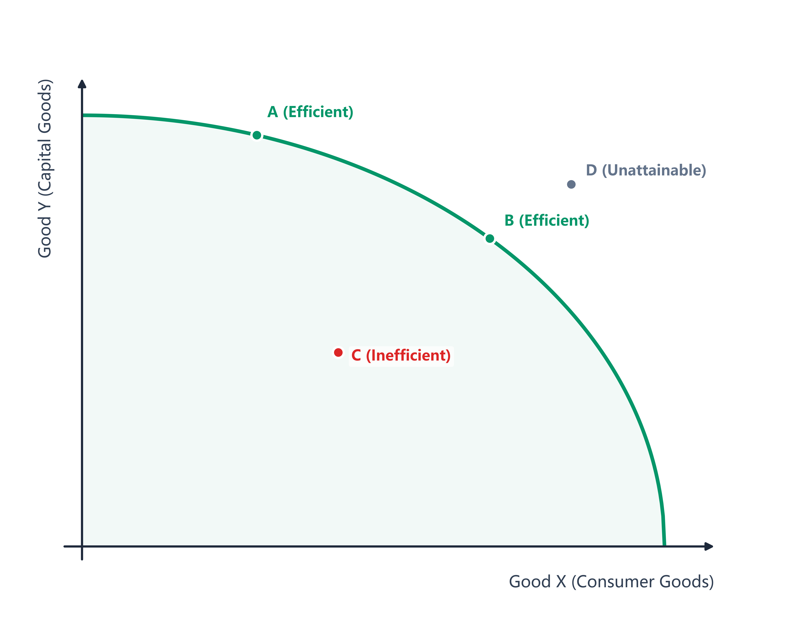

**PPC 五步读图法：**

1. **看坐标轴** — 横轴和纵轴分别代表什么商品？两轴截距分别是什么含义？（截距 = 全部资源只生产一种商品时的最大产量）
2. **看截距** — 横轴截距 = 全部资源用于生产X的最大数量；纵轴截距 = 全部资源用于生产Y的最大数量。截距变化意味着资源或技术的总量变化。
3. **看曲线形状 → 判断机会成本类型** — 凹向原点（concave）= 机会成本递增；直线 = 机会成本恒定。形状由资源的替代性决定。
4. **看斜率 = 机会成本** — 曲线上某点的斜率绝对值 = 多生产1单位X要放弃的Y的数量。沿凹曲线移动，斜率越来越大，说明机会成本递增。
5. **看点位** — 曲线上的点 = 有效率（efficient）；曲线内的点 = 无效率（inefficient/underutilization）；曲线外的点 = 不可达（unattainable）

**PPC 的基本特征：**

- **曲线上的点**：*Efficient*（有效率）— 全部资源充分利用
- **曲线内部的点**：*Inefficient / Underutilization*（无效率）— 存在失业或资源闲置
- **曲线外部的点**：*Unattainable*（不可达）— 当前资源与技术条件下无法实现
- **曲线斜率**：反映机会成本 — 斜率的绝对值 = 多生产一单位 X 所放弃的 Y 数量

**PPC 的形状与机会成本：**

- **凹向原点（Concave）**：表示 *Increasing Opportunity Cost*（机会成本递增）。资源并非同等适用于两种商品的生产，越多资源转向某一商品，额外生产一单位该商品要放弃的另一商品越多。这是现实中最常见的 PPC 形状。
- **直线（Linear）**：表示 *Constant Opportunity Cost*（机会成本恒定）。资源在两种商品生产之间可以等比例转换，斜率不变。

**PPC 数值计算示例 — 机会成本如何递增：**

<table>
<colgroup>
<col style="width:12%"><col style="width:12%"><col style="width:12%"><col style="width:64%">
</colgroup>
<thead>
<tr><th style="text-align:center;vertical-align:middle">组合</th><th style="text-align:center;vertical-align:middle">Guns（枪）</th><th style="text-align:center;vertical-align:middle">Butter（黄油）</th><th style="text-align:center;vertical-align:middle">从上一组合到本组合，多生产1单位Butter的OC（放弃的Guns）</th></tr>
</thead>
<tbody>
<tr><td style="text-align:center;vertical-align:middle">A</td><td style="text-align:center;vertical-align:middle">100</td><td style="text-align:center;vertical-align:middle">0</td><td style="text-align:center;vertical-align:middle">—</td></tr>
<tr><td style="text-align:center;vertical-align:middle">B</td><td style="text-align:center;vertical-align:middle">90</td><td style="text-align:center;vertical-align:middle">20</td><td style="text-align:center;vertical-align:middle">(100-90)/(20-0) = <strong>10/20 = 0.5</strong></td></tr>
<tr><td style="text-align:center;vertical-align:middle">C</td><td style="text-align:center;vertical-align:middle">70</td><td style="text-align:center;vertical-align:middle">40</td><td style="text-align:center;vertical-align:middle">(90-70)/(40-20) = <strong>20/20 = 1.0</strong></td></tr>
<tr><td style="text-align:center;vertical-align:middle">D</td><td style="text-align:center;vertical-align:middle">40</td><td style="text-align:center;vertical-align:middle">60</td><td style="text-align:center;vertical-align:middle">(70-40)/(60-40) = <strong>30/20 = 1.5</strong></td></tr>
<tr><td style="text-align:center;vertical-align:middle">E</td><td style="text-align:center;vertical-align:middle">0</td><td style="text-align:center;vertical-align:middle">80</td><td style="text-align:center;vertical-align:middle">(40-0)/(80-60) = <strong>40/20 = 2.0</strong></td></tr>
</tbody>
</table>

可以看到：多生产同样20单位Butter，需要放弃的Guns从10→20→30→40，即每单位Butter的OC从0.5→1.0→1.5→2.0，**递增**！这就是为什么PPC凹向原点。

**PPC 的移动：**

- **整条曲线向外移动**：*Economic Growth*（经济增长）— 资源增加、技术进步、人力资本提升
- **整条曲线向内移动**：资源减少、技术倒退，或战争/自然灾害破坏生产能力
- **仅一个截距向外移动**：只有一种商品的生产技术/资源改善（偏向性增长）

> 📌 **资本品与增长：** 如果横轴是 consumer goods、纵轴是 capital goods，选择更多 capital goods 往往意味着当前消费减少，但未来生产能力可能更强，因此 PPC 未来更可能向外移动。
>
> 📌 **失业的图形含义：** *Unemployment*（失业）或资源闲置不会让 PPC 本身移动，只会让经济体从曲线上的有效率点移动到曲线内部的无效率点。

> 💡 **记忆口诀：** "**能力变了曲线移，效率变了点上移**"
> - 曲线移动 = 生产**能力**变了（资源增减、技术进步/退步）
> - 点在曲线上移动 = 生产**效率**变了（资源利用率变化，如失业增加→点内移）
>
> ⚠️ **常见误区：** 经济衰退（recession）不是PPC移动！衰退意味着失业增加、资源闲置，经济体从曲线上的点移到曲线内部的点，但PPC本身**不变**。只有当衰退导致人力资本永久损失（如长期失业导致技能退化）时，PPC才可能向内移动。

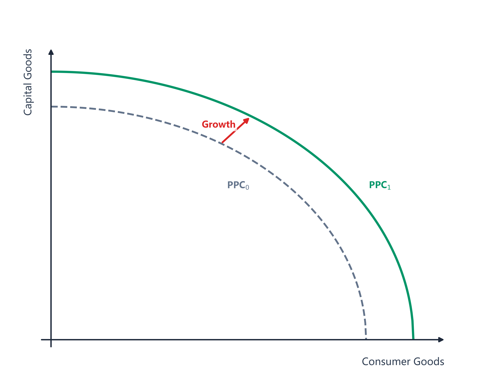

## Comparative Advantage and Gains from Trade 比较优势与贸易收益

贸易的基石是 *Comparative Advantage*（比较优势），而非 *Absolute Advantage*（绝对优势）。

> 💡 **例子：** 你打字快但编程一般，同学编程好但打字慢，你们分工合作效率更高

<table>
<colgroup>
<col style="width:38%"><col style="width:42%"><col style="width:20%">
</colgroup>
<thead>
<tr><th style="text-align:center;vertical-align:middle">概念</th><th style="text-align:center;vertical-align:middle">定义</th><th style="text-align:center;vertical-align:middle">决策依据</th></tr>
</thead>
<tbody>
<tr><td style="text-align:center;vertical-align:middle"><strong>Absolute Advantage</strong>（绝对优势）</td><td style="text-align:center;vertical-align:middle">生产同一商品所需资源更少（或用相同资源生产更多）</td><td style="text-align:center;vertical-align:middle">资源投入量 / 产出量比较</td></tr>
<tr><td style="text-align:center;vertical-align:middle"><strong>Comparative Advantage</strong>（比较优势）</td><td style="text-align:center;vertical-align:middle">生产某一商品的机会成本低于对方</td><td style="text-align:center;vertical-align:middle">机会成本的比较</td></tr>
</tbody>
</table>

$$\text{比较优势判断：比较两国生产同一商品的机会成本，机会成本更低的一方拥有该商品的比较优势。}$$

两国各自专业化生产自己具有比较优势的商品，然后进行贸易，双方都可以获得 *Gains from Trade*（贸易收益）。合理的 *Terms of Trade*（贸易条件）必须落在两国机会成本之间。

**计算机会成本的三种方法：**

- **产出表法**（Output Table）：机会成本 = 放弃的商品数量 / 获得的商品数量
- **投入表法**（Input Table）：机会成本 = 生产一单位 A 所需时间 / 生产一单位 B 所需时间
- **PPC 斜率法**：PPC 的斜率绝对值即为机会成本

**完整计算示例 — 产出表法（Output Table）：**

<table>
<thead>
<tr><th style="text-align:center">国家</th><th style="text-align:center">Wheat（小麦）</th><th style="text-align:center">Cloth（布）</th></tr>
</thead>
<tbody>
<tr><td style="text-align:center">Alpha</td><td style="text-align:center">100</td><td style="text-align:center">50</td></tr>
<tr><td style="text-align:center">Beta</td><td style="text-align:center">60</td><td style="text-align:center">60</td></tr>
</tbody>
</table>

*步骤1：计算各国生产每种商品的机会成本*

Alpha：生产1单位Wheat的OC = 放弃的Cloth / 获得的Wheat = 50/100 = **0.5 Cloth**
Alpha：生产1单位Cloth的OC = 放弃的Wheat / 获得的Cloth = 100/50 = **2 Wheat**

Beta：生产1单位Wheat的OC = 60/60 = **1 Cloth**
Beta：生产1单位Cloth的OC = 60/60 = **1 Wheat**

*步骤2：比较机会成本，确定比较优势*

Wheat：Alpha的OC = 0.5 < Beta的OC = 1 → **Alpha在Wheat上有比较优势**
Cloth：Beta的OC = 1 < Alpha的OC = 2 → **Beta在Cloth上有比较优势**

*步骤3：确定贸易条件范围*

Wheat的贸易条件（用Cloth表示）：0.5 < Terms of Trade < 1（必须落在两国OC之间）

---

**完整计算示例 — 投入表法（Input Table）：**

<table>
<colgroup>
<col style="width:33%"><col style="width:34%"><col style="width:33%">
</colgroup>
<thead>
<tr><th style="text-align:center;vertical-align:middle">国家</th><th style="text-align:center;vertical-align:middle">生产1单位Wheat所需工时</th><th style="text-align:center;vertical-align:middle">生产1单位Cloth所需工时</th></tr>
</thead>
<tbody>
<tr><td style="text-align:center;vertical-align:middle">Alpha</td><td style="text-align:center;vertical-align:middle">4小时</td><td style="text-align:center;vertical-align:middle">8小时</td></tr>
<tr><td style="text-align:center;vertical-align:middle">Beta</td><td style="text-align:center;vertical-align:middle">6小时</td><td style="text-align:center;vertical-align:middle">6小时</td></tr>
</tbody>
</table>

*步骤1：用投入表法计算机会成本（公式：OC of A = Time_A / Time_B）*

Alpha：生产1单位Wheat的OC = 4/8 = **0.5 Cloth**（用4小时可以生产0.5单位Cloth）
Alpha：生产1单位Cloth的OC = 8/4 = **2 Wheat**（用8小时可以生产2单位Wheat）

Beta：生产1单位Wheat的OC = 6/6 = **1 Cloth**
Beta：生产1单位Cloth的OC = 6/6 = **1 Wheat**

*步骤2：结论相同 — Alpha在Wheat有比较优势，Beta在Cloth有比较优势*

> 📌 **AP技巧：** 产出表法中，OC = 分母是你要生产的商品，分子是你放弃的商品（放弃的/获得的）。投入表法中，OC = 生产目标商品所需时间 ÷ 生产另一商品所需时间（Time_A / Time_B）。两种方法结果一致，但公式不同，别混淆！

> ⚠️ **AP考试关键点：** 比较优势决定贸易模式（谁生产什么），而不取决于绝对优势。即使一个国家在所有商品上都具有绝对优势，贸易仍然互利 — 只要机会成本存在差异。

## Marginal Analysis 边际分析

*Marginal Analysis*（边际分析）是经济学最优决策的核心工具。理性决策者会比较边际收益（*Marginal Benefit, MB*）和边际成本（*Marginal Cost, MC*）。

$$\text{最优决策法则：当 } MB \geq MC \text{ 时继续；当 } MB < MC \text{ 时停止。}$$

> 📌 **离散选择 vs 连续选择：** 离散选择中，最优数量是**最后一单位满足 $MB \geq MC$ 且下一单位 $MB < MC$** 的那一个（不一定恰好 $MB = MC$）。在连续、可微的内点解中，最优条件通常写为 $MB = MC$。边界解（如全部买或不买）也未必满足等式。

边际分析关注“多做一单位”的影响，而不是平均值或总量。AP 题目常把它写成：

- 如果 $MB > MC$，增加该活动会提高净收益。
- 如果 $MB < MC$，减少该活动会提高净收益。
- 最优数量通常在 $MB = MC$ 附近。

**MB/MC 决策数值示例 — 学习时间分配：**

<table>
<colgroup>
<col style="width:15%"><col style="width:15%"><col style="width:15%"><col style="width:12%"><col style="width:28%">
</colgroup>
<thead>
<tr><th style="text-align:center;vertical-align:middle">学习小时数</th><th style="text-align:center;vertical-align:middle">Marginal Benefit (MB)</th><th style="text-align:center;vertical-align:middle">Marginal Cost (MC)</th><th style="text-align:center;vertical-align:middle">MB vs MC</th><th style="text-align:center;vertical-align:middle">决策</th></tr>
</thead>
<tbody>
<tr><td style="text-align:center;vertical-align:middle">第1小时</td><td style="text-align:center;vertical-align:middle">20分</td><td style="text-align:center;vertical-align:middle">5分</td><td style="text-align:center;vertical-align:middle">MB &gt; MC</td><td style="text-align:center;vertical-align:middle">✅ 继续学习</td></tr>
<tr><td style="text-align:center;vertical-align:middle">第2小时</td><td style="text-align:center;vertical-align:middle">16分</td><td style="text-align:center;vertical-align:middle">5分</td><td style="text-align:center;vertical-align:middle">MB &gt; MC</td><td style="text-align:center;vertical-align:middle">✅ 继续学习</td></tr>
<tr><td style="text-align:center;vertical-align:middle">第3小时</td><td style="text-align:center;vertical-align:middle">12分</td><td style="text-align:center;vertical-align:middle">5分</td><td style="text-align:center;vertical-align:middle">MB &gt; MC</td><td style="text-align:center;vertical-align:middle">✅ 继续学习</td></tr>
<tr><td style="text-align:center;vertical-align:middle">第4小时</td><td style="text-align:center;vertical-align:middle">8分</td><td style="text-align:center;vertical-align:middle">5分</td><td style="text-align:center;vertical-align:middle">MB &gt; MC</td><td style="text-align:center;vertical-align:middle">✅ 继续学习</td></tr>
<tr><td style="text-align:center;vertical-align:middle"><strong>第5小时</strong></td><td style="text-align:center;vertical-align:middle"><strong>5分</strong></td><td style="text-align:center;vertical-align:middle"><strong>5分</strong></td><td style="text-align:center;vertical-align:middle"><strong>MB = MC</strong></td><td style="text-align:center;vertical-align:middle"><strong>⭐ 最优！</strong></td></tr>
<tr><td style="text-align:center;vertical-align:middle">第6小时</td><td style="text-align:center;vertical-align:middle">3分</td><td style="text-align:center;vertical-align:middle">5分</td><td style="text-align:center;vertical-align:middle">MB &lt; MC</td><td style="text-align:center;vertical-align:middle">❌ 停止学习</td></tr>
<tr><td style="text-align:center;vertical-align:middle">第7小时</td><td style="text-align:center;vertical-align:middle">1分</td><td style="text-align:center;vertical-align:middle">5分</td><td style="text-align:center;vertical-align:middle">MB &lt; MC</td><td style="text-align:center;vertical-align:middle">❌ 停止学习</td></tr>
</tbody>
</table>

> 📌 **关键：** 最优学习时间 = 5小时，此时 MB = MC。超过5小时后，每多学1小时带来的收益（3分、1分）小于付出的成本（5分），净收益反而减少。这解释了为什么"死磕"不如"适度"——边际分析的核心！

## Consumer Choice 消费者选择

消费者在预算约束下追求效用最大化。

- *Total Utility (TU)*：消费一定量商品获得的总满足度
- *Marginal Utility (MU)*：每多消费一单位商品所增加的额外效用；*Law of Diminishing Marginal Utility*（边际效用递减法则）

> 💡 **例子：** 第一口奶茶最爽，喝到第三杯就不那么开心了

**TU/MU 数值表示例 — 奶茶的边际效用递减：**

<table>
<colgroup>
<col style="width:25%"><col style="width:25%"><col style="width:25%"><col style="width:25%">
</colgroup>
<thead>
<tr><th style="text-align:center;vertical-align:middle">奶茶杯数</th><th style="text-align:center;vertical-align:middle">Total Utility (TU)</th><th style="text-align:center;vertical-align:middle">Marginal Utility (MU)</th><th style="text-align:center;vertical-align:middle">MU的变化</th></tr>
</thead>
<tbody>
<tr><td style="text-align:center;vertical-align:middle">0</td><td style="text-align:center;vertical-align:middle">0</td><td style="text-align:center;vertical-align:middle">—</td><td style="text-align:center;vertical-align:middle">—</td></tr>
<tr><td style="text-align:center;vertical-align:middle">1</td><td style="text-align:center;vertical-align:middle">30</td><td style="text-align:center;vertical-align:middle">30</td><td style="text-align:center;vertical-align:middle">第一杯超满足！</td></tr>
<tr><td style="text-align:center;vertical-align:middle">2</td><td style="text-align:center;vertical-align:middle">50</td><td style="text-align:center;vertical-align:middle">20</td><td style="text-align:center;vertical-align:middle">第二杯还不错</td></tr>
<tr><td style="text-align:center;vertical-align:middle">3</td><td style="text-align:center;vertical-align:middle">60</td><td style="text-align:center;vertical-align:middle">10</td><td style="text-align:center;vertical-align:middle">第三杯一般般</td></tr>
<tr><td style="text-align:center;vertical-align:middle">4</td><td style="text-align:center;vertical-align:middle">64</td><td style="text-align:center;vertical-align:middle">4</td><td style="text-align:center;vertical-align:middle">第四杯有点腻了</td></tr>
<tr><td style="text-align:center;vertical-align:middle">5</td><td style="text-align:center;vertical-align:middle">62</td><td style="text-align:center;vertical-align:middle">-2</td><td style="text-align:center;vertical-align:middle">第五杯反而难受🤢</td></tr>
</tbody>
</table>

> 📌 **注意：** TU先增后减（在第4杯达到最大值64），MU持续递减甚至变负。当MU变负时，继续消费反而降低总效用！

- *Utility Maximization Rule*（效用最大化条件）：

$$\frac{MU_x}{P_x} = \frac{MU_y}{P_y} \quad \text{（每元钱的边际效用相等）}$$

**数值计算示例 — 效用最大化：**

假设商品X（奶茶）价格 $P_x = 10$元，商品Y（蛋糕）价格 $P_y = 20$元，消费者预算为60元。

<table>
<colgroup>
<col style="width:20%"><col style="width:20%"><col style="width:20%"><col style="width:20%"><col style="width:20%">
</colgroup>
<thead>
<tr><th style="text-align:center;vertical-align:middle">数量</th><th style="text-align:center;vertical-align:middle">$MU_x$</th><th style="text-align:center;vertical-align:middle">$MU_x/P_x$</th><th style="text-align:center;vertical-align:middle">$MU_y$</th><th style="text-align:center;vertical-align:middle">$MU_y/P_y$</th></tr>
</thead>
<tbody>
<tr><td style="text-align:center;vertical-align:middle">1</td><td style="text-align:center;vertical-align:middle">80</td><td style="text-align:center;vertical-align:middle"><strong>8</strong></td><td style="text-align:center;vertical-align:middle">100</td><td style="text-align:center;vertical-align:middle"><strong>5</strong></td></tr>
<tr><td style="text-align:center;vertical-align:middle">2</td><td style="text-align:center;vertical-align:middle">60</td><td style="text-align:center;vertical-align:middle"><strong>6</strong></td><td style="text-align:center;vertical-align:middle">80</td><td style="text-align:center;vertical-align:middle"><strong>4</strong></td></tr>
<tr><td style="text-align:center;vertical-align:middle">3</td><td style="text-align:center;vertical-align:middle">40</td><td style="text-align:center;vertical-align:middle"><strong>4</strong></td><td style="text-align:center;vertical-align:middle">60</td><td style="text-align:center;vertical-align:middle"><strong>3</strong></td></tr>
<tr><td style="text-align:center;vertical-align:middle">4</td><td style="text-align:center;vertical-align:middle">20</td><td style="text-align:center;vertical-align:middle"><strong>2</strong></td><td style="text-align:center;vertical-align:middle">40</td><td style="text-align:center;vertical-align:middle"><strong>2</strong></td></tr>
<tr><td style="text-align:center;vertical-align:middle">5</td><td style="text-align:center;vertical-align:middle">10</td><td style="text-align:center;vertical-align:middle"><strong>1</strong></td><td style="text-align:center;vertical-align:middle">20</td><td style="text-align:center;vertical-align:middle"><strong>1</strong></td></tr>
<tr><td style="text-align:center;vertical-align:middle">6</td><td style="text-align:center;vertical-align:middle">5</td><td style="text-align:center;vertical-align:middle"><strong>0.5</strong></td><td style="text-align:center;vertical-align:middle">10</td><td style="text-align:center;vertical-align:middle"><strong>0.5</strong></td></tr>
</tbody>
</table>

*寻找最优组合：* 在离散商品且预算有限的情况下，应**枚举所有满足预算约束的可行消费束**（$10X + 20Y \leq 60$），比较总效用后取最大值。本例给定范围内的边际效用均为正，因此最优束会用完预算；下表列出满足 $10X + 20Y = 60$ 的整数组合：

| 消费束 | 花费 | $TU_x$ | $TU_y$ | 总效用 TU |
|:---:|:---:|:---:|:---:|:---:|
| 6杯奶茶 + 0块蛋糕 | 60 | 80+60+40+20+10+5 = 215 | 0 | 215 |
| 4杯奶茶 + 1块蛋糕 | 60 | 80+60+40+20 = 200 | 100 | **300** |
| 2杯奶茶 + 2块蛋糕 | 60 | 80+60 = 140 | 100+80 = 180 | **320** ✅ |
| 0杯奶茶 + 3块蛋糕 | 60 | 0 | 100+80+60 = 240 | 240 |

**最优消费束：2杯奶茶 + 2块蛋糕**（花费10×2 + 20×2 = 60元，总效用 = 320）

验证：在最优消费束处，$MU_x/P_x = 60/10 = 6$，$MU_y/P_y = 80/20 = 4$。虽然两者未严格相等（离散商品的固有局限），但枚举所有可行束后确认这是预算内总效用最高的组合。若改买"4杯奶茶 + 1块蛋糕"（TU=300），总效用反而更低——因为第3、4杯奶茶的边际效用较低，不如第2块蛋糕带来的80单位效用。

> ⚠️ **常见误区：** 逐单位比较 $MU/P$ 的贪心法在遇到**平局**（两个商品 $MU/P$ 相等）或**预算恰好用完**的离散情况时可能失效。最可靠的方法是枚举所有可行束并直接比较总效用。

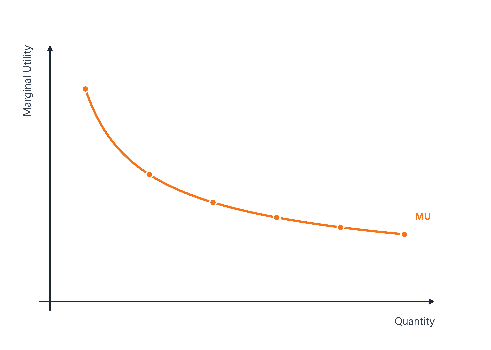

### Budget Constraint 预算约束

*Budget Constraint*（预算约束）表示在收入 $I$ 与商品价格 $P_x, P_y$ 既定时，消费者能负担的最大消费组合：

$$P_x X + P_y Y = I \quad \Rightarrow \quad Y = \frac{I}{P_y} - \frac{P_x}{P_y} X$$

预算线是直线，斜率为 $-P_x/P_y$。收入 $I$ 变化使预算线**平行移动**；价格变化使预算线**旋转**。

**数值示例 — 预算约束：** 假设收入 $I = 100$元，$P_x = 5$元，$P_y = 10$元。

预算方程：$5X + 10Y = 100$，即 $Y = 10 - 0.5X$

<table>
<colgroup>
<col style="width:25%"><col style="width:45%"><col style="width:30%">
</colgroup>
<thead>
<tr><th style="text-align:center;vertical-align:middle">关键点</th><th style="text-align:center;vertical-align:middle">计算过程</th><th style="text-align:center;vertical-align:middle">坐标</th></tr>
</thead>
<tbody>
<tr><td style="text-align:center;vertical-align:middle">横轴截距（全部买X）</td><td style="text-align:center;vertical-align:middle">$X = I/P_x = 100/5 = 20$，$Y = 0$</td><td style="text-align:center;vertical-align:middle">(20, 0)</td></tr>
<tr><td style="text-align:center;vertical-align:middle">纵轴截距（全部买Y）</td><td style="text-align:center;vertical-align:middle">$Y = I/P_y = 100/10 = 10$，$X = 0$</td><td style="text-align:center;vertical-align:middle">(0, 10)</td></tr>
<tr><td style="text-align:center;vertical-align:middle">斜率</td><td style="text-align:center;vertical-align:middle">$-P_x/P_y = -5/10 = -0.5$</td><td style="text-align:center;vertical-align:middle">每多买1单位X，少买0.5单位Y</td></tr>
</tbody>
</table>

**变化分析：**

- **收入增至120元**（价格不变）：截距变为(24, 0)和(0, 12)，预算线**向外平移**（斜率不变，仍为-0.5）
- **$P_x$涨至10元**（收入和$P_y$不变）：横轴截距变为(10, 0)，纵轴截距仍为(0, 10)，预算线**绕纵轴截距向内旋转**（斜率变为-1，更陡）
- **$P_y$降至5元**（收入和$P_x$不变）：横轴截距仍为(20, 0)，纵轴截距变为(0, 20)，预算线**绕横轴截距向外旋转**（斜率变为-1，更陡）

### Indifference Curve 无差异曲线

*Indifference Curve*（无差异曲线）表示给消费者带来相同效用的所有商品组合。三条特征：

- **向下倾斜**：要保持效用不变，多消费 X 必须少消费 Y
- **凸向原点（Convex）**：因 *Diminishing Marginal Rate of Substitution*（边际替代率递减）
- **不相交**：相交会违反传递性

### Marginal Rate of Substitution 边际替代率

*Marginal Rate of Substitution (MRS)* 是消费者在同一条无差异曲线上愿意用 Y 替换 X 的比率：

$$MRS = -\frac{\Delta Y}{\Delta X} = \frac{MU_x}{MU_y}$$

> 📌 **符号约定：** MRS 取正值。无差异曲线向下倾斜，故斜率 $\Delta Y/\Delta X < 0$；加负号后 MRS 为正。等价地，$MRS = |\text{斜率}| = MU_x/MU_y$。

无差异曲线斜率的绝对值即 MRS。沿曲线向右下方移动，MRS 递减 — 这主要来自偏好的**凸性**（convexity of preferences）。两种商品各自边际效用递减并不足以单独保证 MRS 递减，还需要偏好凸性这一更强条件。

### Optimal Consumption Bundle 最优消费束

消费者在**预算线与无差异曲线相切**处达到效用最大化。切点条件（在连续、可分商品且偏好凸的标准假设下的内点解）：

$$MRS = \frac{P_x}{P_y} \quad \Leftrightarrow \quad \frac{MU_x}{P_x} = \frac{MU_y}{P_y}$$

> ⚠️ **注意：** 上述切点条件适用于内点解（两种商品都消费）。若消费者将全部收入用于一种商品，则为**角点解**（corner solution），此时切点条件不必满足，最优解在预算线端点处。

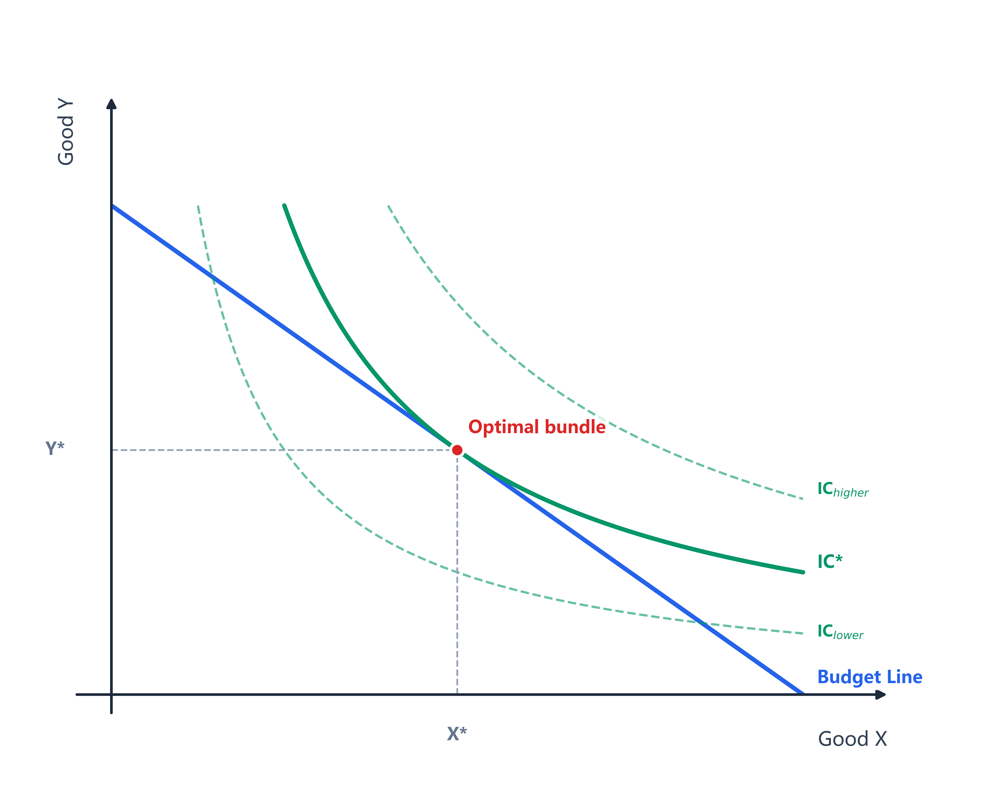

> 📌 **关键等价：** $MRS = P_x/P_y$ 与 $\frac{MU_x}{P_x} = \frac{MU_y}{P_y}$ 是**同一条件的两种表达**。前者从图形（切点斜率）理解，后者从数值（每元边际效用相等）理解 — AP FRQ 两种考法都可能出现。

> ⚠️ **常见误区：** 最优点不是无差异曲线与预算线的任意交点，而必须是**切点**。若两线相交而非相切，消费者可通过调整组合达到更高的无差异曲线。

> 🔗 **概念连接：** 消费者最优条件 $MU_x/P_x = MU_y/P_y$ 与 Unit 3 中企业利润最大化的 $P = MC$ 条件具有深刻的**对偶性**：
> - **消费者侧**：每花1元在不同商品上获得的边际效用相等 → 效用最大化
> - **生产者侧**：每多生产1单位产品的边际收益（价格）等于边际成本 → 利润最大化
> - 两者都体现了**边际量相等时达到最优**的核心思想。在完全竞争市场中，消费者均衡 $MRS = P_x/P_y$ 与生产者均衡 $MRT = MC_x/MC_y$ 在市场均衡处统一，实现资源配置效率（Unit 6 会深入讨论）。

## 例题

### MCQ

1.  The table below shows the number of hours required to produce one unit of each good in two countries, Alpha and Beta.

    <table>
    <colgroup>
    <col style="width:20%"><col style="width:40%"><col style="width:40%">
    </colgroup>
    <thead>
    <tr><th style="text-align:center;vertical-align:middle">Country</th><th style="text-align:center;vertical-align:middle">Hours to produce 1 bushel of corn</th><th style="text-align:center;vertical-align:middle">Hours to produce 1 yard of cloth</th></tr>
    </thead>
    <tbody>
    <tr><td style="text-align:center;vertical-align:middle">Alpha</td><td style="text-align:center;vertical-align:middle">2</td><td style="text-align:center;vertical-align:middle">6</td></tr>
    <tr><td style="text-align:center;vertical-align:middle">Beta</td><td style="text-align:center;vertical-align:middle">3</td><td style="text-align:center;vertical-align:middle">4</td></tr>
    </tbody>
    </table>

    Which of the following is true?

    a) Alpha has an absolute advantage in producing corn, and Beta has an absolute advantage in producing cloth.

    b) Alpha has a comparative advantage in producing corn, and Beta has a comparative advantage in producing cloth.

    c) Alpha has a comparative advantage in producing cloth, and Beta has a comparative advantage in producing corn.

    d) Beta has an absolute advantage in producing both goods.

    e) Alpha has a comparative advantage in producing both goods.

2.  A country can produce only two goods: wheat and cloth. Currently it is producing inside its production possibilities curve. Which of the following must be true?

    a) The country is fully employing all of its resources.

    b) The country cannot produce more wheat without producing less cloth.

    c) The country can produce more of both goods by using its resources more efficiently.

    d) The opportunity cost of producing wheat is increasing.

    e) The country must have a comparative advantage in wheat production.

3.  The table below shows the hours of labor required to produce one unit of each good in two countries.

    <table>
    <colgroup>
    <col style="width:20%"><col style="width:40%"><col style="width:40%">
    </colgroup>
    <thead>
    <tr><th style="text-align:center;vertical-align:middle">Country</th><th style="text-align:center;vertical-align:middle">Hours per car</th><th style="text-align:center;vertical-align:middle">Hours per computer</th></tr>
    </thead>
    <tbody>
    <tr><td style="text-align:center;vertical-align:middle">Alpha</td><td style="text-align:center;vertical-align:middle">6</td><td style="text-align:center;vertical-align:middle">2</td></tr>
    <tr><td style="text-align:center;vertical-align:middle">Beta</td><td style="text-align:center;vertical-align:middle">5</td><td style="text-align:center;vertical-align:middle">10</td></tr>
    </tbody>
    </table>

    Which of the following is true?

    a) Alpha has an absolute advantage in both goods.

    b) Beta has a comparative advantage in cars.

    c) Alpha has a comparative advantage in both goods.

    d) Beta has an absolute advantage in computers.

    e) Neither country has a comparative advantage.

4.  A rational consumer will purchase an additional unit of a good if which of the following is true?

    a) The total benefit exceeds the total cost.

    b) The marginal benefit exceeds the marginal cost.

    c) The average benefit exceeds the average cost.

    d) The total utility is maximized.

    e) The price is less than the consumer's income.

5.  If a consumer's income increases and the prices of both goods remain constant, what will happen to the consumer's budget constraint?

    a) It will shift inward parallel to the original budget constraint.

    b) It will shift outward parallel to the original budget constraint.

    c) It will become steeper.

    d) It will become flatter.

    e) It will remain unchanged.

6.  Nations A and B both produce steel and wheat using only labor. The table below shows the number of labor hours needed to produce one unit of each good.

    | Nation | Hours to produce 1 ton of steel | Hours to produce 1 bushel of wheat |
    |--------|-------------------------------|-----------------------------------|
    | A      | 4                             | 2                                 |
    | B      | 6                             | 3                                 |

    Which of the following is true?

    a) Nation A has an absolute advantage in both goods, and Nation B has a comparative advantage in wheat.

    b) Nation A has a comparative advantage in wheat, and Nation B has a comparative advantage in steel.

    c) Neither nation has a comparative advantage in either good.

    d) Nation A has an absolute advantage in steel, and Nation B exports steel if they trade.

    e) Both nations can gain from trade because their opportunity costs differ.

7.  Janie is deciding whether to attend a two-hour concert that costs \$40 for a ticket. If she does not go to the concert, she could work at her part-time job earning \$15 per hour, or she could tutor a student earning \$20 per hour, or she could study at home. What is Janie's opportunity cost of attending the concert?

    a) \$40

    b) \$70

    c) \$80

    d) \$30

    e) \$55

8.  On a production possibilities curve (PPC) that is bowed outward (concave to the origin), the opportunity cost of producing an additional unit of the good measured on the horizontal axis

    a) is constant as more of that good is produced.

    b) decreases as more of that good is produced.

    c) increases as more of that good is produced.

    d) is zero along the curve.

    e) equals the price of that good.

9.  A consumer spends all of her income on Good X and Good Y. At her current consumption bundle, the marginal utility of Good X is 40 utils, the marginal utility of Good Y is 20 utils, the price of Good X is \$4, and the price of Good Y is \$2. Which of the following is true?

    a) The consumer is maximizing utility.

    b) The consumer should purchase more of Good X and less of Good Y.

    c) The consumer should purchase more of Good Y and less of Good X.

    d) The consumer should purchase more of both goods.

    e) The marginal utility per dollar spent on Good X is greater than that on Good Y.

10. If a consumer's budget constraint shifts outward in a parallel fashion, which of the following could have caused this?

    a) An increase in the price of Good X only.

    b) A decrease in the consumer's income.

    c) An equal percentage decrease in the prices of both goods with money income held constant.

    d) An increase in the price of Good X and a decrease in the price of Good Y.

    e) A decrease in the consumer's preferences for both goods.

### FRQ

Assume two countries, Loriland and Zeeland, produce only two goods: wheat and coffee.

- In Loriland, producing 1 bushel of wheat requires 6 hours of labor, and producing 1 pound of coffee requires 2 hours of labor.

- In Zeeland, producing 1 bushel of wheat requires 4 hours of labor, and producing 1 pound of coffee requires 4 hours of labor.

(a) Calculate the opportunity cost of producing 1 bushel of wheat in Loriland.

(b) Calculate the opportunity cost of producing 1 pound of coffee in Zeeland.

(c) Identify which country has a comparative advantage in producing wheat.

(d) Identify which country has a comparative advantage in producing coffee.

(e) If the terms of trade are 1 bushel of wheat for 2 pounds of coffee, explain why both countries can benefit from trade.

### FRQ 2

The table below shows the marginal utility schedule for a consumer who buys two goods, milk and bread.

| Quantity of milk (bottles) | Marginal utility of milk | Quantity of bread (loaves) | Marginal utility of bread |
|:---:|:---:|:---:|:---:|
| 1 | 30 | 1 | 20 |
| 2 | 24 | 2 | 16 |
| 3 | 18 | 3 | 12 |
| 4 | 12 | 4 | 8 |
| 5 | 6 | 5 | 4 |

The price of milk is \$2 per bottle, the price of bread is \$1 per loaf, and the consumer has a weekly income of \$10 to spend on these two goods. Assume the consumer can purchase at most 5 bottles of milk and 5 loaves of bread, so the table gives the complete quantity range; all purchases are whole units.

(a) What is the marginal utility per dollar of the third bottle of milk? Show your work.

(b) Calculate the total utility the consumer receives from consuming 3 bottles of milk. Show your work.

(c) What is the utility-maximizing combination of milk and bread for this consumer? Explain using marginal analysis and compare the feasible whole-unit bundles.

(d) Suppose the price of milk decreases to \$1 per bottle. Identify the new utility-maximizing combination of milk and bread. Use the same quantity limits and whole-unit assumption.

---

# Supply and Demand

> **考试权重：20–25%**

## Demand 需求

*Demand*（需求）是指在各种可能的价格水平下，消费者愿意并且能够购买的商品数量。**需求不等同于需求量。**

> 📌 **需求 vs. 需求量（Demand vs. Quantity Demanded）——AP 必考辨析：**
> - *Demand*（需求）= **整条需求曲线**，反映在所有可能价格下消费者的购买意愿。只有非价格决定因素（收入、偏好等）变化才会使需求曲线**平移（Shift）**。
> - *Quantity Demanded*（需求量）= **需求曲线上的一个点**，对应某一特定价格下的购买数量。只有商品自身价格变化才会导致需求量变化，表现为**沿曲线移动（Movement）**。
>
> 💡 **生活例子：** 假设奶茶市场，"奶茶的需求增加"意味着在任何价格下消费者都想买更多奶茶（曲线右移，可能因为天气变热）；而"奶茶的需求量增加"只是因为奶茶降价了，消费者沿着同一条需求曲线滑到了更低的价位点。AP 选择题最爱用这两个概念的混淆来设陷阱！

### Law of Demand 需求法则

价格与需求量之间存在**反向关系**：价格上升，需求量减少；价格下降，需求量增加。需求曲线向右下方倾斜，原因有三：

- *Substitution Effect*（替代效应）：商品变贵 → 消费者转向替代品
- *Income Effect*（收入效应）：商品变贵 → 实际购买力下降
- *Diminishing Marginal Utility*（边际效用递减）：随消费量增加，每额外一单位的效用减少，愿意支付的价格递减

**需求表（Demand Schedule）数值示例：**

| 价格 P（$/杯） | 需求量 Qd（杯/天） |
|:-----------:|:--------------:|
| 1           | 100            |
| 2           | 80             |
| 3           | 60             |
| 4           | 40             |
| 5           | 20             |

如上表所示，价格与需求量呈反向关系——这就是需求法则。结合三种效应理解：

- **替代效应**：当价格从 \$2 → \$3（第2行→第3行），奶茶变贵了，消费者转向咖啡等替代品，Qd 从 80 降到 60。
- **收入效应**：价格从 \$2 → \$3 时，消费者实际购买力下降（同样的钱能买更少），不得不减少购买，Qd 下降。
- **边际效用递减**：当消费者已喝了 60 杯（P=\$3），再喝第 61 杯带来的满足感远不如第 1 杯（P=\$1 时的第 81 杯），因此只愿出更低价。

> ⚠️ **常见错误：** 不要把"需求量减少"说成"需求减少"——前者是沿曲线移动（自身价格变化），后者是整条曲线左移（非价格因素变化）。AP 选择题几乎每年都考这个区分！

### Movement vs. Shift

<table>
<colgroup>
<col style="width:16%"><col style="width:42%"><col style="width:42%">
</colgroup>
<thead>
<tr><th style="text-align:center;vertical-align:middle"></th><th style="text-align:center;vertical-align:middle">Movement Along the Curve（沿曲线移动）</th><th style="text-align:center;vertical-align:middle">Shift of the Curve（曲线平移）</th></tr>
</thead>
<tbody>
<tr><td style="text-align:center;vertical-align:middle"><strong>原因</strong></td><td style="text-align:center;vertical-align:middle">商品自身价格（<em>Own Price</em>）变化</td><td style="text-align:center;vertical-align:middle">非价格决定因素（<em>Determinants</em>）变化</td></tr>
<tr><td style="text-align:center;vertical-align:middle"><strong>表现</strong></td><td style="text-align:center;vertical-align:middle">在同一条曲线上点的移动</td><td style="text-align:center;vertical-align:middle">整条曲线向左或向右移动</td></tr>
</tbody>
</table>

> 📌 **7 个典型情景判断——Movement 还是 Shift？**
>
> <table>
> <colgroup>
> <col style="width:45%"><col style="width:15%"><col style="width:40%">
> </colgroup>
> <thead>
> <tr><th style="text-align:center;vertical-align:middle">情景</th><th style="text-align:center;vertical-align:middle">变化类型</th><th style="text-align:center;vertical-align:middle">解释</th></tr>
> </thead>
> <tbody>
> <tr><td style="text-align:center;vertical-align:middle">咖啡自身价格从 $3 降到 $2</td><td style="text-align:center;vertical-align:middle">沿需求曲线<strong>移动</strong>（↓Movement）</td><td style="text-align:center;vertical-align:middle">自身价格变化→需求量变化</td></tr>
> <tr><td style="text-align:center;vertical-align:middle">消费者收入增加</td><td style="text-align:center;vertical-align:middle">需求曲线<strong>右移</strong>（Shift→）</td><td style="text-align:center;vertical-align:middle">收入是非价格决定因素</td></tr>
> <tr><td style="text-align:center;vertical-align:middle">替代品（茶）价格上涨</td><td style="text-align:center;vertical-align:middle">需求曲线<strong>右移</strong>（Shift→）</td><td style="text-align:center;vertical-align:middle">替代品价格是非价格决定因素</td></tr>
> <tr><td style="text-align:center;vertical-align:middle">互补品（奶精）价格下降</td><td style="text-align:center;vertical-align:middle">需求曲线<strong>右移</strong>（Shift→）</td><td style="text-align:center;vertical-align:middle">互补品价格是非价格决定因素</td></tr>
> <tr><td style="text-align:center;vertical-align:middle">消费者预期未来咖啡会涨价</td><td style="text-align:center;vertical-align:middle">需求曲线<strong>右移</strong>（Shift→）</td><td style="text-align:center;vertical-align:middle">预期是非价格决定因素，提前买入</td></tr>
> <tr><td style="text-align:center;vertical-align:middle">咖啡豆涨价→咖啡供给左移→咖啡均衡价格上升→消费者购买减少</td><td style="text-align:center;vertical-align:middle">沿需求曲线<strong>移动</strong>（↑Movement）</td><td style="text-align:center;vertical-align:middle">供给变化改变均衡价格→沿需求曲线移动</td></tr>
> <tr><td style="text-align:center;vertical-align:middle">研究报告称咖啡有益健康</td><td style="text-align:center;vertical-align:middle">需求曲线<strong>右移</strong>（Shift→）</td><td style="text-align:center;vertical-align:middle">偏好是非价格决定因素</td></tr>
> </tbody>
> </table>
>
> ⚠️ **特别注意第6行：** 咖啡豆涨价影响的是**供给**（供给左移），均衡价格上升后消费者**沿需求曲线移动**。题目问"对需求的影响"时答案是"需求量减少（Movement）"，而非"需求减少（Shift）"！

### Determinants of Demand 需求的决定因素

- **收入**（Income）：正常品（*Normal Goods*）收入↑ → 需求↑；劣等品（*Inferior Goods*）收入↑ → 需求↓
- **相关商品价格**：替代品（*Substitutes*）价格↑ → 本商品需求↑；互补品（*Complements*）价格↑ → 本商品需求↓
- **偏好**（Tastes/Preferences）
- **预期**（Expectations）
- **消费者数量**（Number of Buyers）

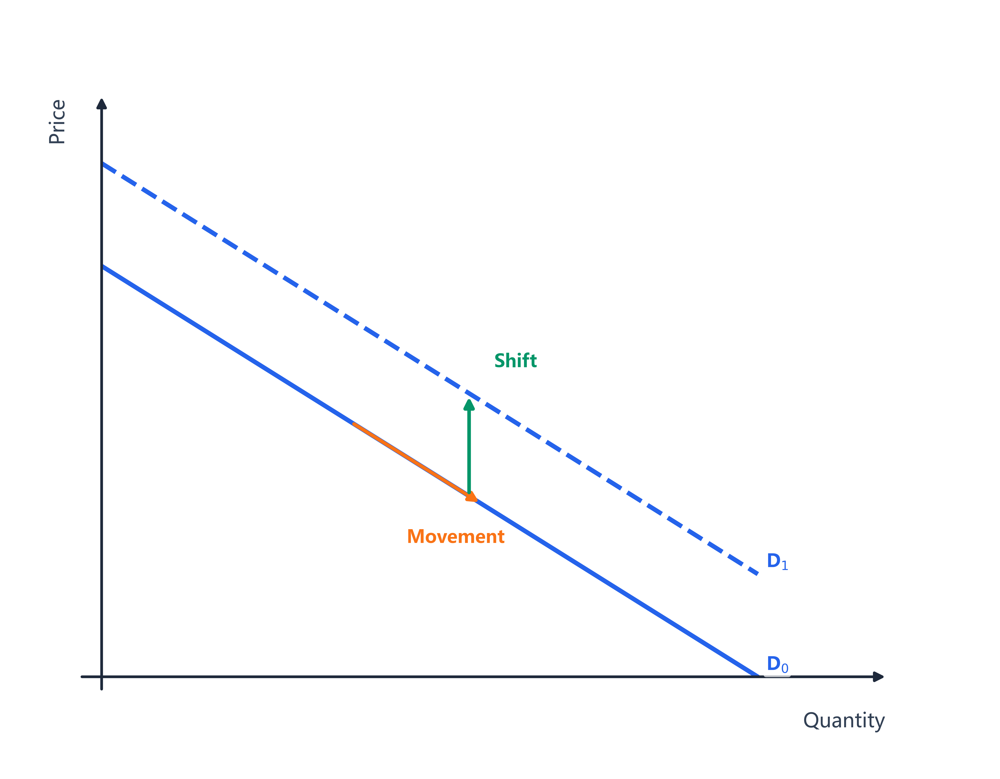

## Supply 供给

*Supply*（供给）是指在各种可能的价格水平下，生产者愿意并且能够生产的商品数量。

> 📌 **供给 vs. 供给量（Supply vs. Quantity Supplied）——与需求对称辨析：**
> - *Supply*（供给）= **整条供给曲线**，反映在所有可能价格下生产者的供给意愿。只有非价格决定因素（投入品价格、技术等）变化才会使供给曲线**平移（Shift）**。
> - *Quantity Supplied*（供给量）= **供给曲线上的一个点**，对应某一特定价格下的供给数量。只有商品自身价格变化才会导致供给量变化，表现为**沿曲线移动（Movement）**。
>
> 💡 **生活例子：** "咖啡豆的供给增加"意味着在任何价格下咖农都愿意供应更多（曲线右移，可能因为丰收或技术进步）；而"咖啡豆的供给量增加"只是因为咖啡豆涨价了，咖农沿着同一条供给曲线滑到了更高的价位点。
>
> 🔗 **概念连接：** Demand/Quantity Demanded 与 Supply/Quantity Supplied 是完全对称的逻辑——记住一个就能推出另一个。AP 考试中两对概念都会考！

### Law of Supply 供给法则

价格与供给量之间存在**正向关系**：价格上升，供给量增加。供给曲线向右上方倾斜，原因是 *Law of Increasing Marginal Cost*（边际成本递增法则）。

### Determinants of Supply 供给的决定因素

- **投入品价格**（Input Prices）：要素价格↑ → 供给↓（曲线左移）
- **技术**（Technology）：技术进步 → 供给↑（曲线右移）
- **相关商品价格**：生产替代品价格↑ → 本商品供给减少
- **预期**（Expectations）
- **卖者数量**（Number of Sellers）
- **政府政策**（税收/补贴）

> ⚠️ **注意：** 价格管制（Price Ceiling / Price Floor）不移动供给曲线，而是设置法定价格上下限，导致沿原供给曲线读取新的供给量。税收和补贴则使供给曲线垂直移动。

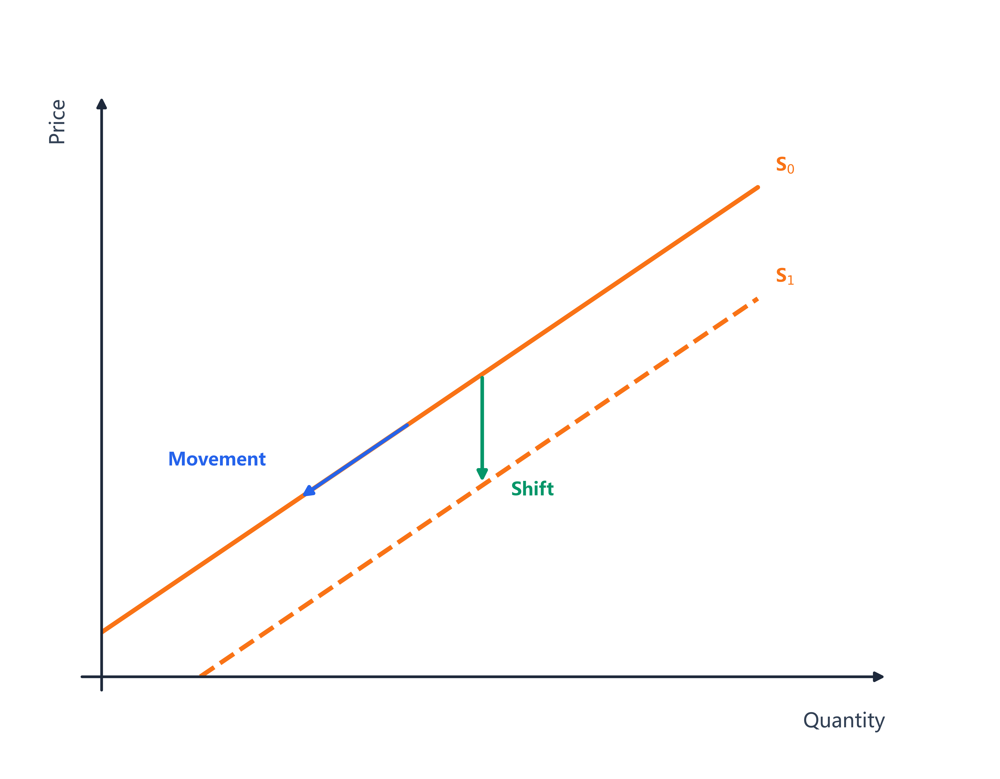

## Market Equilibrium 市场均衡

*Equilibrium*（均衡）发生在供给量与需求量相等的位置 — 需求曲线与供给曲线的交点。

- *Equilibrium Price* ($P_e$)：市场出清价格
- *Equilibrium Quantity* ($Q_e$)：市场出清数量
- *Shortage (Excess Demand)*：当前价格低于均衡价格 → $Q_d > Q_s$
- *Surplus (Excess Supply)*：当前价格高于均衡价格 → $Q_s > Q_d$

> 📌 **均衡价格的代数计算法——AP FRQ 必备技能：**
>
> 假设某商品市场：$Q_d = 100 - 2P$，$Q_s = 20 + 2P$
>
> **第一步：求均衡价格 $P_e$**
>
> 令 $Q_d = Q_s$：$100 - 2P = 20 + 2P$ → $80 = 4P$ → **$P_e = 20$**
>
> **第二步：求均衡数量 $Q_e$**
>
> 代入任一方程：$Q_e = 100 - 2(20) = 60$（或 $Q_e = 20 + 2(20) = 60$，验证一致）
>
> **第三步：验证短缺（Shortage）**
>
> 若政府设价格上限 $P = 15$：$Q_d = 100 - 2(15) = 70$，$Q_s = 20 + 2(15) = 50$ → **Shortage = $Q_d - Q_s = 20$**
>
> **第四步：验证过剩（Surplus）**
>
> 若政府设价格下限 $P = 25$：$Q_d = 100 - 2(25) = 50$，$Q_s = 20 + 2(25) = 70$ → **Surplus = $Q_s - Q_d = 20$**
>
> 💡 **解题技巧：** AP FRQ 经常要求先算均衡，再算干预后的短缺/过剩。记住顺序：先令 $Q_d = Q_s$ 解出 $P_e$，再代入求 $Q_e$，最后代入管制价格求 Shortage/Surplus。

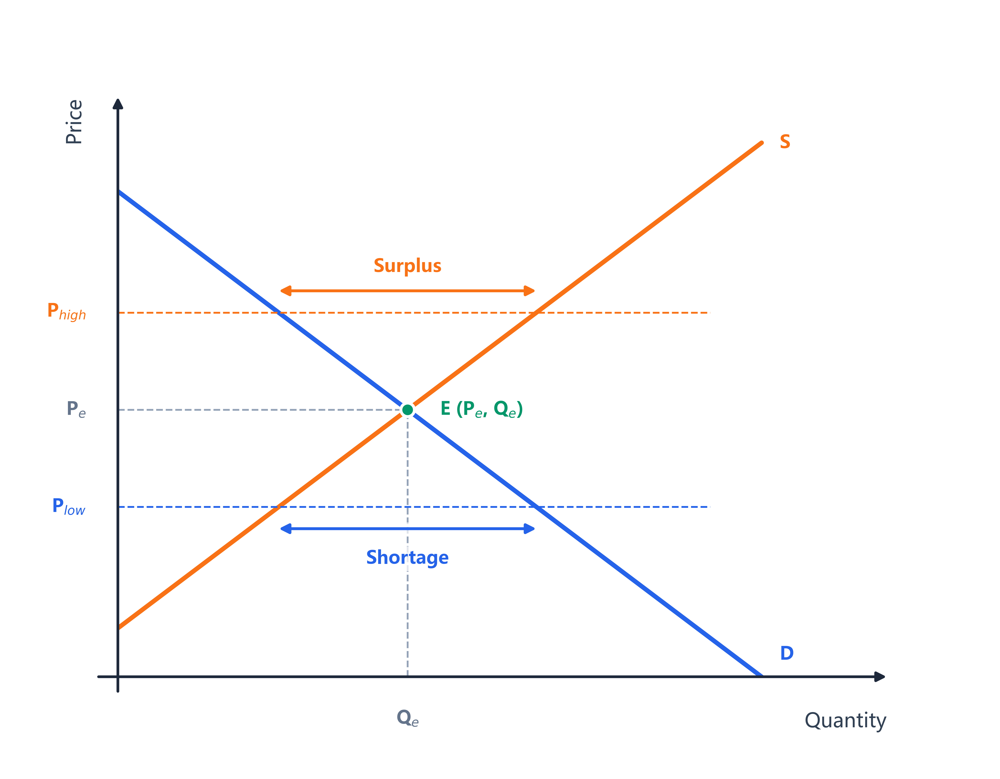

> 📌 **理论桥梁（重要）：** 在竞争市场且不存在外部性等扭曲时，需求曲线可解释为消费者的 *Marginal Benefit (MB)* 曲线 — 每一数量下消费者愿意支付的最高价格反映该单位带来的边际效用。供给曲线可由厂商 *Marginal Cost (MC)* 聚合得到 — 每一数量下生产者愿意接受的最低价格反映该单位的边际成本。这一对应是 2.7 节 CS/PS 与 Unit 3 配置效率（$P=MC$）推导的根基，AP FRQ 常在此设问。

## Comparative Statics 比较静态分析

<table>
<colgroup>
<col style="width:40%"><col style="width:30%"><col style="width:30%">
</colgroup>
<thead>
<tr><th style="text-align:center;vertical-align:middle">变化</th><th style="text-align:center;vertical-align:middle">$P_e$</th><th style="text-align:center;vertical-align:middle">$Q_e$</th></tr>
</thead>
<tbody>
<tr><td style="text-align:center;vertical-align:middle">需求↑</td><td style="text-align:center;vertical-align:middle">↑</td><td style="text-align:center;vertical-align:middle">↑</td></tr>
<tr><td style="text-align:center;vertical-align:middle">需求↓</td><td style="text-align:center;vertical-align:middle">↓</td><td style="text-align:center;vertical-align:middle">↓</td></tr>
<tr><td style="text-align:center;vertical-align:middle">供给↑</td><td style="text-align:center;vertical-align:middle">↓</td><td style="text-align:center;vertical-align:middle">↑</td></tr>
<tr><td style="text-align:center;vertical-align:middle">供给↓</td><td style="text-align:center;vertical-align:middle">↑</td><td style="text-align:center;vertical-align:middle">↓</td></tr>
<tr><td style="text-align:center;vertical-align:middle">需求↑ + 供给↑</td><td style="text-align:center;vertical-align:middle">不确定</td><td style="text-align:center;vertical-align:middle">↑</td></tr>
<tr><td style="text-align:center;vertical-align:middle">需求↓ + 供给↓</td><td style="text-align:center;vertical-align:middle">不确定</td><td style="text-align:center;vertical-align:middle">↓</td></tr>
<tr><td style="text-align:center;vertical-align:middle">需求↑ + 供给↓</td><td style="text-align:center;vertical-align:middle">↑</td><td style="text-align:center;vertical-align:middle">不确定</td></tr>
<tr><td style="text-align:center;vertical-align:middle">需求↓ + 供给↑</td><td style="text-align:center;vertical-align:middle">↓</td><td style="text-align:center;vertical-align:middle">不确定</td></tr>
</tbody>
</table>

> 📌 **比较静态分析逐步推理——每个场景的推导逻辑：**
>
> 1. **需求↑**：D 右移 → 新交点在 S 上方偏右 → P↑、Q↑
> 2. **需求↓**：D 左移 → 新交点在 S 下方偏左 → P↓、Q↓
> 3. **供给↑**：S 右移 → 新交点在 D 下方偏右 → P↓、Q↑
> 4. **供给↓**：S 左移 → 新交点在 D 上方偏左 → P↑、Q↓
> 5. **需求↑ + 供给↑**：D 右移→P↑Q↑，S 右移→P↓Q↑；Q 同向（都↑→确定↑），P 反向（一↑一↓→不确定）
> 6. **需求↓ + 供给↓**：D 左移→P↓Q↓，S 左移→P↑Q↓；Q 同向（都↓→确定↓），P 反向→不确定
> 7. **需求↑ + 供给↓**：D 右移→P↑Q↑，S 左移→P↑Q↓；P 同向（都↑→确定↑），Q 反向→不确定
> 8. **需求↓ + 供给↑**：D 左移→P↓Q↓，S 右移→P↓Q↑；P 同向（都↓→确定↓），Q 反向→不确定
>
> 📌 **记忆口诀：同向变 Q 确定 P 不确定，反向变 P 确定 Q 不确定。**
> - "同向"= 两条曲线同方向移动（都右移或都左移）→ Q 一定变化、P 不确定
> - "反向"= 两条曲线反方向移动（一左一右）→ P 一定变化、Q 不确定
>
> ⚠️ **常见错误：** 看到"需求↑ + 供给↑"就写 P↑Q↑ 是错的！必须分别分析 D 和 S 各自对 P 和 Q 的影响方向，再判断是否矛盾。

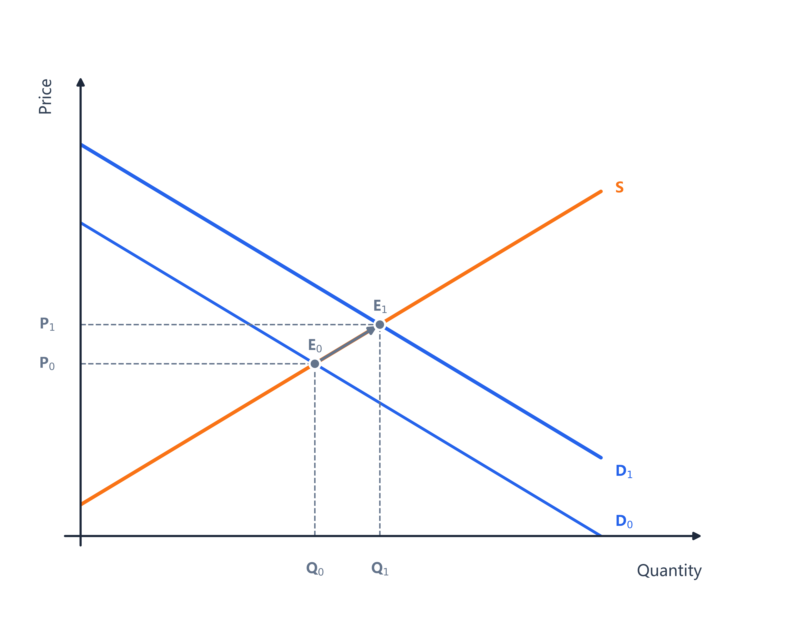

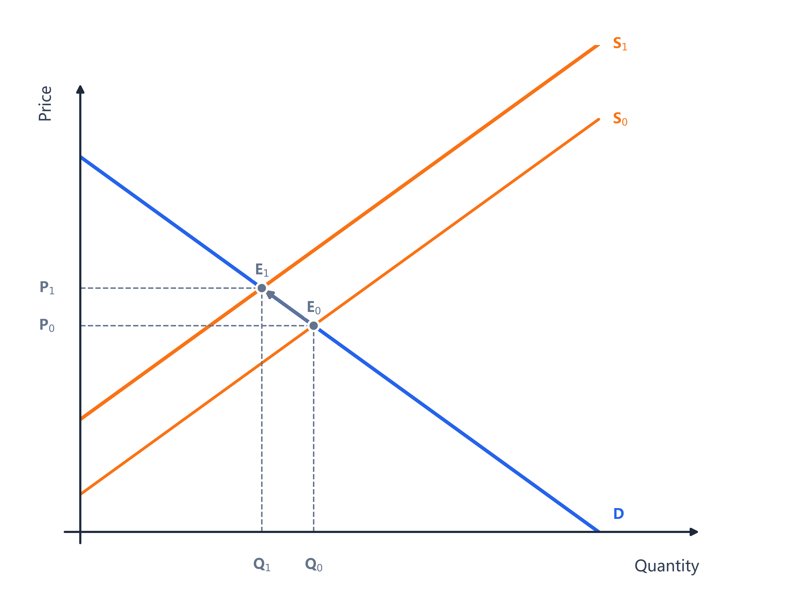

## Elasticity 弹性

*Elasticity*（弹性）衡量一个变量对另一个变量变化的反应程度。在 AP 微观经济学中，最重要的是需求的价格弹性。

> 💡 **例子：** 食盐涨价你还是会买（inelastic），但奶茶涨价你可能就不买了（elastic）

### Price Elasticity of Demand (PED) 需求的价格弹性

$$PED = \left|\frac{\%\Delta Q_d}{\%\Delta P}\right|$$

$$PED = \left|\frac{\Delta Q / Q_{avg}}{\Delta P / P_{avg}}\right| \quad \text{（midpoint formula，中点公式）}$$

AP 题目若直接给出百分比变化，使用第一条公式；若给出两个价格和两个数量，优先使用 midpoint formula，避免起点不同导致答案不一致。

> 📌 **中点公式完整计算示例——务必掌握！**
>
> 已知：$P_1 = 8$，$Q_1 = 100$，$P_2 = 10$，$Q_2 = 80$
>
> **第一步：计算变化量**
>
> $\Delta Q = Q_2 - Q_1 = 80 - 100 = -20$，$\Delta P = P_2 - P_1 = 10 - 8 = 2$
>
> **第二步：计算中点（平均值）**
>
> $Q_{avg} = (Q_1 + Q_2) / 2 = (100 + 80) / 2 = 90$，$P_{avg} = (P_1 + P_2) / 2 = (8 + 10) / 2 = 9$
>
> **第三步：代入中点公式**
>
> $$PED = \left|\frac{\Delta Q / Q_{avg}}{\Delta P / P_{avg}}\right| = \left|\frac{-20/90}{2/9}\right| = \left|\frac{-0.222}{0.222}\right| = |-1.0| = 1.0$$
>
> **结论：** PED = 1.0，属于 *Unit Elastic*（单位弹性）。价格变化的百分比与需求量变化的百分比恰好相等。
>
> ⚠️ **常见错误：** 若不用中点公式而以 $P_1$、$Q_1$ 为基准，则 PED = |(-20/100)/(2/8)| = |(-0.2)/(0.25)| = 0.8；以 $P_2$、$Q_2$ 为基准则 PED = |(-20/80)/(2/10)| = |(-0.25)/(0.2)| = 1.25——起点不同结果不同！中点公式消除了这一歧义，AP 考试要求使用中点公式。

$$TR = P \times Q$$

**Total Revenue (TR) 与弹性：** 当需求富有弹性（*elastic*, $|PED|>1$）时，价格上升会使数量下降得更多，所以 TR 下降；价格下降会使 TR 上升。当需求缺乏弹性（*inelastic*, $|PED|<1$）时，价格上升会使 TR 上升；价格下降会使 TR 下降。单位弹性（*unit elastic*, $|PED|=1$）时，价格变化不改变 TR。

<table>
<colgroup>
<col style="width:34%"><col style="width:12%"><col style="width:38%"><col style="width:16%">
</colgroup>
<thead>
<tr><th style="text-align:center;vertical-align:middle">弹性类型</th><th style="text-align:center;vertical-align:middle">|PED|</th><th style="text-align:center;vertical-align:middle">特征</th><th style="text-align:center;vertical-align:middle">价格↑ → TR?</th></tr>
</thead>
<tbody>
<tr><td style="text-align:center;vertical-align:middle">Perfectly Inelastic（完全无弹性）</td><td style="text-align:center;vertical-align:middle">= 0</td><td style="text-align:center;vertical-align:middle">需求量不随价格变化；垂直需求线</td><td style="text-align:center;vertical-align:middle">TR↑</td></tr>
<tr><td style="text-align:center;vertical-align:middle">Relatively Inelastic（缺乏弹性）</td><td style="text-align:center;vertical-align:middle">&lt; 1</td><td style="text-align:center;vertical-align:middle">需求量变化幅度 &lt; 价格变化幅度</td><td style="text-align:center;vertical-align:middle">TR↑</td></tr>
<tr><td style="text-align:center;vertical-align:middle">Unit Elastic（单位弹性）</td><td style="text-align:center;vertical-align:middle">= 1</td><td style="text-align:center;vertical-align:middle">需求量变化幅度 = 价格变化幅度</td><td style="text-align:center;vertical-align:middle">TR 不变</td></tr>
<tr><td style="text-align:center;vertical-align:middle">Relatively Elastic（富有弹性）</td><td style="text-align:center;vertical-align:middle">&gt; 1</td><td style="text-align:center;vertical-align:middle">需求量变化幅度 &gt; 价格变化幅度</td><td style="text-align:center;vertical-align:middle">TR↓</td></tr>
<tr><td style="text-align:center;vertical-align:middle">Perfectly Elastic（完全弹性）</td><td style="text-align:center;vertical-align:middle">= ∞</td><td style="text-align:center;vertical-align:middle">价格微小上升导致需求量降为零；水平需求线</td><td style="text-align:center;vertical-align:middle">TR→0</td></tr>
</tbody>
</table>

> 📌 **Total Revenue Test（总收入检验）：** 如果涨价使 TR 增加 → 需求缺乏弹性；如果涨价使 TR 减少 → 需求富有弹性。这是 AP 考试中频繁出现的考点。

**TR Test 数值验证表：**

<table>
<colgroup>
<col style="width:28%"><col style="width:24%"><col style="width:24%"><col style="width:24%">
</colgroup>
<thead>
<tr><th style="text-align:center;vertical-align:middle">弹性类型</th><th style="text-align:center;vertical-align:middle">初始 P, Q → TR</th><th style="text-align:center;vertical-align:middle">涨价后 P, Q → TR</th><th style="text-align:center;vertical-align:middle">TR 变化</th></tr>
</thead>
<tbody>
<tr><td style="text-align:center;vertical-align:middle">Inelastic（缺乏弹性）</td><td style="text-align:center;vertical-align:middle">P=$2, Q=100 → TR=$200</td><td style="text-align:center;vertical-align:middle">P=$3, Q=90 → TR=$270</td><td style="text-align:center;vertical-align:middle">TR↑</td></tr>
<tr><td style="text-align:center;vertical-align:middle">Elastic（富有弹性）</td><td style="text-align:center;vertical-align:middle">P=$2, Q=100 → TR=$200</td><td style="text-align:center;vertical-align:middle">P=$3, Q=50 → TR=$150</td><td style="text-align:center;vertical-align:middle">TR↓</td></tr>
<tr><td style="text-align:center;vertical-align:middle">Unit Elastic（单位弹性）</td><td style="text-align:center;vertical-align:middle">P=$2, Q=100 → TR=$200</td><td style="text-align:center;vertical-align:middle">P=$4, Q=50 → TR=$200</td><td style="text-align:center;vertical-align:middle">TR 不变</td></tr>
</tbody>
</table>

> 💡 **解读：** Inelastic 时数量下降很少（90 vs 100，降10%），价格上涨更多（\$3 vs \$2，涨50%），所以 TR 增加；Elastic 时数量下降剧烈（50 vs 100，降50%），抵消了价格上涨带来的收益。AP 选择题常给出 P 和 Q 的变化让你判断弹性类型——直接用 TR Test！
>
> 🔗 **概念连接：** TR Test 的结论与 PED > 1 / < 1 / = 1 完全等价。记住：**弹性大→数量对价格敏感→涨价得不偿失→TR↓**。

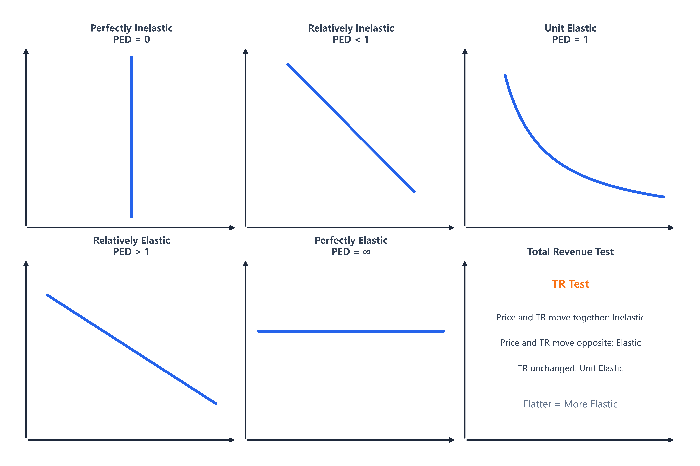

### Determinants of PED 影响需求弹性的因素

- **替代品数量**：替代品越多 → 弹性越大
- **必需品 vs 奢侈品**：必需品弹性小，奢侈品弹性大
- **占收入比重**：比重越大 → 弹性越大
- **时间跨度**：时间越长 → 弹性越大（消费者有更多时间调整行为）

### Other Elasticities 其他弹性

- *Price Elasticity of Supply (PES)*：$\%\Delta Q_s / \%\Delta P$

PES 衡量供给量对价格变化的敏感程度。与 PED 类似，根据 |PES| 的大小可分为五种类型：

<table>
<colgroup>
<col style="width:26%"><col style="width:14%"><col style="width:34%"><col style="width:26%">
</colgroup>
<thead>
<tr><th style="text-align:center;vertical-align:middle">PES 类型</th><th style="text-align:center;vertical-align:middle">|PES|</th><th style="text-align:center;vertical-align:middle">图形特征</th><th style="text-align:center;vertical-align:middle">典型案例</th></tr>
</thead>
<tbody>
<tr><td style="text-align:center;vertical-align:middle">Perfectly Inelastic（完全无弹性）</td><td style="text-align:center;vertical-align:middle">= 0</td><td style="text-align:center;vertical-align:middle">垂直供给线；供给量不随价格变化</td><td style="text-align:center;vertical-align:middle">土地、绝版收藏品</td></tr>
<tr><td style="text-align:center;vertical-align:middle">Relatively Inelastic（缺乏弹性）</td><td style="text-align:center;vertical-align:middle">&lt; 1</td><td style="text-align:center;vertical-align:middle">供给线较陡；供给量变化幅度 &lt; 价格变化幅度</td><td style="text-align:center;vertical-align:middle">农产品（短期）</td></tr>
<tr><td style="text-align:center;vertical-align:middle">Unit Elastic（单位弹性）</td><td style="text-align:center;vertical-align:middle">= 1</td><td style="text-align:center;vertical-align:middle">供给量变化幅度 = 价格变化幅度</td><td style="text-align:center;vertical-align:middle">较少见，理论参考</td></tr>
<tr><td style="text-align:center;vertical-align:middle">Relatively Elastic（富有弹性）</td><td style="text-align:center;vertical-align:middle">&gt; 1</td><td style="text-align:center;vertical-align:middle">供给线较平；供给量变化幅度 &gt; 价格变化幅度</td><td style="text-align:center;vertical-align:middle">轻工业品（长期）</td></tr>
<tr><td style="text-align:center;vertical-align:middle">Perfectly Elastic（完全弹性）</td><td style="text-align:center;vertical-align:middle">= ∞</td><td style="text-align:center;vertical-align:middle">水平供给线；价格微小变化导致供给量无限变化</td><td style="text-align:center;vertical-align:middle">理论上在给定价格可无限供给的情形（注：完全竞争单厂商面对的是完全弹性<span style="color:red">需求</span>，非供给）</td></tr>
</tbody>
</table>

**Determinants of PES 影响供给弹性的因素：**

- **时间跨度**：长期弹性 > 短期（长期可调整产能）
- **库存能力**：易存储商品供给更弹性
- **闲置产能**：产能越闲置，提价后越能迅速增产 → 弹性越大
- **要素流动性**：生产要素越容易转入该行业 → 弹性越大

- *Cross-Price Elasticity of Demand (XED)*：$\%\Delta Q_{d,A} / \%\Delta P_B$

<table>
<colgroup>
<col style="width:20%"><col style="width:40%"><col style="width:40%">
</colgroup>
<thead>
<tr><th style="text-align:center;vertical-align:middle">XED</th><th style="text-align:center;vertical-align:middle">关系</th><th style="text-align:center;vertical-align:middle">例子</th></tr>
</thead>
<tbody>
<tr><td style="text-align:center;vertical-align:middle">XED > 0</td><td style="text-align:center;vertical-align:middle">替代品（Substitutes）</td><td style="text-align:center;vertical-align:middle">咖啡与茶</td></tr>
<tr><td style="text-align:center;vertical-align:middle">XED < 0</td><td style="text-align:center;vertical-align:middle">互补品（Complements）</td><td style="text-align:center;vertical-align:middle">汽车与汽油</td></tr>
<tr><td style="text-align:center;vertical-align:middle">XED = 0</td><td style="text-align:center;vertical-align:middle">无关商品</td><td style="text-align:center;vertical-align:middle">面包与自行车</td></tr>
</tbody>
</table>

- *Income Elasticity of Demand (YED)*：$\%\Delta Q_d / \%\Delta\text{Income}$

<table>
<colgroup>
<col style="width:20%"><col style="width:40%"><col style="width:40%">
</colgroup>
<thead>
<tr><th style="text-align:center;vertical-align:middle">YED</th><th style="text-align:center;vertical-align:middle">类型</th><th style="text-align:center;vertical-align:middle">例子</th></tr>
</thead>
<tbody>
<tr><td style="text-align:center;vertical-align:middle">YED < 0</td><td style="text-align:center;vertical-align:middle">劣等品（Inferior Goods）</td><td style="text-align:center;vertical-align:middle">公共交通、方便面</td></tr>
<tr><td style="text-align:center;vertical-align:middle">0 < YED < 1</td><td style="text-align:center;vertical-align:middle">必需品（Necessities）</td><td style="text-align:center;vertical-align:middle">米、电、医疗</td></tr>
<tr><td style="text-align:center;vertical-align:middle">YED > 1</td><td style="text-align:center;vertical-align:middle">奢侈品（Luxuries）</td><td style="text-align:center;vertical-align:middle">高档车、珠宝</td></tr>
</tbody>
</table>

## Government Intervention 政府干预

### Price Controls 价格管制

- *Price Ceiling*（价格上限）：法定**最高**价格。若低于均衡价格（*Binding*），将导致持续性的 *Shortage*（短缺）。典型例子：租金管制。
- *Price Floor*（价格下限）：法定**最低**价格。若高于均衡价格（*Binding*），将导致持续性的 *Surplus*（过剩）。典型例子：最低工资、农产品价格支持。

> ⚠️ **关键：** 非约束性（Non-binding）的价格管制对市场无效 — Price Ceiling > $P_e$ 或 Price Floor < $P_e$ 时，市场价格不受影响。

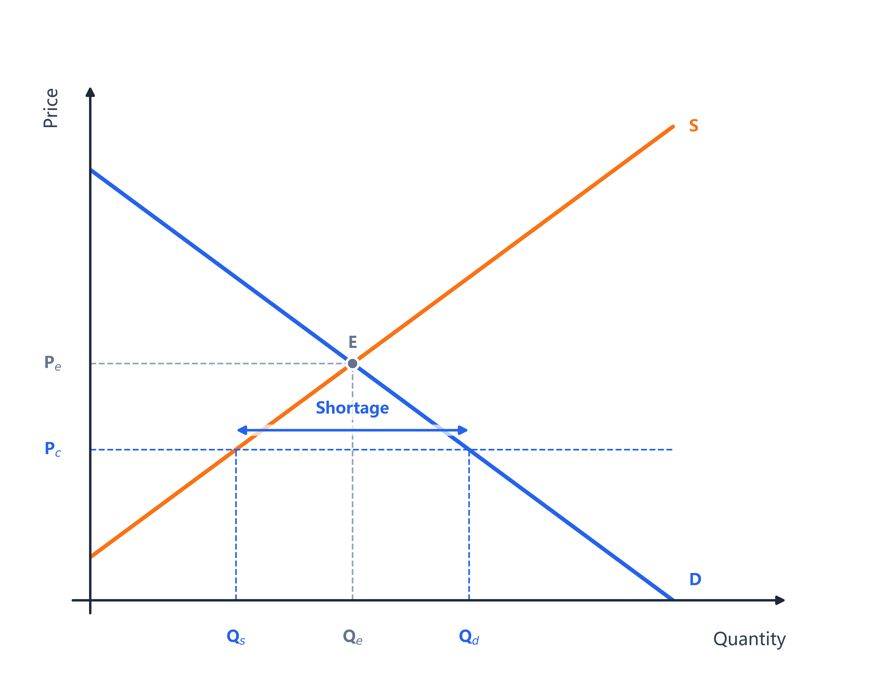

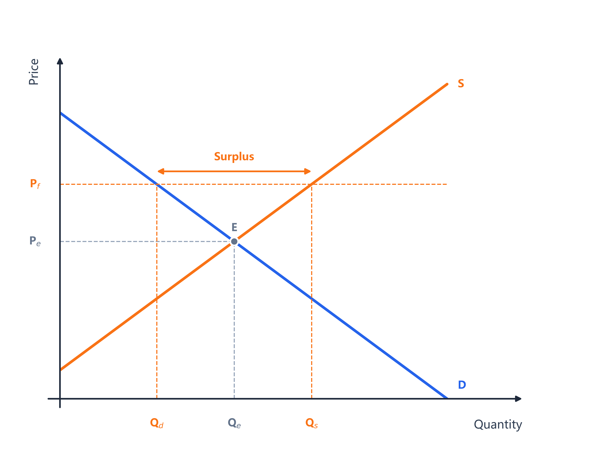

> 📌 **价格管制的完整福利分析——以数值为例：**
>
> 假设市场：$Q_d = 60 - P$，$Q_s = P - 10$，$P_e = 35$，$Q_e = 25$
>
> **均衡时的 CS 和 PS：**
> - 需求曲线纵截距：令 $Q_d = 0$ → $P = 60$，即 $P_{max} = 60$
> - 供给曲线纵截距：令 $Q_s = 0$ → $P = 10$，即 $P_{min} = 10$
> - CS = $\frac{1}{2} \times 25 \times (60 - 35)$ = $\frac{1}{2} \times 25 \times 25$ = **312.5**
> - PS = $\frac{1}{2} \times 25 \times (35 - 10)$ = $\frac{1}{2} \times 25 \times 25$ = **312.5**
> - TS = CS + PS = **625**
>
> **情景一：Binding Price Ceiling $P_c = 30$**（假设有效配给，即支付意愿最高的消费者买到商品）
> - $Q_s = 30 - 10 = 20$（实际交易量 = 20，因为 Shortage 下卖方决定数量）
> - $Q_d = 60 - 30 = 30$ → Shortage = 10
> - 在 $Q = 20$ 处，需求曲线上的价格 $P_d = 60 - 20 = 40$（第20个消费者的支付意愿）
> - CS = 梯形面积 = $\frac{1}{2} \times 20 \times [(60 - 30) + (40 - 30)]$ = $\frac{1}{2} \times 20 \times [30 + 10]$ = **400**
> - PS = $\frac{1}{2} \times 20 \times (30 - 10)$ = $\frac{1}{2} \times 20 \times 20$ = **200**
> - TS = 400 + 200 = **600**
> - **DWL = 625 - 600 = 25**（也可直接算：$\frac{1}{2} \times (25-20) \times (40-30) = 25$）
>
> **情景二：Binding Price Floor $P_f = 40$**（假设有效配给，即成本最低的生产者卖出商品）
> - $Q_d = 60 - 40 = 20$（实际交易量 = 20，因为 Surplus 下买方决定数量）
> - $Q_s = 40 - 10 = 30$ → Surplus = 10
> - 在 $Q = 20$ 处，供给曲线上的价格 $P_s = 10 + 20 = 30$（第20个生产者的边际成本）
> - CS = $\frac{1}{2} \times 20 \times (60 - 40)$ = $\frac{1}{2} \times 20 \times 20$ = **200**
> - PS = 梯形面积 = $\frac{1}{2} \times 20 \times [(40 - 10) + (40 - 30)]$ = $\frac{1}{2} \times 20 \times [30 + 10]$ = **400**
> - TS = 200 + 400 = **600**
> - **DWL = 625 - 600 = 25**
>
> 💡 **规律总结：** 在竞争市场、没有外部性且自由市场均衡是有效率基准的标准模型中，Price Ceiling 或 Price Floor 偏离均衡会减少 TS 并产生 DWL。DWL 的本质是本该发生的互利交易被政策阻止了。
>
> ⚠️ **常见错误：** Price Ceiling 不一定让消费者整体变好！虽然买到的人支付更低价格（CS 中价格部分增加），但交易量减少（CS 中数量部分减少），两者相抵后 CS 可能增加也可能减少——取决于需求曲线的具体形状。

### Taxation & Tax Incidence 税收与税收归宿

政府对商品征税会产生以下效应：

- 卖方税使供给曲线**垂直上移**税额 $t$，买方税使需求曲线**垂直下移**税额 $t$（注意：是垂直移动而非平移，因为每单位税额固定）。无论向买方还是卖方征税，均产生 $P_d - P_s = t$ 的价格楔子（tax wedge），且经济归宿与法定征收对象无关
- 均衡数量减少
- 消费者支付价格上升，生产者收到价格下降
- *Tax Incidence*（税收归宿）取决于弹性：**弹性越小的一方承担越多税负**。如果 demand 更 inelastic，消费者承担更多；如果 supply 更 inelastic，生产者承担更多。
- 产生 *Deadweight Loss (DWL)*（无谓损失）

> 📌 **税收归宿逐步计算——AP FRQ 高频题型：**
>
> 假设市场：$Q_d = 60 - P$，$Q_s = P - 10$
>
> **税前均衡：** 令 $Q_d = Q_s$：$60 - P = P - 10$ → $70 = 2P$ → $P_e = 35$，$Q_e = 25$
>
> 现在政府对每单位商品征收 \$6 的税（向卖者征收）：
>
> **第一步：写出税后供给方程**
>
> 卖者每单位需交 \$6 税，市场价格为 $P$ 时卖者实际收到 $P - 6$。代入原供给方程：
> $Q_s' = (P - 6) - 10 = P - 16$
>
> **第二步：求新均衡**
>
> 令 $Q_d = Q_s'$：$60 - P = P - 16$ → $76 = 2P$ → **$P_{buyer} = 38$**（消费者支付的价格）
>
> 卖者实际收到：$P_{seller} = 38 - 6$ = **32**
>
> 新均衡数量：$Q_t = 60 - 38$ = **22**
>
> **第三步：计算税收归宿**
>
> - 消费者负担 = $P_{buyer} - P_e = 38 - 35$ = **\$3**（价格上涨了 \$3）
> - 生产者负担 = $P_e - P_{seller} = 35 - 32$ = **\$3**（收入减少了 \$3）
> - 总税额 = \$6 × 22 = **\$132**（消费者付 \$3×22 = \$66，生产者付 \$3×22 = \$66）
>
> 💡 **解读：** D 和 S 斜率绝对值相同（都是 1），因此税负均等分担。若需求更 inelastic（需求线更陡），消费者承担更多税负。
>
> **第四步：计算 DWL**
>
> - 税前 CS = $\frac{1}{2} \times 25 \times (60 - 35)$ = $\frac{1}{2} \times 25 \times 25$ = **312.5**
> - 税前 PS = $\frac{1}{2} \times 25 \times (35 - 10)$ = $\frac{1}{2} \times 25 \times 25$ = **312.5**
> - 税前 TS = **625**
> - 税后 CS = $\frac{1}{2} \times 22 \times (60 - 38)$ = $\frac{1}{2} \times 22 \times 22$ = **242**
> - 税后 PS = $\frac{1}{2} \times 22 \times (32 - 10)$ = $\frac{1}{2} \times 22 \times 22$ = **242**
> - 税收收入 = \$6 × 22 = **132**
> - 税后 TS = CS + PS + 税收收入 = 242 + 242 + 132 = **616**
> - **DWL = 625 - 616 = 9**
> - 验证：DWL = $\frac{1}{2} \times t \times \Delta Q$ = $\frac{1}{2} \times 6 \times (25 - 22)$ = $\frac{1}{2} \times 6 \times 3$ = **9** ✓
>
> ⚠️ **线性图示中的便捷公式：** DWL = $\frac{1}{2} \times \text{税额} \times \text{数量减少}$。AP FRQ 常要求同时算出消费者/生产者税负分担和 DWL；非线性曲线应按区域计算。

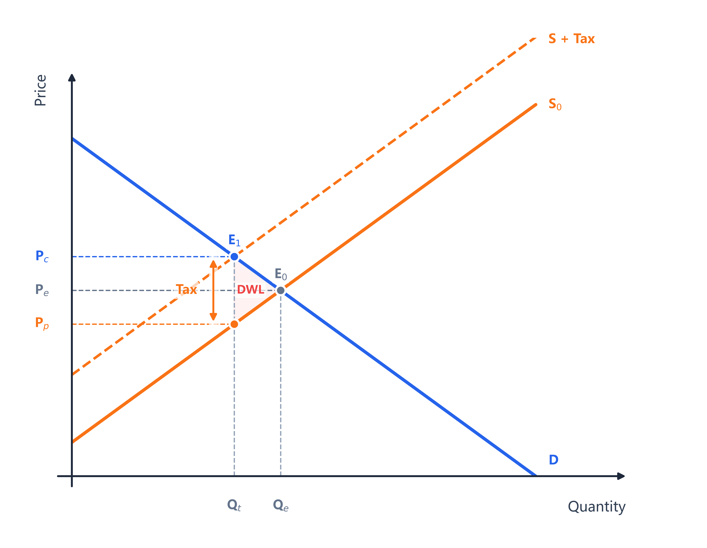

> 💡 **弹性与税收归宿：** 需求越缺乏弹性，消费者承担越多税负；供给越缺乏弹性，生产者承担越多税负。如果需求完全无弹性，消费者承担全部税负；如果需求完全弹性，生产者承担全部税负。

### Subsidy 补贴

补贴可视为 *Negative Tax*。政府补贴导致供给曲线右移（或需求曲线右移），均衡数量增加。在竞争市场且不存在未计入的外部收益或成本时，若补贴使数量偏离有效率水平，通常会产生 DWL；若补贴用于纠正正外部性，则可能提高总剩余。补贴的财政成本由公共财政承担，经济归宿则由市场弹性共同决定。

> 💡 **补贴的生活例子：** 中国政府对新能源汽车每辆补贴数万元 → 厂商降价 → 消费者买得更多 → 产量增加。但补贴来自纳税人，且过度补贴会导致"生产太多"的无谓损失。

**补贴的福利分析：**

- 补贴后：消费者支付价格 $P_c$ 下降，生产者收到价格 $P_s$ 上升，$P_s - P_c = $ 补贴额 $s$
- CS ↑（消费者以更低价格买到更多）
- PS ↑（生产者以更高价格卖出更多）
- 政府支出 = $s \times Q_{after}$（由纳税人承担）
- **在非纠正性补贴情形下，DWL > 0**：因为政府支出 > CS增量 + PS增量，差额即为无谓损失

> ⚠️ **补贴的 DWL 来源：** 补贴鼓励了"成本高于消费者真实估值"的额外产量 — 这些额外单位的边际成本超过边际收益，是对社会资源的浪费。

> 📌 **补贴 vs 税收对比：** 税收使供给左移 → 产量↓、价格↑、CS↓、PS↓、政府收入↑；补贴使供给右移 → 产量↑、价格↓、CS↑、PS↑、政府支出↑。在不纠正外部性的标准比较中，两者都可能产生 DWL，但方向相反。

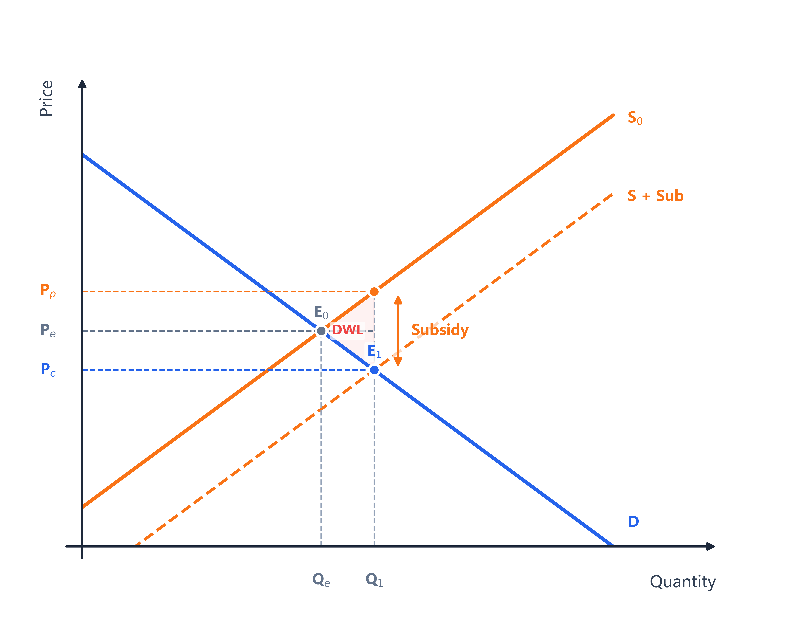

## Consumer Surplus, Producer Surplus & Total Surplus

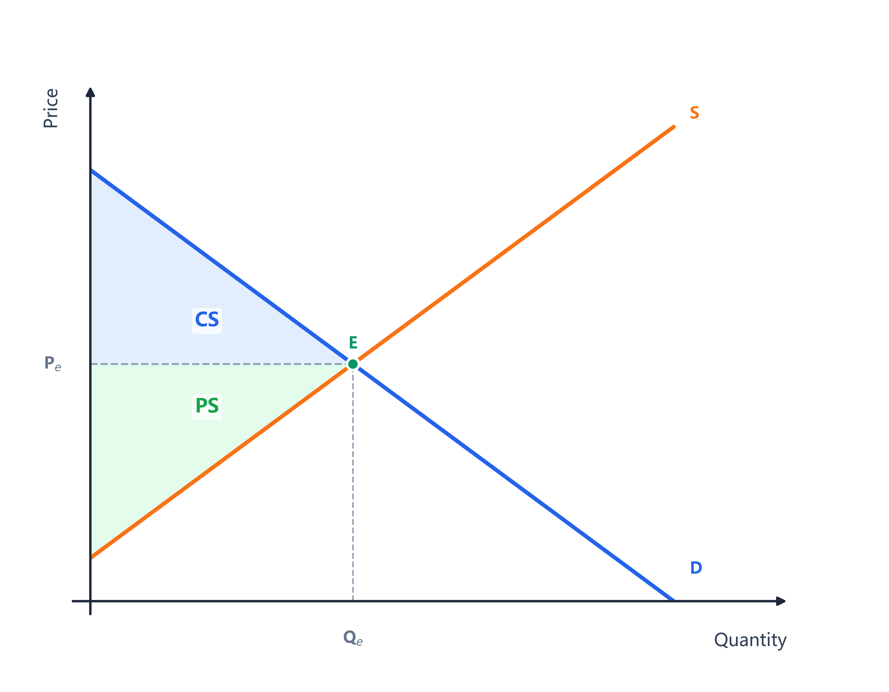

- *Consumer Surplus (CS)*：消费者愿意支付的最高价格与实际支付价格之间的差额。需求曲线以下、价格线以上的区域（线性需求时为三角形）。
- *Producer Surplus (PS)*：生产者实际收到的价格与其最低愿意接受价格之间的差额。价格线以下、供给曲线以上的区域（线性供给时为三角形）。
- *Total Surplus (TS)* = CS + PS。在竞争市场且没有外部性等其他扭曲时，自由市场均衡使 TS 最大；偏离这个有效率基准的干预会产生 DWL。
- *Deadweight Loss (DWL)*：相对于适用的有效率基准所损失的 Total Surplus，而不只是“没有处于均衡状态”本身。

> 💡 **例子：** 政府对奢侈品征税导致富人少买、厂家少生产，这就是无谓损失

> 📌 **CS、PS、DWL 图形读取四步法——AP FRQ 必备：**
>
> **第一步：确认坐标轴与关键价格**
> - 纵轴为价格 P，横轴为数量 Q
> - 找到均衡价格 $P_e$（或政策后的价格）和均衡数量 $Q_e$（或政策后的交易量）
> - 找到需求曲线纵截距 $P_{max}$（消费者愿意付的最高价）和供给曲线纵截距 $P_{min}$（生产者最低愿意接受价）
>
> **第二步：画出价格水平线，划分区域**
> - 过 $P_e$ 画一条水平线，将图形分成上下两部分
>
> **第三步：识别 CS 和 PS**
> - **CS** = 需求曲线**以下**、价格线**以上**的三角形 → 底边 = $Q$，高 = $P_{max} - P_e$
>   - 面积 = $\frac{1}{2} \times Q \times (P_{max} - P_e)$
> - **PS** = 价格线**以下**、供给曲线**以上**的三角形 → 底边 = $Q$，高 = $P_e - P_{min}$
>   - 面积 = $\frac{1}{2} \times Q \times (P_e - P_{min})$
>
> **第四步：识别 DWL**
> - 在本节的线性供需示例中，DWL 可由自由市场总剩余减去实际 CS + PS + 政府收入（如有）得到；一般情形应比较相应的总剩余区域
> - 在线性图上，DWL 常表现为因价格偏离均衡而"缺失"的小三角形
>
> **数值示例：** 沿用 $Q_d = 60 - P$，$Q_s = P - 10$，$P_e = 35$，$Q_e = 25$
> - $P_{max} = 60$（令 $Q_d = 0$），$P_{min} = 10$（令 $Q_s = 0$）
> - CS = $\frac{1}{2} \times 25 \times (60 - 35)$ = $\frac{1}{2} \times 25 \times 25$ = **312.5**
> - PS = $\frac{1}{2} \times 25 \times (35 - 10)$ = $\frac{1}{2} \times 25 \times 25$ = **312.5**
> - TS = **625**
>
> 🔗 **概念连接：** CS 和 PS 的计算将在 Unit 4 中用于判断配置效率（Allocative Efficiency）——当 TS 最大且 DWL = 0 时，市场实现配置效率。

## International Trade and Public Policy 国际贸易与公共政策

### Free Trade 自由贸易

在标准的小国开放经济、竞争市场且不存在外部性或其他贸易扭曲的模型中，开放贸易后国内价格收敛到 *World Price*（$P_w$）。比较 $P_w$ 与封闭均衡价 $P_e$：

- 若 $P_w < P_e$（国内劣势产业）：成为**进口国**。国内价格降至 $P_w$，国内消费量 $Q_d$ > 国内产量 $Q_s$，缺口由进口填补：$Q_{import} = Q_d - Q_s$。
  - CS 增加（消费者以更低价格买到更多商品）
  - PS 减少（生产者以更低价格卖出更少商品）
  - **TS 增加**（CS 增量 > PS 减量）— 贸易创造净收益
- 若 $P_w > P_e$（国内优势产业）：成为**出口国**。国内价格升至 $P_w$，国内产量 > 国内消费量，过剩部分出口：$Q_{export} = Q_s - Q_d$。
  - PS 增加 > CS 减少，TS 增加。

> 📌 **关键：** 在上述标准模型中，无论进口或出口，自由贸易都使 *Total Surplus* 增加 — 这与 1.5 节比较优势的结论一致。

### Tariff 关税

*Tariff*（关税）是对进口商品征收的从量税。以下按 AP 常用的**小国开放经济模型**处理，即世界价格 $P_w$ 外生且不因本国贸易量改变。效果：

- 国内价格上升至 $P_w + t$（$t$ 为单位税额）
- 进口量减少：$Q_{import}^{after} < Q_{import}^{before}$
- 国内产量增加（生产者受益）
- 国内消费量减少（消费者受损）

**福利变化（进口国视角）：**

<table>
<colgroup>
<col style="width:20%"><col style="width:50%"><col style="width:30%">
</colgroup>
<thead>
<tr><th style="text-align:center;vertical-align:middle">区域</th><th style="text-align:center;vertical-align:middle">含义</th><th style="text-align:center;vertical-align:middle">变化</th></tr>
</thead>
<tbody>
<tr><td style="text-align:center;vertical-align:middle">CS</td><td style="text-align:center;vertical-align:middle">消费者剩余</td><td style="text-align:center;vertical-align:middle">↓（价格上升、消费量减少）</td></tr>
<tr><td style="text-align:center;vertical-align:middle">PS</td><td style="text-align:center;vertical-align:middle">生产者剩余</td><td style="text-align:center;vertical-align:middle">↑（价格上升、产量增加）</td></tr>
<tr><td style="text-align:center;vertical-align:middle">Government Revenue</td><td style="text-align:center;vertical-align:middle">政府关税收入 = $t \times Q_{import}^{after}$</td><td style="text-align:center;vertical-align:middle">↑</td></tr>
<tr><td style="text-align:center;vertical-align:middle">DWL</td><td style="text-align:center;vertical-align:middle">无谓损失 = 生产扭曲三角形 + 消费扭曲三角形</td><td style="text-align:center;vertical-align:middle">&gt; 0</td></tr>
</tbody>
</table>

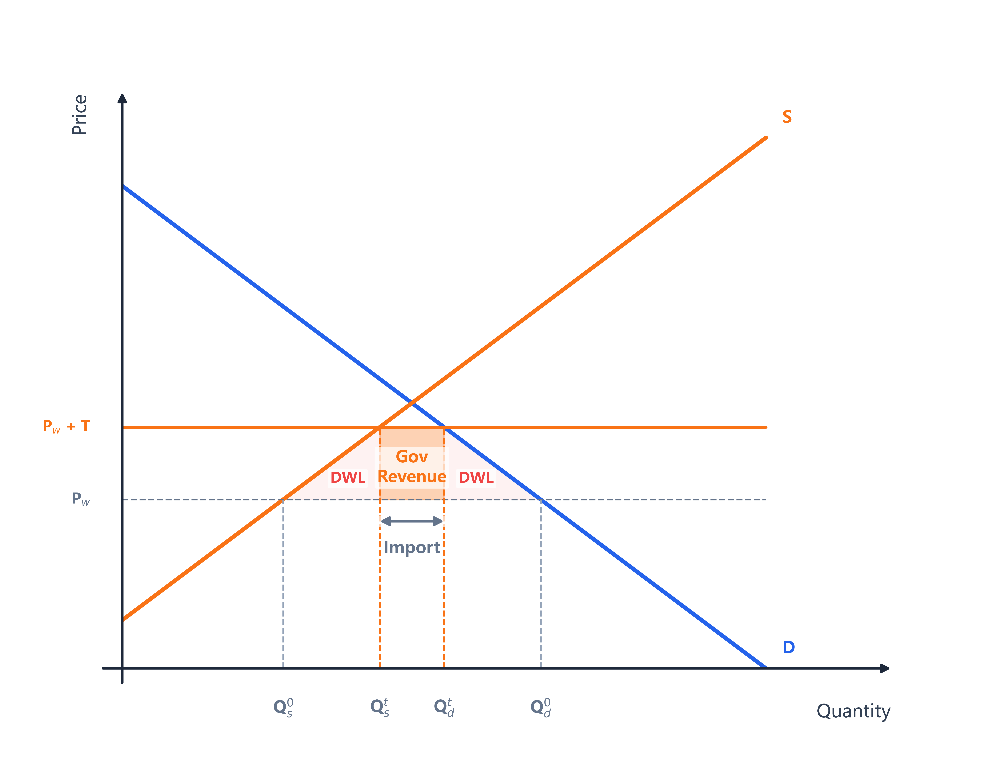

> ⚠️ **DWL 的两部分：** 关税的 DWL 由两个三角形组成 — *Production Distortion*（生产扭曲：低效率国内生产替代进口）+ *Consumption Distortion*（消费扭曲：消费者放弃部分消费）。AP FRQ 常要求在图上分别标出。

> 📌 **关税 DWL 的数值分解——AP FRQ 进阶要求：**
>
> 假设某进口国，自由贸易时世界价格 $P_w = 30$：
> - 自由贸易下：国内产量 $Q_s = 20$，国内消费量 $Q_d = 50$，进口量 = 30
> - 征收关税 $t = \$10$ 后：国内价格升至 $P_w + t = 40$
>   - 国内产量增至 $Q_s' = 28$，国内消费量降至 $Q_d' = 42$，进口量 = 14
>
> **Production Distortion Triangle（生产扭曲三角形）：**
> - 底边 = 国内产量增加 = $Q_s' - Q_s = 28 - 20 = 8$
> - 高 = 关税额 $t = 10$
> - 面积 = $\frac{1}{2} \times 8 \times 10$ = **40**
> - 含义：国内低效率生产替代了高效进口，浪费了社会资源
>
> **Consumption Distortion Triangle（消费扭曲三角形）：**
> - 底边 = 国内消费量减少 = $Q_d - Q_d' = 50 - 42 = 8$
> - 高 = 关税额 $t = 10$
> - 面积 = $\frac{1}{2} \times 8 \times 10$ = **40**
> - 含义：消费者因价格上升放弃了部分消费，失去了本可获得的剩余
>
> **总 DWL = 40 + 40 = 80**
>
> 政府关税收入 = $t \times Q_{import}' = 10 \times 14$ = **140**（这部分从 CS 转移到政府，不是 DWL）
>
> 💡 **记忆方法：** DWL 的两个三角形共享同一条高（= 关税额 $t$），底边分别是国内产量的增加量和国内消费量的减少量。在图上，Production Distortion 在供给曲线一侧，Consumption Distortion 在需求曲线一侧。
>
> 🔗 **概念连接：** 如果配额的进口许可证发给外国生产者，则 Quota Rent（= 140）流向国外。此时：
> - **全球效率损失（DWL）仍为 80**（Production Distortion + Consumption Distortion，与关税相同）
> - **进口国国民福利损失 = 80 + 140 = 220**（效率损失 80 + 配额租金外流 140）
>
> 关键区分：配额租金外流对进口国而言是剩余外流（国民福利损失），但对全球而言是转移支付而非额外效率损失。AP 常考关税 vs 配额的福利对比。

### Quota 配额

*Quota*（进口配额）是政府对进口量设置的数量上限。效果与关税类似（价格上升、进口减少、CS↓、PS↑、产生 DWL），但**关键区别**：

- **无政府税收收入**
- 配额限制下进口量能带来的"价差收益"称为 *Quota Rent*（配额租金），归**进口许可证持有者**（可能是外国政府、进口商或外国生产者，取决于配额分配机制）

<table>
<colgroup>
<col style="width:28%"><col style="width:36%"><col style="width:36%">
</colgroup>
<thead>
<tr><th style="text-align:center"></th><th style="text-align:center">Tariff 关税</th><th style="text-align:center">Quota 配额</th></tr>
</thead>
<tbody>
<tr><td style="text-align:center">价格效应</td><td style="text-align:center">↑ 至 $P_w + t$</td><td style="text-align:center">↑ 至使进口量 = 配额的水平</td></tr>
<tr><td style="text-align:center">政府收入</td><td style="text-align:center">$t \times Q_{import}$</td><td style="text-align:center">无</td></tr>
<tr><td style="text-align:center">配额租金</td><td style="text-align:center">无</td><td style="text-align:center">归许可证持有者</td></tr>
<tr><td style="text-align:center">福利（小国、竞争市场）</td><td style="text-align:center">国内总剩余下降，DWL&gt;0</td><td style="text-align:center">全球配置性 DWL 由生产/消费扭曲决定；若配额租金归外国，进口国还损失租金外流</td></tr>
</tbody>
</table>

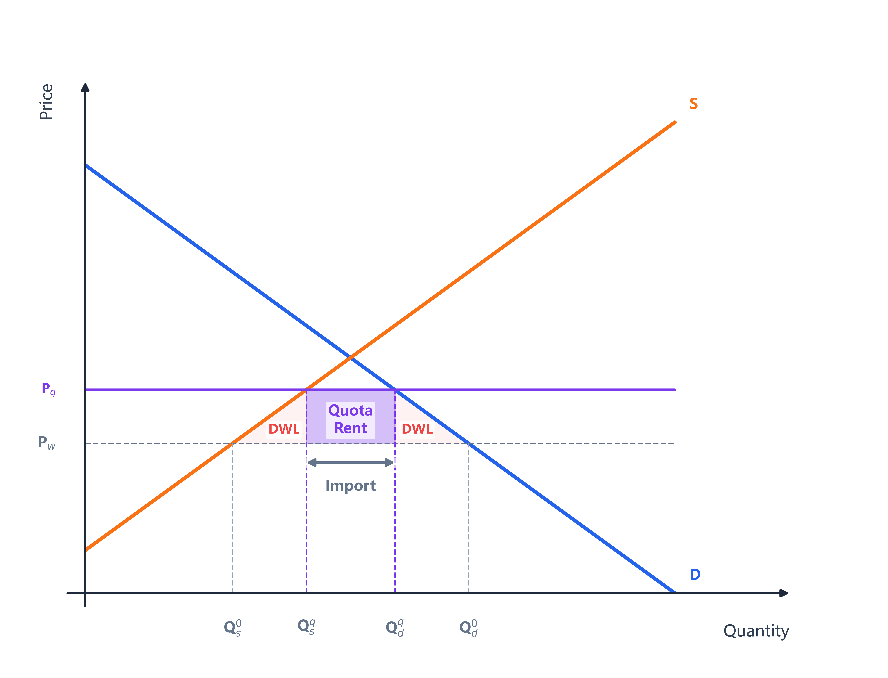

### Export Subsidy 出口补贴

*Export Subsidy*（出口补贴）是政府对出口商品给予的补贴。对**出口国**而言：

- 国内价格上升至 $P_w + s$（补贴额）
- 出口量增加，但国内消费量减少
- 生产者剩余 ↑，消费者剩余 ↓，政府支出 = $s \times Q_{export}^{after}$
- 在小国、竞争市场且不存在外部性的标准模型中，TS↓、DWL>0

> 📌 **关税 vs 配额 vs 出口补贴：** 在上述标准小国模型中，三者都使国内价格偏离世界价格、降低 TS、产生 DWL。关税把一部分剩余转化为政府收入，配额转化为许可证持有者租金，出口补贴则直接由纳税人承担 — AP 常考这三者的福利对比。

## 例题

### MCQ

1.  A local bakery sells apple pies for \$8 each. At that price, the bakery sells 100 pies per day. When the bakery raises the price to \$10, sales fall to 80 pies per day. Using the midpoint formula, what is the price elasticity of demand for apple pies?

    a) 0.5

    b) 0.9

    c) 1.0

    d) 1.1

    e) 2.0

2.  Which of the following would cause a decrease in the demand for apples?

    a) An increase in the price of apples

    b) A decrease in the price of oranges, a substitute for apples

    c) An increase in consumer income if apples are a normal good

    d) A successful advertising campaign for apples

    e) An increase in the population

3.  If the price elasticity of demand for a good is 0.5, a 10 percent increase in price will lead to which of the following changes in quantity demanded?

    a) A 5 percent increase

    b) A 5 percent decrease

    c) A 20 percent decrease

    d) A 20 percent increase

    e) No change

4.  If the government imposes a per-unit tax on a good and the demand is perfectly inelastic, which of the following correctly describes the burden of the tax?

    a) Producers bear the entire burden.

    b) Consumers bear the entire burden.

    c) The burden is shared equally between consumers and producers.

    d) Neither consumers nor producers bear any burden.

    e) The government bears the burden.

5.  A binding price ceiling in a market will result in which of the following?

    a) A surplus of the good

    b) A shortage of the good

    c) An increase in producer surplus

    d) An increase in total surplus

    e) No change in equilibrium quantity

6.  Which of the following would cause the supply curve for automobiles to shift to the right?

    a) An increase in the price of steel, an input in automobile production.

    b) An increase in consumer income, assuming automobiles are a normal good.

    c) A technological improvement that reduces the cost of manufacturing automobiles.

    d) A decrease in the price of gasoline, a complement to automobiles.

    e) An increase in the wages paid to automobile workers.

7.  If the cross-price elasticity of demand between Good A and Good B is negative, this indicates that Goods A and B are

    a) normal goods.

    b) inferior goods.

    c) substitutes.

    d) complements.

    e) unrelated goods.

8.  The market for good X is in equilibrium. If the government imposes a binding price ceiling below the equilibrium price, which of the following will occur?

    a) There will be a surplus of good X.

    b) The quantity transacted will be less than the equilibrium quantity.

    c) Producer surplus will increase.

    d) Total surplus will increase.

    e) There will be no effect on the market.

9.  The imposition of a per-unit tax on a good will generate the largest deadweight loss when

    a) demand is perfectly inelastic.

    b) demand is relatively inelastic and supply is relatively inelastic.

    c) demand is unit elastic and supply is unit elastic.

    d) demand is relatively elastic and supply is relatively elastic.

    e) supply is perfectly inelastic.

10. A country opens up to free trade and becomes an importer of a good. Compared to autarky, which of the following will occur?

    a) Domestic producer surplus increases and domestic consumer surplus decreases.

    b) Domestic consumer surplus increases and total surplus increases.

    c) Domestic producer surplus decreases and total surplus decreases.

    d) Domestic production increases and domestic consumption decreases.

    e) The domestic price rises above the autarky price.

---

# Production, Cost & Perfect Competition

> **考试权重：22–25%**

## The Production Function 生产函数

生产函数描述投入与产出之间的关系。在短期内，至少一种生产要素是固定的（通常是资本），可变要素是劳动。

> 💡 **为什么要有生产函数？** 想象你开了一家奶茶店。店面的面积是固定的（资本），但你可以雇佣不同数量的员工（劳动）。你自然会问：多雇一个人能多做几杯奶茶？雇第一个人和第五个人的效果一样吗？生产函数就是帮你系统回答这类问题的工具 — 它把"投入多少"和"产出多少"之间的关系用数学语言表达出来，是后续理解成本曲线的基础。
>
> 🔗 **概念连接：** 生产函数是成本函数的"上游" — 生产的物理规律（产量如何随劳动变化）决定了成本曲线的形状。理解了 TP、MP、AP 的关系，后面理解 MC、AVC、ATC 的 U 形就水到渠成了。

- *Total Product (TP)*：总产量 — 给定投入量下的总产出
- *Marginal Product (MP)*：边际产量 — $\Delta TP / \Delta L$，每增加一单位劳动带来的额外产出
- *Average Product (AP)*：平均产量 — $TP / L$，每单位劳动的平均产出
- *Law of Diminishing Marginal Returns*（边际报酬递减法则）：随着可变要素（劳动）的不断增加，超过某一点后，MP 开始下降。这是**短期**特有的现象，因为存在固定要素。

> 💡 **餐厅厨房类比 — 为什么边际报酬会递减？** 想象一家厨房面积固定的小餐厅。雇第 1 个厨师，他从无到有做出很多菜，MP 很高；雇第 2 个厨师，两人分工协作效率更高，MP 甚至可能上升（递增阶段）；雇第 3 个、第 4 个，厨房空间开始拥挤，每个人能额外做出的菜越来越少，MP 开始下降（递减阶段）；雇第 7 个厨师时，厨房里已经挤得转不开身，新增的人反而碍手碍脚，MP 可能变成负数（总产量反而下降）。关键在于：**固定要素（厨房面积）限制了可变要素的效率发挥**。这不是说劳动力的质量变差了，而是每单位劳动能搭配的固定资本越来越少。
>
> ⚠️ **常见误区：** 边际报酬递减 ≠ 总产量下降！MP 开始下降只是说"增加的速度变慢了"，TP 仍在上升（只是升得更慢）。只有当 MP 变成负数时，TP 才会真正开始下降。AP 考试最爱考的就是区分"MP 下降"和"TP 下降" — MP 下降时 TP 仍然可以很高。
>
> 📌 **AP 重点：** 本讲义把边际报酬递减作为**短期分析**：固定要素不变时，持续增加可变要素会使其边际产量下降。长期通常改用规模报酬分析，但这不是说生产关系不可能出现边际产量下降；两者的控制变量和问题不同。

**📋 数值计算示例：TP、MP、AP 的逐步计算**

假设一家奶茶店的店面固定，雇佣不同数量员工时的总产量如下：

| 劳动量 (L) | TP（杯/天） | MP = ΔTP/ΔL | AP = TP/L | MP 阶段 |
|:---:|:---:|:---:|:---:|:---|
| 0 | 0 | — | — | — |
| 1 | 10 | 10 | 10.0 | 递增 |
| 2 | 25 | 15 | 12.5 | 递增 |
| 3 | 42 | 17 | 14.0 | 递增 |
| 4 | 55 | 13 | 13.8 | **递减开始** |
| 5 | 63 | 8 | 12.6 | 递减 |
| 6 | 66 | 3 | 11.0 | 递减 |
| 7 | 66 | 0 | 9.4 | MP = 0，TP 最大 |
| 8 | 62 | -4 | 7.8 | 负值，TP 下降 |

> 📌 **关键观察：** (1) L=3→4 时 MP 从 17 降到 13，**边际报酬递减从这里开始**（注意不是 MP=0 时才递减）；(2) MP 与 AP 交于 AP 的最大值处 — L=3→4 之间，MP 从 17 降到 13，AP 约 14，即 MP 穿过 AP 的最高点；(3) L=7 时 MP=0，TP 达到最大值 66；(4) L=8 时 MP 为负，TP 开始下降。

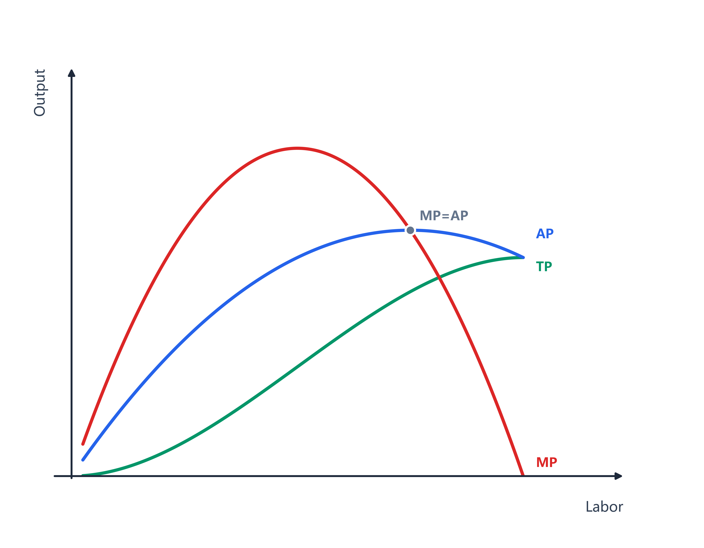

> 📌 **MP 与 AP 的关系：** MP > AP 时，AP 上升；MP < AP 时，AP 下降；**MP = AP 时，AP 达到最大值**。这类似于"平均分与边际分"的逻辑。

> 💡 **"边际分拉平均分"的直觉：** 你的 GPA 目前是 3.5（平均分）。如果你下学期拿了 4.0（边际分 > 平均分），GPA 会被拉高；如果你下学期只拿了 2.0（边际分 < 平均分），GPA 会被拉低。只有当边际分等于平均分时，平均分才不变 — 这正是 MP 穿过 AP 最高点的数学本质！

## Short-Run Costs 短期成本

- *Fixed Cost (FC / TFC)*：固定成本 — 不随产量变化的成本，如租金、设备租赁费
- *Variable Cost (VC / TVC)*：可变成本 — 随产量变化的成本，如原材料、劳动力工资
- *Total Cost (TC)* = TFC + TVC

> 💡 **为什么区分固定成本和可变成本？** 回到奶茶店的例子：不管你每天卖 0 杯还是 500 杯奶茶，每月 8000 元的店面租金你都得付 — 这就是固定成本。但茶叶、牛奶、糖浆这些原材料的费用，卖得越多花得越多 — 这就是可变成本。这个区分至关重要，因为它直接决定了厂商在亏损时是否应该继续经营（后面 Shutdown Decision 会详细展开）。
>
> 📌 **推理链：** 固定成本在短期不可回避 → 即使停产也要付 → 短期决策时不可避免的固定成本相当于"沉没"成本 → 厂商只需比较收入和可变成本来决定是否停产。

**📋 短期成本完整数值计算示例**

假设奶茶店每月固定成本 TFC = \$100。随产量变化的可变成本 TVC 如下，我们逐步计算所有成本指标：

| Q | TFC | TVC | TC=TFC+TVC | MC=ΔTC/ΔQ | AFC=TFC/Q | AVC=TVC/Q | ATC=TC/Q |
|:---:|:---:|:---:|:---:|:---:|:---:|:---:|:---:|
| 0 | 100 | 0 | 100 | — | — | — | — |
| 1 | 100 | 50 | 150 | 50 | 100.0 | 50.0 | 150.0 |
| 2 | 100 | 90 | 190 | 40 | 50.0 | 45.0 | 95.0 |
| 3 | 100 | 120 | 220 | 30 | 33.3 | 40.0 | 73.3 |
| 4 | 100 | 160 | 260 | 40 | 25.0 | 40.0 | 65.0 |
| 5 | 100 | 220 | 320 | 60 | 20.0 | 44.0 | 64.0 |
| 6 | 100 | 300 | 400 | 80 | 16.7 | 50.0 | 66.7 |
| 7 | 100 | 410 | 510 | 110 | 14.3 | 58.6 | 72.9 |

> 📌 **逐步计算示例（以 Q=3 为例）：**
> - TC = TFC + TVC = 100 + 120 = 220
> - MC = (TC₃ - TC₂) / (3 - 2) = (220 - 190) / 1 = 30
> - AFC = TFC / Q = 100 / 3 ≈ 33.3
> - AVC = TVC / Q = 120 / 3 = 40.0
> - ATC = TC / Q = 220 / 3 ≈ 73.3（验证：AFC + AVC = 33.3 + 40.0 = 73.3 ✓）
>
> ⚠️ **注意：** Q=0 时 AFC、AVC、ATC 都无法计算（分母为 0），但 TC = TFC = 100（停产也得付固定成本）。MC 在 Q=0 处也没有定义（没有"前一个"观测值）。
>
> 📌 **AP 考试重点：** 从表中可以观察到 — MC 先降后升（U 形），AVC 和 ATC 也是 U 形，AFC 持续下降。注意：Q=3 时 MC=30 而 AVC=40，两者并非精确相等；Q=5 时 MC=60 而 ATC≈64.0，也只是接近而非精确穿越。离散数据表只能**近似呈现**连续曲线中"MC 穿过 AVC/ATC 最低点"的规律——在连续模型中，MC 恰好在 AVC 最低点和 ATC 最低点处与之相交（见下方 `u3_unit_cost.png` 图）。

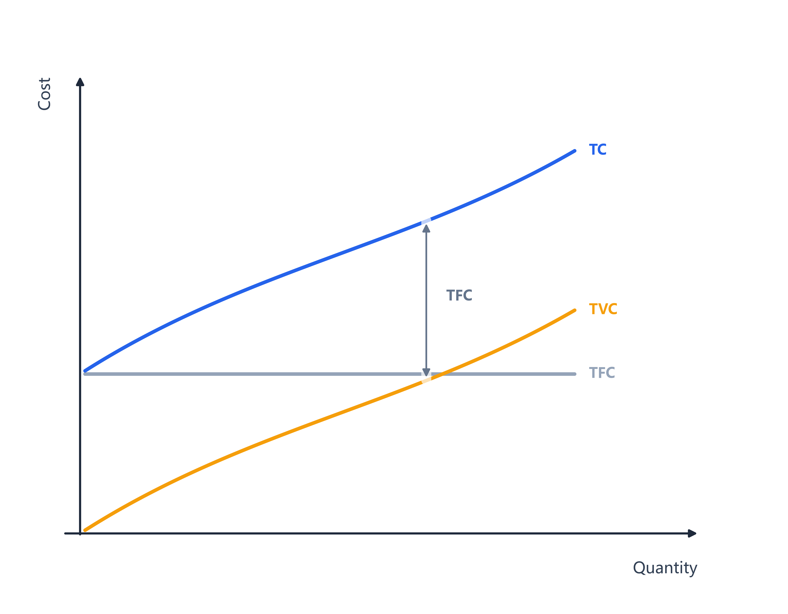

## Per-Unit Costs 单位成本

> 💡 **小技巧：** 从量税（per-unit tax）和定额税（lump-sum tax）的区别 — per-unit tax 会移动 MC 和 ATC 曲线；lump-sum tax 只移动 ATC 曲线，不移动 MC 曲线。

> 💡 **为什么 per-unit tax 移动 MC 而 lump-sum tax 不移动？** per-unit tax 是每多生产一单位就要多付的税，它直接增加了每一单位生产的额外成本，所以 MC 上移。lump-sum tax 是一笔固定费用（不管生产多少），类似于增加了固定成本，所以只影响 ATC（通过 AFC 间接影响），不影响 MC — 因为边际决策不受固定费用影响。
>
> 📌 **AP 超高频考点：** 给你一个税收政策，问你"MC 怎么移？ATC 怎么移？"— 记住：影响边际的税收 → MC 移；只影响固定的税收 → MC 不动，ATC 移。


AP微观经济学最重要的图表之一：**四条单位成本曲线的 U 形结构**。

$$AFC = \frac{TFC}{Q} \quad \text{（持续下降，渐进于横轴）}$$

$$AVC = \frac{TVC}{Q} \quad \text{（U 形）}$$

$$ATC = \frac{TC}{Q} = AFC + AVC \quad \text{（U 形，位于 AVC 上方）}$$

$$MC = \frac{\Delta TC}{\Delta Q} \quad \text{（U 形，穿过 AVC 和 ATC 的最低点）}$$

> 💡 **Tips：** MC 曲线既可以是一条像对勾（✓）一样的弧线，也可以是一条直线来表示——在 AP 考试中两种画法都被接受。关键特征是 MC 向右下方倾斜后转向右上方，并且在 ATC 和 AVC 的最低点分别穿过它们。

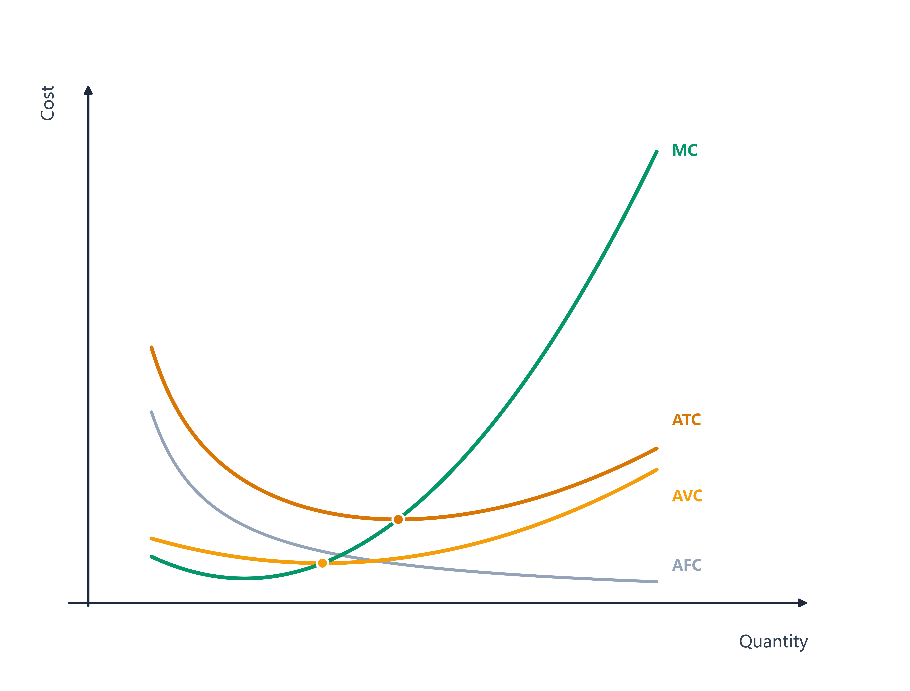

> ⚠️ **核心关系：** MC 曲线**从下方穿过** AVC 和 ATC 曲线的最低点。这不是巧合 — 当边际成本低于平均值时，平均值被拉低；当边际成本高于平均值时，平均值被拉高。**MC 与 ATC 的交点即 *Productive Efficiency*（生产效率点）。**

> 💡 **GPA 类比 — 彻底理解 MC 为什么穿过 ATC/AVC 的最低点：**
>
> 把 ATC 想象成你的累计 GPA（平均分），MC 想象成你这学期的绩点（边际分）：
>
> **阶段一：MC < ATC → ATC 下降**
> 你的 GPA 是 3.5，这学期只拿了 2.0 — 低于平均，GPA 被拉低到 3.3。同理，当多生产一单位产品的成本（MC）低于当前的平均成本（ATC），平均成本自然被拉低。
>
> **阶段二：MC > ATC → ATC 上升**
> 你的 GPA 是 3.3，这学期拿了 3.8 — 高于平均，GPA 被拉高。同理，当 MC 高于 ATC，平均成本被拉高。
>
> **交叉点：MC = ATC → ATC 不再变化，即最低点！**
> 你的 GPA 是 3.3，这学期也拿 3.3 — 正好等于平均，GPA 不变。这正是 ATC 的最低点：在这一点上，边际既不拉高也不拉低平均，平均处于"悬停"状态 — 而这个"悬停点"就是 U 形曲线的底部。
>
> 📌 **AP 应试技巧：** 如果题目问"MC 与 ATC 的交点在哪里？"— 答案永远是 **ATC 的最低点**。这个结论对 AVC 同样适用。AP 考试几乎每年都会以某种形式考这个关系，确保你能闭眼写出来。
>
> ⚠️ **为什么 MC 先穿过 AVC 的最低点，再穿过 ATC 的最低点？** 因为 ATC = AVC + AFC，而 AFC 始终在下降。所以 ATC 的最低点出现在比 AVC 最低点更大的产量处。在图上表现为：MC 先与 AVC 相交（AVC 最低点），再与 ATC 相交（ATC 最低点，在 AVC 最低点的右上方）。

## Long-Run Costs 长期成本

长期中，所有成本都是可变的（没有固定成本）。*Long-Run Average Total Cost (LRATC)* 曲线是不同工厂规模下 SRATC 曲线的**下包络线**（lower envelope）。

> 💡 **为什么需要长期成本曲线？** 短期内你被"锁"在某个工厂规模里 — 不管你怎么调整劳动力，厂房面积就是那么大。但长期来看，你可以选择搬到更大的工厂、购买更多机器、甚至开连锁店。长期成本曲线回答的问题是：**如果你可以选择任何工厂规模，每种产量下你能达到的最低平均成本是多少？**
>
> 🔗 **概念连接：** 短期成本 vs 长期成本的区别，本质上是"固定要素能否调整"的区别。短期你只能在一条 SRATC 曲线上移动；长期你可以在不同 SRATC 曲线之间选择。

> 💡 **工厂规模类比 — 理解 LRATC 包络曲线：**
>
> 想象你要开一家面包店，有三种规模可选：
> - **小工厂**（SRATC₁）：适合低产量，但产量大了就拥挤，ATC 急剧上升
> - **中工厂**（SRATC₂）：适合中等产量，U 形的最低点比小工厂更低
> - **大工厂**（SRATC₃）：适合高产量，但产量太低时设备闲置，ATC 也很高
>
> 长期决策 = 对每个产量 Q，选择使 ATC 最低的工厂规模。LRATC 就是这三条（或无数条）SRATC 曲线的**下边界**（包络线）— 像一条"挂"在这些 U 形曲线底部的平滑曲线。
>
> ⚠️ **关键细节：** LRATC **不一定**经过每条 SRATC 的最低点！只有在 LRATC 自身的最低点处，LRATC 才与某条 SRATC 相切于后者的最低点。在其他位置，LRATC 与 SRATC 相切于 SRATC 最低点的左侧（规模经济阶段）或右侧（规模不经济阶段）。
>
> 📌 **AP 判断点：** 如果题目给你多条 SRATC 曲线，问你"生产 Q=100 的长期最低成本是多少" — 先找到 Q=100 对应的纵坐标，然后选所有 SRATC 中最低的那个值，那就是 LRATC 上的点。

- *Economies of Scale*（规模经济）：LRATC 下降 — 产量增加，长期平均成本降低
- *Constant Returns to Scale*（规模报酬不变）：LRATC 水平 — 产量增加，长期平均成本不变
- *Diseconomies of Scale*（规模不经济）：LRATC 上升 — 产量增加，长期平均成本升高

> 💡 **规模经济的来源（为什么"做大"可以"做便宜"）：**
> - **劳动分工与专业化**：小面包店一个人又和面又烤面包又收银；大工厂每个人只做一件事，效率更高
> - **批量采购折扣**：大量购买面粉可以拿到批发价
> - **技术效率**：大烤箱的单位能耗比小烤箱低
> - **管理固定成本摊薄**：一套会计系统服务 100 家店和服务 1 家店，单位管理成本更低
>
> 💡 **规模不经济的来源（为什么"太大"反而"贵"）：**
> - **管理成本上升**：组织层级增多，沟通效率下降，"大企业病"
> - **协调困难**：不同部门之间配合变差，决策变慢
> - **官僚主义**：流程复杂化，创新动力下降
>
> 📌 **AP 易混淆对比：** "边际报酬递减"是短期概念（固定要素不变，增加可变要素），"规模不经济"是长期概念（所有要素同时增加，但效率仍然下降）。二者的原因完全不同：前者是因为固定要素的约束，后者是因为组织管理的困难。
>
> ⚠️ **常见错误：** 不要把"规模经济"和"边际报酬递增"搞混！规模经济是长期概念（同时增加所有要素），边际报酬递增是短期概念（只增加一种要素时 MP 在增加）。

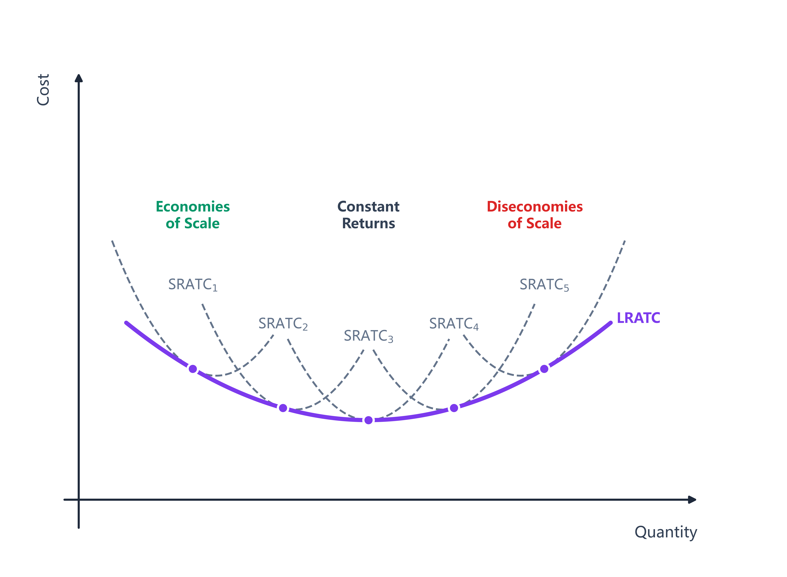

## Perfect Competition 完全竞争

> 💡 **为什么先学完全竞争？** 完全竞争是所有市场结构的"基准线"（benchmark）。就像学物理先学"无摩擦的理想环境"一样，我们先理解最理想化的市场如何运作，然后逐步放松假设，引入垄断、垄断竞争、寡头等更现实的结构。完全竞争之所以重要，还因为它是唯一同时实现生产效率和配置效率的市场 — 经济学家用它来评判其他市场结构的"效率损失"。

### Characteristics 特征

- **Many buyers and sellers**（大量买卖者）— 每个参与者都是 *Price Taker*（价格接受者）
- **Identical / Homogeneous products**（同质化产品）— 产品完全可替代
- **No barriers to entry or exit**（无进入/退出壁垒）
- **Perfect information**（完全信息）
- **Firms are price takers**：单个厂商面对的需求曲线是**水平的**（*Perfectly Elastic*），D = MR = AR = P

> 💡 **生活化理解：** 农产品市场是最接近完全竞争的现实例子 — 农民卖小麦，市场上千万个农民在卖同质的小麦，你一个人的产量不可能影响市场价格，所以你只能接受市场价。如果你定价高于市场价，买家立刻去找别人买（完全替代 + 完全信息）；如果定价低于市场价，你白白亏钱（因为你按市场价就能卖光）。
>
> 📌 **为什么单个厂商的需求曲线是水平的？** 因为厂商太小了，产量变化对市场供给几乎无影响。就像你往大海里倒一杯水，海平面不会因此上升。所以厂商可以按市场价格卖任意数量 — 需求曲线是一条水平线。
>
> ⚠️ **常见错误：** 不要把"厂商的需求曲线"和"市场的需求曲线"搞混！市场的需求曲线是向下倾斜的（价格高→需求少），但单个厂商面对的需求曲线是水平的（价格不变，卖多少都可以）。

### Profit Maximization 利润最大化

$$\text{Profit Maximization Rule：在可行的内点解且 MC 从下向上穿过 MR 时，选择满足 } MR = MC \text{ 的产量。}$$

- 若 MR > MC → 增加产量
- 若 MR < MC → 减少产量
- 若 MR = MC 且满足上述穿越条件 → 利润最大化；离散选择或边界解应比较相邻单位，未必出现精确相等

在完全竞争中，MR = P（因为价格恒定），因此利润最大化条件简化为：$P = MC$

> 💡 **为什么 MR = MC 是利润最大化？** 直觉：每多生产一单位产品，你获得的额外收入是 MR，付出的额外成本是 MC。如果 MR > MC，这单位产品"赚了"，应该继续增产；如果 MR < MC，这单位产品"亏了"，应该减产。只有 MR = MC 时，多生产不再带来额外利润，利润达到最大。
>
> 📌 **逐步利润计算示例（完全竞争）：**
>
> 假设市场价格 P = \$50，厂商的成本数据如下：

<table>
<thead>
<tr><th style="text-align:center;vertical-align:middle">Q</th><th style="text-align:center;vertical-align:middle">TC</th><th style="text-align:center;vertical-align:middle">MC</th><th style="text-align:center;vertical-align:middle">TR = P×Q</th><th style="text-align:center;vertical-align:middle">Profit = TR - TC</th></tr>
</thead>
<tbody>
<tr><td style="text-align:center;vertical-align:middle">0</td><td style="text-align:center;vertical-align:middle">40</td><td style="text-align:center;vertical-align:middle">—</td><td style="text-align:center;vertical-align:middle">0</td><td style="text-align:center;vertical-align:middle">-40</td></tr>
<tr><td style="text-align:center;vertical-align:middle">1</td><td style="text-align:center;vertical-align:middle">70</td><td style="text-align:center;vertical-align:middle">30</td><td style="text-align:center;vertical-align:middle">50</td><td style="text-align:center;vertical-align:middle">-20</td></tr>
<tr><td style="text-align:center;vertical-align:middle">2</td><td style="text-align:center;vertical-align:middle">95</td><td style="text-align:center;vertical-align:middle">25</td><td style="text-align:center;vertical-align:middle">100</td><td style="text-align:center;vertical-align:middle">5</td></tr>
<tr><td style="text-align:center;vertical-align:middle">3</td><td style="text-align:center;vertical-align:middle">120</td><td style="text-align:center;vertical-align:middle">25</td><td style="text-align:center;vertical-align:middle">150</td><td style="text-align:center;vertical-align:middle">30</td></tr>
<tr><td style="text-align:center;vertical-align:middle">4</td><td style="text-align:center;vertical-align:middle">155</td><td style="text-align:center;vertical-align:middle">35</td><td style="text-align:center;vertical-align:middle">200</td><td style="text-align:center;vertical-align:middle">45</td></tr>
<tr><td style="text-align:center;vertical-align:middle">5</td><td style="text-align:center;vertical-align:middle">205</td><td style="text-align:center;vertical-align:middle">50</td><td style="text-align:center;vertical-align:middle">250</td><td style="text-align:center;vertical-align:middle"><strong>45</strong> ← 最大！</td></tr>
<tr><td style="text-align:center;vertical-align:middle">6</td><td style="text-align:center;vertical-align:middle">270</td><td style="text-align:center;vertical-align:middle">65</td><td style="text-align:center;vertical-align:middle">300</td><td style="text-align:center;vertical-align:middle">30</td></tr>
</tbody>
</table>

> **分析步骤：**
> 1. 利润最大化产量：P = MC → \$50 = MC → Q = 5（MC 从 35 跳到 50，Q=5 时 MC = \$50 = P）
> 2. 最大利润 = TR - TC = 250 - 205 = \$45
> 3. 也可以用单位利润法验证：(P - ATC) × Q = (50 - 41) × 5 = \$45 ✓（ATC = 205/5 = 41）
>
> 📌 **AP 关键技巧：** FRQ 题目经常给你一个成本表，让你计算利润最大化产量。记住三步：(1) 找到 MC = MR（完全竞争中 MR = P）的产量；(2) 计算该产量下的 TR 和 TC；(3) Profit = TR - TC。也可以直接算 (P - ATC) × Q。

### Profit / Loss in the Short Run 短期盈亏

$$\text{Profit} = TR - TC = (P - ATC) \times Q$$

- 若 $P > ATC$ → *Economic Profit*（经济利润，>0）
- 若 $P = ATC$ → *Normal Profit / Break-even*（正常利润，Economic Profit = 0）
- 若 $AVC < P < ATC$ → *Loss but Continue Operating*（亏损但继续经营 — 可覆盖部分固定成本）
- 若 $P < AVC$ → *Shut Down*（停产 — 连可变成本都无法覆盖）

> 💡 **图上怎么看利润/亏损？** 在利润最大化产量 Q* 处，P 和 ATC 之间的垂直距离就是单位利润/亏损。P 在 ATC 上方 → 每单位赚（P-ATC）；P 在 ATC 下方 → 每单位亏（ATC-P）。总利润/亏损 = 垂直距离 × Q* = 矩形面积。
>
> 📌 **推理链 — P 介于 AVC 和 ATC 之间时，为什么继续经营？**
> 停产损失 = TFC（全部固定成本，一分钱也省不了）
> 继续经营损失 = TC - TR = (TFC + TVC) - TR = TFC - (TR - TVC)
> 因为 P > AVC → TR > TVC → (TR - TVC) > 0 → 继续经营的损失 = TFC - (正数) < TFC
> **结论：继续经营的亏损 < 停产的亏损，所以继续经营更划算！**
>
> 💡 **生活类比：** 你的奶茶店月租金 8000 元（固定成本）。某个月生意不好，总收入 15000 元，可变成本 10000 元。虽然亏损（15000 - 10000 - 8000 = -3000），但如果你关门，亏损就是 8000 元（纯租金）。继续经营只亏 3000，比关门亏 8000 好。所以"硬撑着"是理性选择！

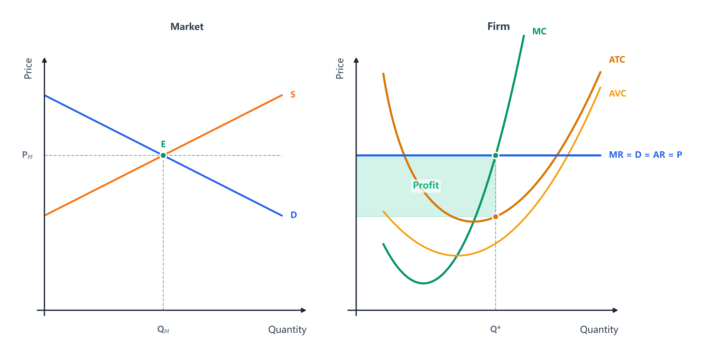

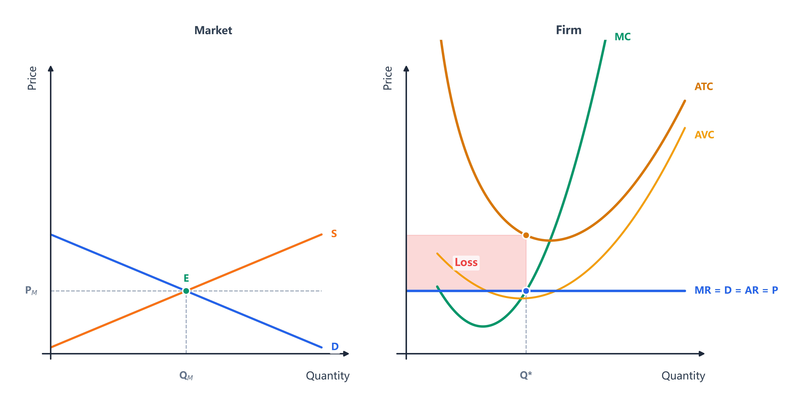

### Shutdown Decision 停产决策

*Shutdown Point*（停产点）是 MC 与 AVC 的交点（即 AVC 的最低点）。

$$\text{Shutdown Rule: Shut down if } P < AVC \ (\text{或 } TR < TVC)$$

若 $P \geq AVC$ → 继续经营（短期）。即使亏损，只要收入能覆盖可变成本，继续经营可减少损失。若 $P < AVC$ → 立即停产。停产后的损失仅限于固定成本（TFC）。

> 📌 **停产决策流程图（Shutdown Decision Tree）：**
>
> ```
> Step 1: 找到利润最大化产量 Q*（MR = MC 处）
>     ↓
> Step 2: 比较 P 与 ATC
>     ├── P > ATC → 经济利润 ✅ 继续经营
>     ├── P = ATC → 正常利润 ✅ 继续经营
>     └── P < ATC → 亏损 ⚠️ 进入 Step 3
>              ↓
> Step 3: 比较 P 与 AVC
>     ├── P ≥ AVC → 继续经营（亏损 < TFC）
>     └── P < AVC → 停产（停产亏损 = TFC < 继续经营亏损）
> ```
>
> ⚠️ **关键误区：** 停产 ≠ 退出！停产（*Shutdown*）是短期概念 — 你暂停生产但仍然支付固定成本（租金照付）；退出（*Exit*）是长期概念 — 你彻底离开这个行业，连固定成本也不付了（租约到期不再续约）。
>
> 📌 **AP 必记等价条件：**
> - P < AVC ⟺ TR < TVC（价格法 vs 总收入法，两种表述等价）
> - 停产后的亏损 = TFC（只亏固定成本）
> - 继续经营且 P < ATC 时的亏损 = TFC - (TR - TVC)（比 TFC 小）
>
> 💡 **补充：** 厂商的短期供给曲线 = MC 曲线位于 AVC 最低点以上的部分。当 P < min AVC 时，供给量为 0（停产）。

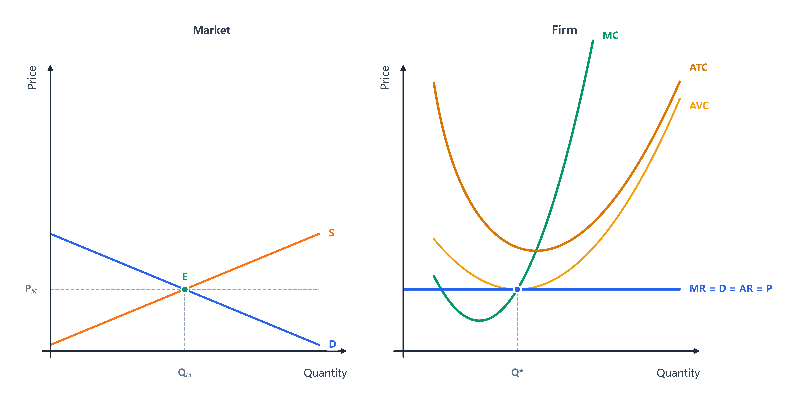

### Long-Run Equilibrium 长期均衡

长期中，经济利润（或亏损）会引发进入（或退出），直到所有厂商获得零经济利润（*Normal Profit*）。

> 💡 **长期均衡的动态故事 — 从经济利润到零利润的完整时间线：**
>
> **T₀（初始状态）：** 假设由于市场需求突然增加，市场价格从 \$50 涨到 \$70。现有厂商在 P = \$70 > ATC = \$50 处生产，每单位赚 \$20 经济利润。
>
> **T₁（进入阶段）：** 经济利润像磁铁一样吸引新厂商进入。因为完全竞争没有进入壁垒，任何人都可以开一家同样的企业。
>
> **T₂（供给增加）：** 新厂商的加入使市场供给曲线右移（S₁ → S₂），市场价格从 \$70 开始下降。
>
> **T₃（价格下降）：** 价格持续下降，\$70 → \$60 → \$55 → ... 每个厂商的经济利润在缩小。
>
> **T₄（均衡到达）：** 当价格降到 \$50 = min ATC 时，经济利润为零。此时不再有新厂商愿意进入（没有超额利润可赚），也不会有厂商退出（至少赚到了正常利润，涵盖所有机会成本）。
>
> **同理，短期亏损的动态：**
> T₀: P < ATC，厂商亏损 → T₁: 部分厂商退出行业 → T₂: 市场供给减少（S 左移）→ T₃: 价格回升 → T₄: P 回到 min ATC，亏损消除，停止退出。
>
> 📌 **AP 核心逻辑：** 长期均衡的驱动力是"经济利润吸引进入，经济亏损导致退出" — 这是一个自动调节机制。只要存在进入/退出自由，经济利润就不可能长期存在（零经济利润 ≠ 零会计利润！正常利润已经包含了机会成本）。

- 短期经济利润 → 新厂商进入 → 市场供给增加 → 价格下降 → 利润归零
- 短期亏损 → 厂商退出 → 市场供给减少 → 价格上升 → 亏损消除
- **长期均衡条件：** $P = MC = \min ATC = MR = AR = D$
- 长期均衡位于 ATC 曲线的最低点 — 这同时实现了 *Productive Efficiency*（生产效率）和 *Allocative Efficiency*（配置效率，P = MC）

> ⚠️ **"零经济利润"不等于"没赚钱"！** 经济利润 = 会计利润 - 机会成本。零经济利润意味着厂商赚到的会计利润刚好等于其机会成本（即次优选择的收益）。例如，你开奶茶店年收入 10 万，如果去打工也能赚 10 万，那经济利润 = 0，但你并没有"亏" — 你只是没有比其他选择赚得更多。
>
> 📌 **长期供给曲线：**
> - **成本不变行业**（Constant-Cost Industry）：长期供给曲线水平 — 新厂商进入不改变要素价格
> - **成本递增行业**（Increasing-Cost Industry）：长期供给曲线向上倾斜 — 新厂商进入推高了要素价格（最常见）
> - **成本递减行业**（Decreasing-Cost Industry）：长期供给曲线向下倾斜 — 极少见
>
> 🔗 **概念连接：** 完全竞争的长期均衡是效率的标杆 — 后面学垄断时你会发现，垄断在 P > MC 处生产，既没有生产效率也没有配置效率。理解完全竞争的效率，是为了衡量其他市场结构"差在哪里"。

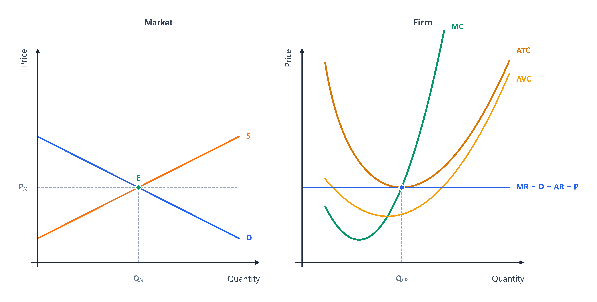

> 💡 **完全竞争的效率含义：** 完全竞争是唯一**同时满足**生产效率（P = min ATC）和配置效率（P = MC）的市场结构。这也是为什么它被视为最"有效率"的市场结构 — 尽管现实中几乎不存在完美的完全竞争市场。

## 例题

### MCQ

1.  The table below shows the total cost of a firm at different levels of output.

    | Quantity | Total Cost |
    |:--------:|:----------:|
    | 0        | \$100     |
    | 1        | \$150     |
    | 2        | \$190     |
    | 3        | \$240     |
    | 4        | \$300     |

    Which of the following is true?

    a) The marginal cost of the 2nd unit is \$50.

    b) The average variable cost at 3 units is \$80.

    c) The average total cost at 4 units is \$75.

    d) The total fixed cost increases as output increases.

    e) The marginal cost of the 3rd unit is \$60.

2.  A firm is producing 100 units of output. Its average total cost is \$50, its average variable cost is \$30, and its marginal cost is \$40. What is the firm's total fixed cost?

    a) \$20

    b) \$2,000

    c) \$3,000

    d) \$5,000

    e) \$8,000

3.  If a firm experiences diminishing marginal returns to labor, which of the following must be true?

    a) Total product is decreasing.

    b) Marginal product is negative.

    c) Marginal product is decreasing.

    d) Average product is increasing.

    e) Fixed costs are increasing.

4.  A perfectly competitive firm is currently producing at an output level where marginal cost is \$8 and marginal revenue is \$10. To maximize profit, the firm should do which of the following?

    a) Decrease output

    b) Increase output

    c) Shut down

    d) Maintain the current output

    e) Exit the industry

5.  In the long-run equilibrium, a perfectly competitive firm earns

    a) positive economic profit.

    b) negative economic profit.

    c) zero economic profit.

    d) accounting losses.

    e) monopoly profits.

6.  The table below shows a firm's total product at various quantities of labor.

    | Units of labor | Total product |
    |:-:|:-:|
    | 0 | 0 |
    | 1 | 8 |
    | 2 | 20 |
    | 3 | 30 |
    | 4 | 36 |
    | 5 | 40 |
    | 6 | 42 |

    Diminishing marginal returns begin with the hiring of which worker?

    a) The 1st worker

    b) The 2nd worker

    c) The 3rd worker

    d) The 4th worker

    e) The 6th worker

7.  If a firm's average total cost decreases as output increases, which of the following must be true?

    a) Marginal cost is greater than average total cost.

    b) Marginal cost is less than average total cost.

    c) Average fixed cost is increasing.

    d) Average variable cost is decreasing.

    e) The firm is experiencing diseconomies of scale.

8.  A profit-maximizing firm in a perfectly competitive market is currently producing 100 units of output. At this output, the firm's marginal cost is \$8, average variable cost is \$6, and average total cost is \$10. The market price is \$8. Which of the following is true?

    a) The firm should shut down immediately.

    b) The firm is earning positive economic profit.

    c) The firm should increase output to maximize profit.

    d) The firm is operating at a loss but should continue to produce in the short run.

    e) The firm is earning zero economic profit.

9.  In a perfectly competitive constant-cost industry that is in long-run equilibrium, a permanent increase in demand will result in which of the following in the long run?

    a) A higher price and a higher equilibrium quantity.

    b) The same price and a higher equilibrium quantity.

    c) A higher price and the same equilibrium quantity.

    d) A lower price and a higher equilibrium quantity.

    e) The same price and the same equilibrium quantity.

10. A lump-sum tax (a fixed fee regardless of output) on firms in a perfectly competitive market will have which effect in the short run?

    a) It will shift the marginal cost curve upward, causing firms to reduce output.

    b) It will shift the average total cost curve upward but not the marginal cost curve.

    c) It will cause each firm's profit-maximizing quantity to decrease.

    d) It will shift only the average variable cost curve upward.

    e) It will cause the market price to decrease.

### FRQ

Assume a perfectly competitive firm produces 100 units of output. At that level of output, the firm's total cost is \$500, its average variable cost is \$3, its marginal revenue is \$5, and its marginal cost is \$5.

(a) Calculate the firm's average total cost.

(b) Calculate the firm's fixed cost.

(c) Can the firm's profit-maximizing level of output be determined from the information given? Explain.

(d) Would the firm continue to operate in the short run? Explain.

(e) Would the firm enter or exit the market in the long run? Explain.

### FRQ 2

The table provided shows the short-run production and cost data for a perfectly competitive firm that sells its output at a price of \$20 per unit and hires labor at a wage of \$120 per worker per day. Labor is the only variable input.

| Number of workers | Total product (units per day) | Total fixed cost (\$) |
|:-:|:-:|:-:|
| 0 | 0 | 120 |
| 1 | 10 | 120 |
| 2 | 25 | 120 |
| 3 | 45 | 120 |
| 4 | 60 | 120 |
| 5 | 70 | 120 |
| 6 | 75 | 120 |

(a) Calculate the marginal product of the 4th worker. Show your work.

(b) Calculate the marginal cost of producing the 31st through 45th units (i.e., the units produced by the 3rd worker). Show your work.

(c) Determine the profit-maximizing number of workers the firm will hire. Explain using marginal analysis.

(d) At the profit-maximizing quantity you identified in part (c), calculate the firm's economic profit. Show your work.

(e) Is this firm operating in a long-run equilibrium? Explain.

---

# Imperfect Competition

> **考试权重：15–22%**

## Monopoly 垄断

> 💡 **为什么会有垄断？** 如果完全竞争是"无摩擦的理想世界"，那垄断就是"有围墙的花园"。围墙（进入壁垒）阻止了竞争者的进入，让垄断者可以长期维持高于成本的价格。壁垒的来源包括：政府授予的专利权（药品专利）、对关键资源的控制（De Beers 曾经控制全球大部分钻石矿）、规模经济（自然垄断）、以及网络效应（微信的社交网络）。理解垄断的核心就是理解**进入壁垒** — 没有壁垒就没有长期垄断。

### Characteristics 特征

- **Single seller**（单一卖者）— 厂商即行业
- **Unique product with no close substitutes**（无近似替代品）
- **High barriers to entry**（高进入壁垒）— 法律/专利/资源控制/规模经济
- 垄断者是 *Price Maker*（价格制定者）
- 垄断者面临的是**向下倾斜的市场需求曲线**（D = AR），而非水平线

> 💡 **例子：** 自来水公司、电力公司，一个区域只有一家供应商
>
> 📌 **进入壁垒的四种来源（AP 必背）：**
> 1. **法律/政府壁垒**：专利（Patent）、版权（Copyright）、特许经营执照（Government License / Franchise）。例如，药品专利给制药公司 20 年的垄断权 — 这是激励创新的代价
> 2. **资源控制**：De Beers 曾经控制全球 80% 以上的钻石供应；中国稀土出口一度占全球 90%+
> 3. **规模经济 / 自然垄断**：一家公司就能以最低成本服务整个市场（详见后面的自然垄断章节）
> 4. **网络效应**：用户越多价值越大 — 微信、Windows 操作系统。新竞争者很难起步，因为用户已经"锁定"在现有平台上
>
> ⚠️ **常见错误：** 垄断者虽然可以制定价格，但并不意味着可以随意定价！垄断者仍然受需求曲线约束 — 定价太高，消费者就不买了。垄断者必须在"价格"和"销量"之间取舍（trade-off），这就是为什么 MR < P。

### Monopoly MR vs Perfect Competition MR

在垄断中，$MR < D(AR)$ — 因为要多卖一单位商品就必须降低所有商品的价格。MR 曲线位于需求曲线（AR）的下方，且对于线性需求，MR 的斜率是需求曲线斜率的两倍。

> 💡 **为什么垄断中 MR < P？用一个具体数值例子彻底搞懂：**
>
> 假设一家垄断厂商面对以下需求：价格 \$10 时卖出 1 单位，价格 \$9 时卖出 2 单位，价格 \$8 时卖出 3 单位...
>
> | Q | P（= AR） | TR = P × Q | MR = ΔTR |
> |:---:|:---:|:---:|:---:|
> | 1 | \$10 | \$10 | \$10 |
> | 2 | \$9 | \$18 | \$8 |
> | 3 | \$8 | \$24 | \$6 |
> | 4 | \$7 | \$28 | \$4 |
> | 5 | \$6 | \$30 | \$2 |
>
> **关键观察：** 当厂商从卖 1 单位（P=\$10）变成卖 2 单位（P=\$9）时：
> - 多卖了 1 单位，额外收入 = \$9
> - 但原来那 1 单位的价格也从 \$10 降到了 \$9，损失了 \$1
> - 净效果：MR = \$9 - \$1 = \$8 < P = \$9
>
> 一般公式：**MR = P + (ΔP/ΔQ) × Q**。因为需求曲线向下倾斜，ΔP/ΔQ < 0，所以 MR < P。
>
> 📌 **AP 必记：** 在完全竞争中，厂商是 Price Taker，多卖一单位不影响价格，所以 MR = P。但在垄断中，厂商是 Price Maker，多卖必须降价，所以 MR < P = AR = D。这就是两种市场结构最根本的区别之一。
>
> ⚠️ **常见错误：** 不要以为 MR 曲线就是需求曲线向下平移一个固定距离！对于线性需求 P = a - bQ，MR = a - 2bQ，MR 的斜率是需求曲线斜率的两倍。在图上，MR 从和需求曲线同一个纵截距出发，但以两倍的速度下降，与横轴的交点是需求曲线与横轴交点的一半。

<table>
<colgroup>
<col style="width:20%"><col style="width:40%"><col style="width:40%">
</colgroup>
<thead>
<tr><th style="text-align:center;vertical-align:middle"></th><th style="text-align:center;vertical-align:middle">Perfect Competition</th><th style="text-align:center;vertical-align:middle">Monopoly</th></tr>
</thead>
<tbody>
<tr><td style="text-align:center;vertical-align:middle">需求曲线</td><td style="text-align:center;vertical-align:middle">水平（Perfectly Elastic）</td><td style="text-align:center;vertical-align:middle">向下倾斜</td></tr>
<tr><td style="text-align:center;vertical-align:middle">MR vs D</td><td style="text-align:center;vertical-align:middle">MR = D = AR = P</td><td style="text-align:center;vertical-align:middle">MR &lt; D（MR is below D）</td></tr>
<tr><td style="text-align:center;vertical-align:middle">价格</td><td style="text-align:center;vertical-align:middle">Price Taker</td><td style="text-align:center;vertical-align:middle">Price Maker</td></tr>
<tr><td style="text-align:center;vertical-align:middle">进入壁垒</td><td style="text-align:center;vertical-align:middle">无</td><td style="text-align:center;vertical-align:middle">有（高）</td></tr>
</tbody>
</table>

### Profit Maximization for Monopoly

垄断者同样在 $MR = MC$ 处实现利润最大化。但与完全竞争不同，垄断者在通过 MR = MC 确定最优产量 $Q_m$ 后，会**向上读到需求曲线**来确定价格 $P_m$。

> 💡 **垄断利润最大化的逐步分析（用数值例子）：**
>
> 续用前面的需求表，假设 MC = \$4（恒定）：
>
> | Q | P | MR | MC | 决策 |
> |:---:|:---:|:---:|:---:|:---:|
> | 1 | \$10 | \$10 | \$4 | MR > MC，增产 |
> | 2 | \$9 | \$8 | \$4 | MR > MC，增产 |
> | 3 | \$8 | \$6 | \$4 | MR > MC，增产 |
> | 4 | \$7 | **\$4** | **\$4** | **MR = MC ✅ 利润最大** |
> | 5 | \$6 | \$2 | \$4 | MR < MC，减产 |
>
> **结果：** $Q_m$ = 4，沿需求曲线定价 $P_m$ = \$7
> - TR = 7 × 4 = \$28
> - TC = 4 × 4 = \$16（假设 $TC = 4Q$，即固定成本为零、MC 恒定为 4）
> - 利润 = \$28 - \$16 = \$12
>
> 📌 **关键步骤：** MR = MC → 确定 Q → **向上读 D 曲线** → 确定 P。这个"向上读需求曲线"的步骤是垄断特有的 — 完全竞争中 MR = P，不需要这步。
>
> ⚠️ **绝不能在 MR = MC 的交点直接读价格！** MR 曲线与 MC 曲线的交点只确定了产量 $Q_m$。价格必须从需求曲线上读取（在 $Q_m$ 处垂直向上到达 D 曲线对应的纵坐标值）。AP 考试中很多学生在此处犯错。

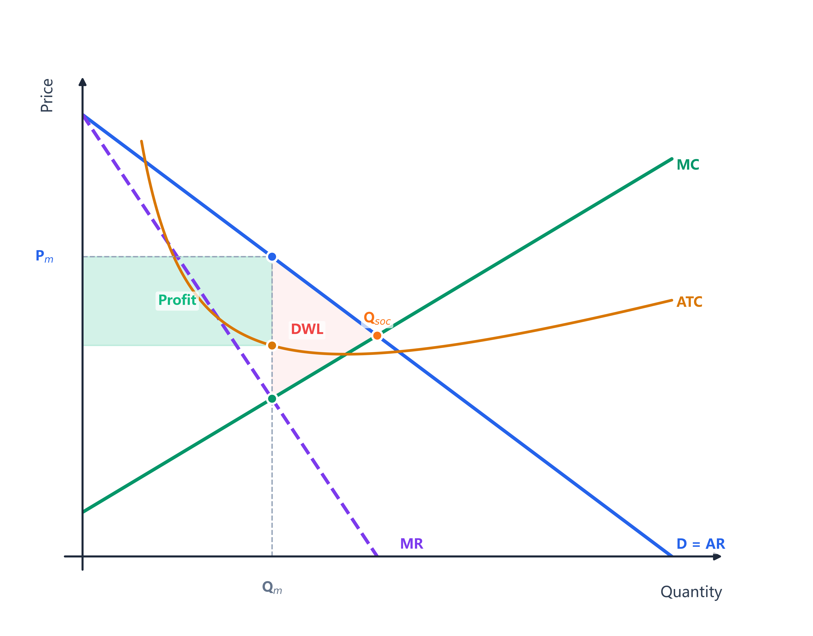

> 📌 **垄断图五步读图法：**
> ① 找到 MR 与 MC 的交点 → 确定 $Q_m$（利润最大化产量）
> ② 从 $Q_m$ 向上读到需求曲线 D → 确定 $P_m$（垄断定价）
> ③ 从 $Q_m$ 向上读到 ATC 曲线 → 确定单位成本 ATC($Q_m$)
> ④ 利润 = $(P_m - ATC) \times Q_m$，即价格线与ATC之间的矩形面积
> ⑤ 从 $Q_m$ 延伸到 $Q_{soc}$（D=MC交点），在 D 与 MC 之间的三角形即为 DWL

> 📌 **无谓损失 (DWL)：** 垄断者生产的数量 $Q_m$ 小于社会最优数量（P = MC 处的数量），导致 Deadweight Loss。DWL 表现为需求曲线与 MC 曲线之间、从 $Q_m$ 到 $Q_{soc}$ 的三角形区域。这也是政府对垄断进行反垄断规制的经济学依据。

> � **DWL 产生的原因 — 一步步推理：**
> 1. 社会最优产量在 P = MC 处（因为 P 代表社会边际收益，MC 代表社会边际成本，P = MC 时社会净收益最大）
> 2. 垄断者在 MR = MC 处生产，但 MR < P，所以 MR = MC 时的产量 < P = MC 时的产量
> 3. 从 $Q_m$ 到 $Q_{soc}$ 之间的每一单位，消费者愿意支付的价格（P）都大于生产成本（MC），但垄断者不愿生产 — 因为多生产会拉低所有单位的价格，减少总利润
> 4. 这些"本该生产但没生产"的单位构成了 DWL — 社会白白损失了这些交易的好处
>
> 📌 **垄断的效率损失总结：** 在标准单一价格垄断模型中，厂商通常不在 min ATC 处生产，且有配置无效率（P > MC）。与完全竞争相比，垄断通常产量更少、价格更高并存在 DWL；完全价格歧视是配置有效、DWL=0 但 CS=0 的特殊情形。

> 📌 **线性 demand curve 的弹性分布：** 同一条向下倾斜的直线需求曲线上，**上半部分 elastic**，**中点 unit elastic**，**下半部分 inelastic**。不要把"斜率不变"误认为"弹性不变"。

> 💡 **为什么垄断者一定在弹性区间生产？** 利润最大化条件 MR = MC，在利润最大化的内点解且 MC > 0 时，MR = MC > 0，所以 MR > 0。当 MR > 0 时，TR 随 Q 增加而增加，这意味着需求是弹性的（|Ed| > 1）。如果垄断者在 inelastic 区间生产（|Ed| < 1，MR < 0），**减少产量**可以增加 TR（因为 |Ed|<1 时减产提价使 TR 增加），同时减少产量也会**降低 TC**（生产更少产品成本更低），因此利润 = TR − TC 必然增加——这说明 inelastic 区间不可能是利润最大化点。**结论：在 MC > 0 且存在内点解的条件下，垄断者在需求弹性大于 1 的区间生产。**

### Price Discrimination 价格歧视

垄断者向不同消费者收取不同价格（对相同商品），以获取更多消费者剩余。前提条件：

- 具有一定的市场力量（Monopoly Power）
- 能够识别并区分不同支付意愿的消费者
- 能够防止转售（No Resale）

> 💡 **例子：** 电影院的学生票和成人票价格不同
>
> 📌 **价格歧视的三种程度（AP 重点）：**
>
> **一度价格歧视（First-Degree / Perfect Price Discrimination）：**
> - 对每一单位商品收取消费者愿意支付的最高价格
> - 例子：讨价还价的地摊 — 卖家根据你的表情判断你的底线，尽可能收最高价
> - 结果：MR = D，DWL = 0，CS = 0，所有剩余归生产者
> - 现实中极少完美实现；电商"大数据杀熟"等个性化定价可能使用支付意愿信息，但通常不满足完全识别每单位保留价格的严格定义
>
> **二度价格歧视（Second-Degree Price Discrimination）：**
> - 根据购买数量定价 — 买得越多，单价越低（或越高）
> - 例子：超市"买二送一"、批发价 vs 零售价、手机流量套餐（1GB \$10，5GB \$30）
> - 关键特征：厂商不知道具体谁是高/低支付意愿消费者，但设计了不同的"套餐"让消费者**自我选择**（Self-Selection）
>
> **三度价格歧视（Third-Degree Price Discrimination）：**
> - 根据可观察的特征（年龄、身份、地区）将消费者分组，对不同组收取不同价格
> - 例子：电影院（学生票 vs 成人票）、航空公司（提前订票 vs 临时买票）、旅游景点（本地人半价）
> - 关键特征：厂商能识别消费者属于哪个群体，并在需求弹性低的市场定高价、弹性高的市场定低价
> - 📌 **AP 必记公式：** 利润最大化条件是 $MR_1 = MR_2 = MC$，其中 $MR = P(1 - \frac{1}{|E_d|})$。即在两个市场上边际收益相等且等于 MC；需求弹性较低的市场定价更高
>
> ⚠️ **价格歧视的前提条件（AP 常考）：**
> 1. 市场力量（能定高于 MC 的价格）
> 2. 能区分支付意愿不同的消费者
> 3. **能防止转售**（Arbitrage）— 如果学生票可以转卖给成人，学生就会低价买入高价卖出，价格歧视就失效了

**Perfect Price Discrimination（完全价格歧视）：** 垄断者对每一单位商品收取消费者愿意支付的最高价格。在垄断者能识别每单位保留价格、防止转售、且无额外识别/实施成本的条件下，结果：

- MR = D（每个消费者的保留价格即 MR）
- 产出 = 社会最优数量（$Q_{soc}$）
- DWL = 0
- 但所有消费者剩余被转换为生产者剩余（利润）

> ⚠️ **上述结论的前提：** 完全价格歧视要求垄断者能识别每一单位商品的保留价格、有效防止转售、且无额外识别/实施成本。这些条件在现实中难以完全满足。

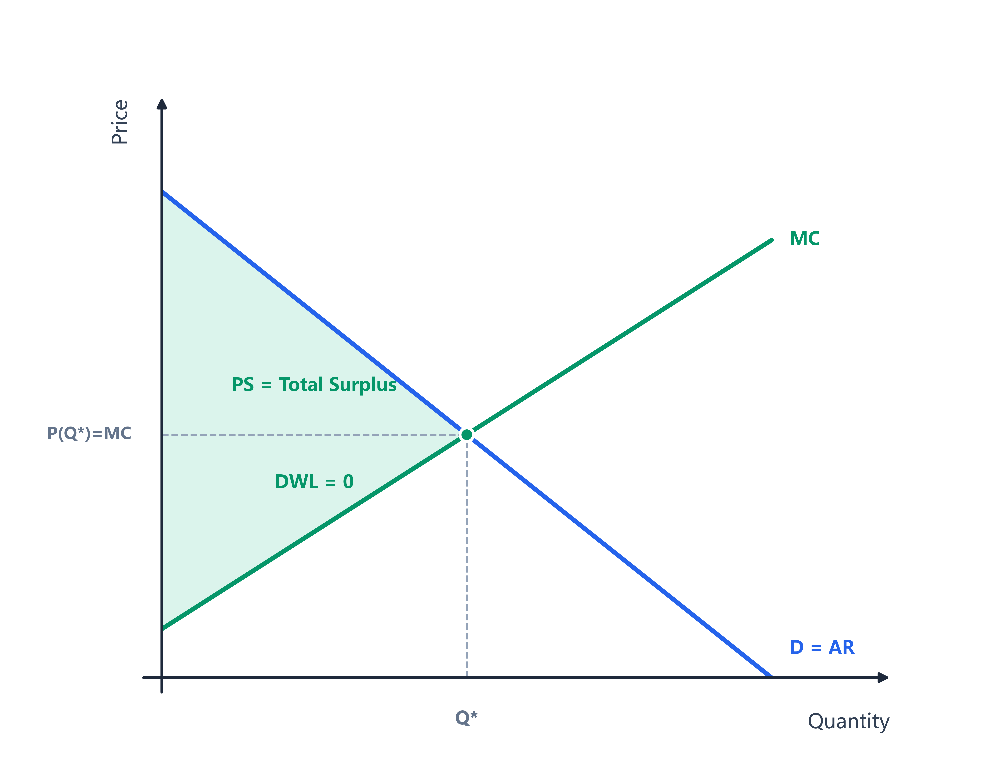

### Natural Monopoly 自然垄断

当单一厂商由于规模经济能够以低于多家厂商的成本服务于整个市场时，形成 *Natural Monopoly*。典型特点：**ATC 持续下降**（在整个市场需求范围内）。常见于公用事业（自来水、电力、天然气）。政府通常通过 *Fair-Return Pricing*（公平回报定价，P = ATC）或 *Marginal-Cost Pricing*（边际成本定价，P = MC，厂商亏损需政府补贴）进行价格管制。

> 💡 **为什么自然垄断的 ATC 持续下降？一步一步推理：**
>
> 1. **极高的固定成本**：铺设自来水管网需要几十亿的前期投资（管道、处理厂、泵站），这是一笔巨大的固定成本 TFC
> 2. **极低的边际成本**：每多供应一户自来水的额外成本非常低 — 几乎只是水的处理费，管道已经铺好了
> 3. **ATC = TFC/Q + AVC**：随着 Q 越来越大，TFC/Q（平均固定成本）持续摊薄 → ATC 持续下降
> 4. **整个市场需求都在 ATC 下降区间**：由于 TFC 极大，ATC 即使到了整个市场的需求量，仍在下降 — 这意味着一家企业生产全部市场需求的 ATC，比两家企业平分市场时的 ATC 更低
>
> 💡 **生活类比：** 想象一栋公寓楼的供水系统。铺设管道的固定成本是 \$100 万，但每多接一户的可变成本只有 \$100。10 户时 ATC = 100 万/10 + 100 = \$10 万/户；1000 户时 ATC = 100 万/1000 + 100 = \$1100/户。户越多，每户分摊的管道费越少。如果让两家公司各铺一套管道，反而浪费 — 这就是为什么自来水公司是自然垄断。
>
> 📌 **自然垄断 vs 普通垄断：** 普通垄断通过进入壁垒"阻止"竞争者进入；自然垄断则是"不需要"竞争者 — 一家企业反而是成本最低的安排。这也就是为什么政府通常不拆分自然垄断企业，而是进行价格管制。
>
> ⚠️ **为什么自然垄断的 MC 一定在 ATC 下方？** 因为 ATC 在持续下降。回顾 GPA 类比：ATC 下降意味着"边际分 < 平均分"，即 MC < ATC。所以 MC 曲线一定在 ATC 曲线的下方。这也解释了为什么 P = MC 定价一定低于 ATC — 厂商必定亏损。

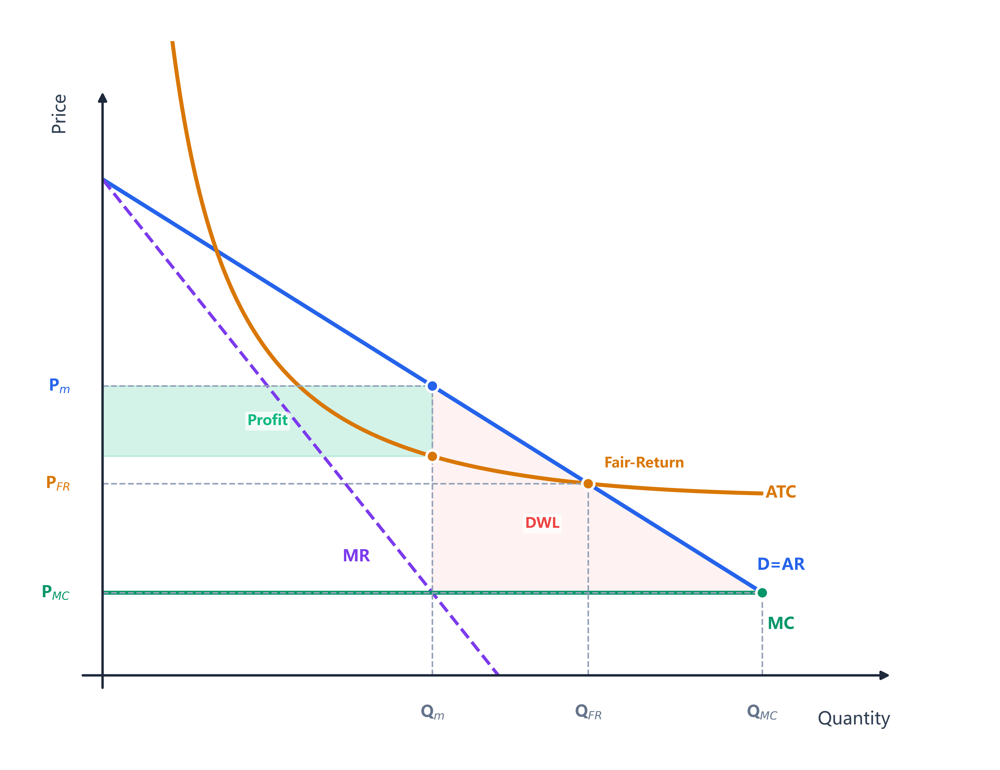

三种定价方案对比：

<table>
<colgroup>
<col style="width:24%"><col style="width:12%"><col style="width:14%"><col style="width:14%"><col style="width:14%"><col style="width:22%">
</colgroup>
<thead>
<tr><th style="text-align:center;vertical-align:middle">方案</th><th style="text-align:center;vertical-align:middle">定价规则</th><th style="text-align:center;vertical-align:middle">产量</th><th style="text-align:center;vertical-align:middle">价格</th><th style="text-align:center;vertical-align:middle">厂商利润</th><th style="text-align:center;vertical-align:middle">配置效率</th></tr>
</thead>
<tbody>
<tr><td style="text-align:center;vertical-align:middle"><strong>Unregulated Monopoly</strong>（不受管制）</td><td style="text-align:center;vertical-align:middle">MR = MC</td><td style="text-align:center;vertical-align:middle">$Q_m$（最低）</td><td style="text-align:center;vertical-align:middle">$P_m$（最高）</td><td style="text-align:center;vertical-align:middle">可能为正/零/负</td><td style="text-align:center;vertical-align:middle">❌ 存在 DWL</td></tr>
<tr><td style="text-align:center;vertical-align:middle"><strong>Fair-Return Pricing</strong>（公平回报定价，P = ATC）</td><td style="text-align:center;vertical-align:middle">P = ATC</td><td style="text-align:center;vertical-align:middle">$Q_{FR}$（中等）</td><td style="text-align:center;vertical-align:middle">$P_{FR}$（中等）</td><td style="text-align:center;vertical-align:middle">零经济利润</td><td style="text-align:center;vertical-align:middle">❌ 仍有 DWL（较小）</td></tr>
<tr><td style="text-align:center;vertical-align:middle"><strong>MC Pricing</strong>（社会最优定价）</td><td style="text-align:center;vertical-align:middle">P = MC</td><td style="text-align:center;vertical-align:middle">$Q_{MC}$（最高）</td><td style="text-align:center;vertical-align:middle">$P_{MC}$（最低）</td><td style="text-align:center;vertical-align:middle">亏损（需补贴）</td><td style="text-align:center;vertical-align:middle">✅ 配置有效</td></tr>
</tbody>
</table>

> 📌 **AP 判断点：** Natural Monopoly 通常来自很高的 fixed cost 和持续的 economies of scale，因此一家公司生产全部市场需求时 ATC 更低。若政府要求 $P=MC$，价格可能低于 ATC，厂商亏损，需要补贴；若要求 $P=ATC$，厂商零经济利润，但产量低于社会最优。

## Monopolistic Competition 垄断竞争

> 💡 **垄断竞争 — 最接近日常生活的市场结构：** 你每天光顾的奶茶店、理发店、餐厅、服装品牌，几乎都是垄断竞争。它既有垄断的一面（每个品牌都有独特性，能稍微定高价），又有竞争的一面（替代品很多，定太高消费者就跑了）。这种"微弱的垄断力量 + 激烈的竞争"是垄断竞争的核心矛盾。

### Characteristics 特征

- **Many firms**（较多厂商）
- **Differentiated products**（差异化产品）— 通过品牌、质量、位置、广告区分
- **Low barriers to entry and exit**（低进入/退出壁垒）
- 厂商具有一定的市场力量（定价能力），但受限于替代品的竞争

> 💡 **产品差异化的具体例子 — 理解"差异化"到底意味着什么：**
>
> 奶茶市场是最好的例子。喜茶、奈雪、CoCo、蜜雪冰城卖的都是"奶茶"，但：
> - **品牌/形象差异化**：喜茶走高端路线，蜜雪冰城走平价路线
> - **质量差异化**：鲜奶 vs 奶精，真水果 vs 果酱
> - **位置差异化**：楼下那家奶茶店就是比 500 米外的那家方便
> - **服务差异化**：有些店可以自定义甜度冰量，有些不能
> - **广告/包装差异化**：喜茶的杯子设计感强，顾客愿意拍照发朋友圈
>
> 因为这些差异，每个品牌都面对一条**向下倾斜的需求曲线**（而不是完全竞争的水平线）— 如果你涨价一点，不是所有人都会跑掉（因为你的奶茶和别人的不完全一样）。但如果你涨太多，消费者还是会转去买替代品。
>
> 📌 **AP 判断点：** 如果题目说"产品差异化"或"通过广告/品牌区分"，这是垄断竞争；如果说"同质产品"，这是完全竞争或寡头（同质寡头）。

### Short Run

短期表现类似垄断：向下倾斜的需求曲线，MR 在 D 下方。厂商可在短期获得经济利润或亏损。

> 💡 **垄断竞争短期的直觉：** 短期内，因为产品有差异，每个厂商都像一个小垄断者 — 如果你做出来的奶茶有独特口味，消费者愿意多付一点钱。所以短期可以赚经济利润。但和真正的垄断不同，这个利润不会持久 — 因为进入壁垒很低，看到你赚钱，别人很快也能开一家奶茶店。

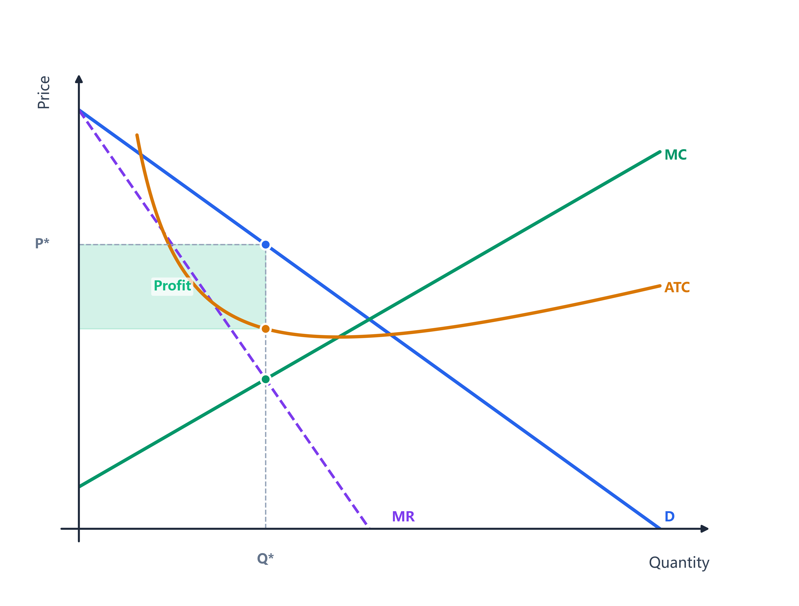

### Long-Run Equilibrium

长期中，经济利润吸引新厂商进入 → 替代品增加 → 每个厂商的需求曲线左移，直到与 ATC 相切 → 零经济利润。

$$\text{长期均衡条件：} MR = MC \text{ 且 } P = ATC \text{（D 与 ATC 相切）}$$

但注意：垄断竞争长期均衡时，$Q^*$ 小于 min ATC 所对应的产量 — 存在 *Excess Capacity*（过剩产能）。$P > MC$，因此不满足配置效率。

> 💡 **Excess Capacity（过剩产能）的直觉：**
>
> 想象一家奶茶店，它的 ATC 最低点对应的是每天做 500 杯。但长期均衡时它只做 300 杯 — 它其实有产能可以做更多，但做更多就得降价，而降价会让利润变负。这个"能做到但不想做"的差距就是过剩产能。
>
> 为什么会有过剩产能？因为需求曲线是向下倾斜的（产品有差异），D 曲线只能与 ATC 相切于 ATC 下降段（左侧），而不是 ATC 的最低点。如果 D 是水平的（完全竞争），切点就在 min ATC — 这就是为什么完全竞争没有过剩产能。
>
> 📌 **AP 对比总结：**

<table>
<thead>
<tr><th style="text-align:center;vertical-align:middle"></th><th style="text-align:center;vertical-align:middle">完全竞争 LR</th><th style="text-align:center;vertical-align:middle">垄断竞争 LR</th></tr>
</thead>
<tbody>
<tr><td style="text-align:center;vertical-align:middle"><strong>P vs MC</strong></td><td style="text-align:center;vertical-align:middle">P = MC</td><td style="text-align:center;vertical-align:middle">P &gt; MC</td></tr>
<tr><td style="text-align:center;vertical-align:middle"><strong>P vs min ATC</strong></td><td style="text-align:center;vertical-align:middle">P = min ATC</td><td style="text-align:center;vertical-align:middle">P &gt; min ATC</td></tr>
<tr><td style="text-align:center;vertical-align:middle"><strong>Excess Capacity</strong></td><td style="text-align:center;vertical-align:middle">无</td><td style="text-align:center;vertical-align:middle">有</td></tr>
<tr><td style="text-align:center;vertical-align:middle"><strong>配置效率</strong></td><td style="text-align:center;vertical-align:middle">✅</td><td style="text-align:center;vertical-align:middle">❌</td></tr>
<tr><td style="text-align:center;vertical-align:middle"><strong>生产效率</strong></td><td style="text-align:center;vertical-align:middle">✅</td><td style="text-align:center;vertical-align:middle">❌</td></tr>
</tbody>
</table>

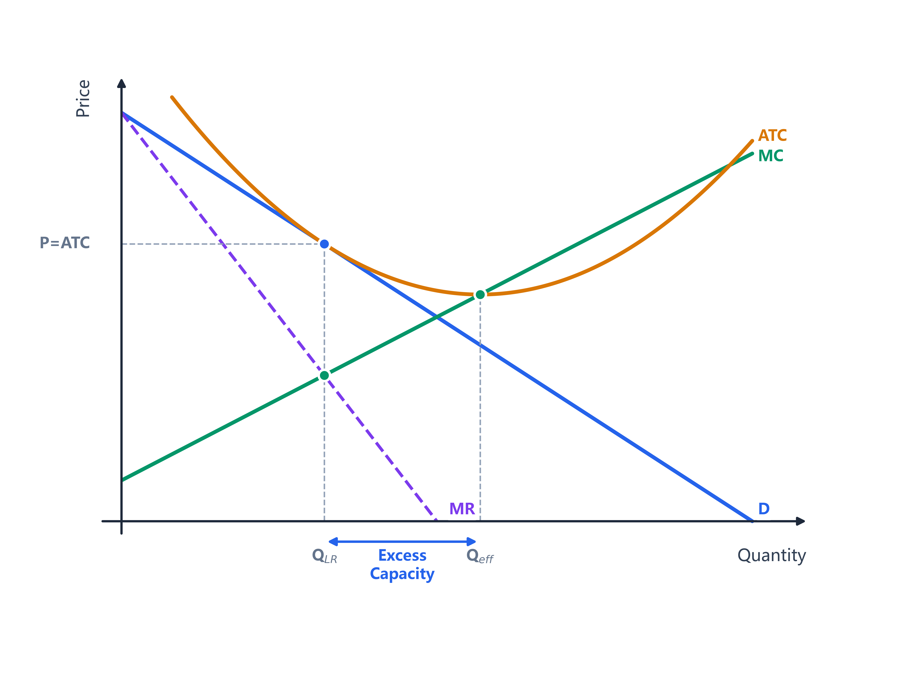

> ⚠️ **垄断竞争 vs 完全竞争 vs 垄断：** 完全竞争长期在 min ATC 生产（无 Excess Capacity）；垄断竞争长期在 tangency 点生产（有 Excess Capacity，$Q^* < \min ATC$ 对应的 Q），$P > MC$；垄断因进入壁垒可长期维持经济利润，且通常存在 DWL。

> 📌 **垄断竞争长期均衡的动态过程（与完全竞争类似）：**
> 1. 短期经济利润 → 新厂商进入（壁垒低）→ 每个厂商的需求曲线左移（因为消费者有更多替代选择）→ 利润下降
> 2. 短期亏损 → 厂商退出 → 每个厂商的需求曲线右移 → 亏损减少
> 3. 直到 P = ATC（D 与 ATC 相切），经济利润为零，进入/退出停止
>
> 🔗 **概念连接：** 垄断竞争的长期调整机制和完全竞争一样 — 都是"利润吸引进入，亏损导致退出"。区别在于，完全竞争的长期均衡在 min ATC（效率最高），而垄断竞争在 ATC 下降段的切点（存在效率损失）。这个差异的根源是产品差异化导致的需求曲线向下倾斜。

## Oligopoly & Game Theory 寡头与博弈论

> 💡 **寡头 — 最"戏剧性"的市场结构：** 寡头市场的独特之处在于"相互依赖" — 你的利润不仅取决于你自己的决策，还取决于对手怎么选。就像下棋一样，你必须考虑"如果我这样做，对方会怎么反应？"。这种策略互动使得寡头市场无法用简单的供需模型分析，而必须借助博弈论。

### Oligopoly 寡头特征

- **Few large firms**（少数大厂商统治市场）
- 高度 *Interdependent*（相互依赖）— 每个厂商的决策取决于对其他厂商行为的预期
- 进入壁垒较高
- 产品可同质（如钢铁、石油）也可差异化（如汽车、手机）

> 💡 **生活例子：** 可口可乐 vs 百事可乐（双寡头）、波音 vs 空客（飞机制造双寡头）、中国三大运营商（移动/联通/电信）。注意寡头不一定是两家；“少数”表示相互依赖的主要厂商，数量没有固定阈值。

### Game Theory & Payoff Matrix 博弈论与收益矩阵

寡头行为主要通过 *Game Theory*（博弈论）分析。核心概念：

- **Players**（参与者）：厂商
- **Strategies**（策略）：厂商可以选择的行动（如高价/低价）
- **Payoffs**（收益）：每种策略组合下的利润
- *Dominant Strategy*（占优策略）：不论对手做什么，自己选择某个策略总是最优的
- *Nash Equilibrium*（纳什均衡）：给定对手的选择，没有参与者愿意单方面改变自己的策略
- *Prisoner's Dilemma*（囚徒困境）：个体理性导致集体非理性的结果

> 💡 **例子：** 两家奶茶店决定是否降价，对方的决策会影响自己的最优选择
>
> 📌 **如何找 Nash Equilibrium — 完整步骤演示：**
>
> 假设两家公司 A 和 B 都可以选择"高价"或"低价"，收益矩阵如下（括号内第一个数字是 A 的利润，第二个是 B 的利润，单位：百万）：
>
> | | B 定高价 | B 定低价 |
> |:---:|:---:|:---:|
> | **A 定高价** | (5, 5) | (2, 7) |
> | **A 定低价** | (7, 2) | (3, 3) |
>
> **Step 1：找 A 的占优策略（固定 B 的选择，比较 A 的收益）**
> - 如果 B 定高价：A 定高价赚 5，定低价赚 7 → A 选低价（7 > 5）
> - 如果 B 定低价：A 定高价赚 2，定低价赚 3 → A 选低价（3 > 2）
> - **结论：无论 B 怎么选，A 都选低价 → 低价是 A 的占优策略**
>
> **Step 2：找 B 的占优策略（固定 A 的选择，比较 B 的收益）**
> - 如果 A 定高价：B 定高价赚 5，定低价赚 7 → B 选低价（7 > 5）
> - 如果 A 定低价：B 定高价赚 2，定低价赚 3 → B 选低价（3 > 2）
> - **结论：无论 A 怎么选，B 都选低价 → 低价是 B 的占优策略**
>
> **Step 3：确定 Nash Equilibrium**
> - A 选低价，B 选低价 → (3, 3)
> - **验证：** 给定 B 选低价，A 选高价赚 2 < 3，A 不会单方面改；给定 A 选低价，B 选高价赚 2 < 3，B 不会单方面改 ✅
> - **Nash Equilibrium = (低价, 低价) → (3, 3)**
>
> **Step 4：识别囚徒困境**
> - 双方都定高价 → (5, 5)，比 (3, 3) 更好！
> - 但这不是均衡 — 任何一方都可以通过单方面降价从 5 变成 7
> - **这就是囚徒困境：个体理性（各选占优策略）导致集体非理性（都赚 3 而不是 5）**
>
> 📌 **AP 应试要点：**
> - 不是所有博弈都有占优策略 — 有时需要逐格分析
> - Nash Equilibrium 可能有多个（但 AP 一般只考一个的简单情形）
> - 如果双方都有占优策略，占优策略的交点一定是 Nash Equilibrium

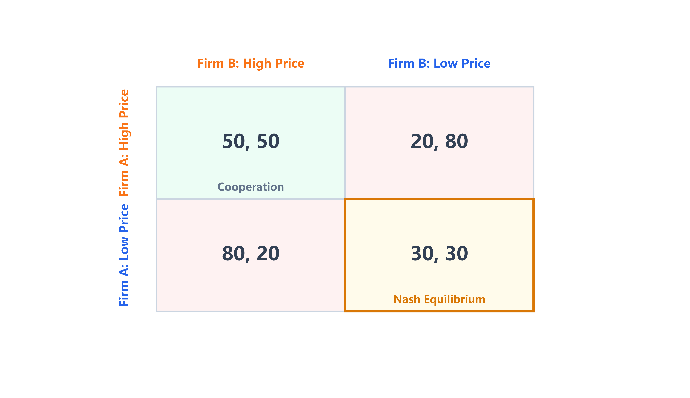

> 💡 **囚徒困境解析：** 双方都选择 Low Price 是一个 Nash Equilibrium — 个人最优策略的结果是双方都只赚 \$30。但若双方能合作（都选 High Price），各自可赚 \$50。合作高价虽能提高厂商联合利润，却损害消费者利益并可能违法。反垄断法（*Antitrust Law*）正是为了限制寡头合谋（*Collusion*）和形成卡特尔（*Cartel*），保护市场竞争和消费者利益。

> 💡 **卡特尔（Cartel）与合谋（Collusion）：**
>
> 如果寡头们能达成协议共同维持高价，就能像垄断者一样赚取高额利润 — 这就是**合谋**。最著名的例子是 OPEC（石油输出国组织），成员国约定限产保价。
>
> 但合谋很难维持，原因有三：
> 1. **违约诱惑**：每个成员都有暗地降价、多卖的冲动（就像囚徒困境中的"背叛"）
> 2. **执法困难**：在很多国家，明目张胆的价格合谋是违法的（反垄断法 / *Sherman Act*）
> 3. **新进入者**：如果合谋导致价格过高，可能吸引新竞争者进入
>
> 📌 **AP 考点：** 合谋的结果类似垄断（高价格、低产量、DWL），但不如垄断稳定。卡特尔成员之间的"背叛"激励使得合谋往往在长期难以维持 — 除非有强大的执行机制。
>
> ⚠️ **Explicit Collusion（明示合谋）vs Tacit Collusion（默契合谋）：** 明示合谋是厂商之间直接协商定价（违法）；默契合谋是厂商通过观察对手行为自然形成的价格跟随（如"价格领袖制"— 一家涨价其他家跟着涨，难以被法律追究）。

## Market Structure Comparison 市场结构对比

<table>
<colgroup>
<col style="width:28%"><col style="width:18%"><col style="width:18%"><col style="width:18%"><col style="width:18%">
</colgroup>
<thead>
<tr><th style="text-align:center">特征</th><th style="text-align:center">Perfect Competition</th><th style="text-align:center">Monopolistic Competition</th><th style="text-align:center">Oligopoly</th><th style="text-align:center">Monopoly</th></tr>
</thead>
<tbody>
<tr><td style="text-align:center">厂商数量</td><td style="text-align:center">非常多</td><td style="text-align:center">多</td><td style="text-align:center">少</td><td style="text-align:center">一个</td></tr>
<tr><td style="text-align:center">产品类型</td><td style="text-align:center">同质</td><td style="text-align:center">差异化</td><td style="text-align:center">同质或差异化</td><td style="text-align:center">独特</td></tr>
<tr><td style="text-align:center">进入壁垒</td><td style="text-align:center">无</td><td style="text-align:center">低</td><td style="text-align:center">高</td><td style="text-align:center">非常高</td></tr>
<tr><td style="text-align:center">LR经济利润</td><td style="text-align:center">0</td><td style="text-align:center">0</td><td style="text-align:center">&gt;0（可能）</td><td style="text-align:center">&gt;0（可能）</td></tr>
<tr><td style="text-align:center">P vs MC</td><td style="text-align:center">P = MC</td><td style="text-align:center">P &gt; MC</td><td style="text-align:center">取决于博弈与竞争方式</td><td style="text-align:center">标准单一价格模型通常 P &gt; MC</td></tr>
<tr><td style="text-align:center">DWL</td><td style="text-align:center">0</td><td style="text-align:center">通常 &gt;0</td><td style="text-align:center">取决于具体模型</td><td style="text-align:center">标准单一价格模型通常 &gt;0</td></tr>
<tr><td style="text-align:center">Excess Capacity</td><td style="text-align:center">无</td><td style="text-align:center">有</td><td style="text-align:center">可能有</td><td style="text-align:center">可能有</td></tr>
</tbody>
</table>

> 📌 **如何识别市场结构 — AP 解题决策指南：**
>
> 遇到"这是什么市场结构？"的题目，按以下顺序判断：
>
> ```
> Step 1: 厂商数量
>     ├── 只有一个 → 垄断（Monopoly）
>     ├── 少数相互依赖的主要厂商 → 寡头（Oligopoly）
>     └── 很多 → 进入 Step 2
>              ↓
> Step 2: 产品类型
>     ├── 同质/无差异 → 完全竞争（Perfect Competition）
>     └── 差异化 → 垄断竞争（Monopolistic Competition）
> ```
>
> **关键识别线索（AP 常见关键词）：**
>
> | 关键词 | 对应市场结构 |
> |:---:|:---:|
> | Price Taker, 水平需求曲线, D = MR = P | 完全竞争 |
> | 差异化产品, 广告/品牌, Excess Capacity | 垄断竞争 |
> | 相互依赖, 博弈论, 收益矩阵, 卡特尔 | 寡头 |
> | 单一卖者, 进入壁垒, Price Maker, MR < D | 垄断 |
> | 长期零经济利润 + P = min ATC | 完全竞争 |
> | 长期零经济利润 + P > min ATC | 垄断竞争 |
> | 可能长期经济利润 + 高壁垒 | 寡头或垄断 |
>
> ⚠️ **常见混淆：** "很多厂商 + 差异化产品"是垄断竞争，不是完全竞争！"同质产品"是完全竞争的特征，而"差异化"是垄断竞争的特征。这个区分在 AP 选择题中出现频率极高。
>
> 🔗 **全单元概念连接 — 四种市场结构的效率排序：**
> - **生产效率（P = min ATC）：** 完全竞争 ✅ → 其余均 ❌
> - **配置效率（P = MC）：** 完全竞争 ✅ → 其余均 ❌（完全价格歧视的垄断是特殊情况：配置有效但 CS = 0）
> - **长期经济利润：** 完全竞争和垄断竞争在标准自由进入模型中趋于 0；寡头和垄断的利润取决于需求、成本、进入壁垒与竞争方式，可能为正、零或负。
> - **DWL：** 完全竞争在标准模型中为 0；寡头和垄断的效率结果取决于具体模型，标准单一价格垄断通常有 DWL，完全价格歧视垄断是 DWL=0 但 CS=0 的例外。

## 例题

### MCQ

1.  A monopolist faces a downward-sloping demand curve. Which of the following is true about the monopolist's marginal revenue?

    a) Marginal revenue is equal to price.

    b) Marginal revenue is greater than price.

    c) Marginal revenue is less than price.

    d) Marginal revenue is constant at all quantities.

    e) Marginal revenue is zero at the profit-maximizing quantity.

2.  Compared to a perfectly competitive market with the same cost structure, a single-price monopolist will

    a) produce more output and charge a higher price

    b) produce less output and charge a higher price

    c) produce the same output and charge a higher price

    d) produce less output and charge a lower price

    e) produce more output and charge a lower price

3.  A firm that practices perfect price discrimination will do which of the following?

    a) Charge all consumers the same price

    b) Produce the socially efficient quantity

    c) Earn less profit than a single-price monopolist

    d) Produce less output than a single-price monopolist

    e) Create a larger deadweight loss than a single-price monopolist

4.  In a typical prisoner's dilemma, the Nash equilibrium occurs when

    a) both players choose the strategy that maximizes their joint payoffs

    b) both players choose their dominant strategy

    c) both players choose to cooperate

    d) neither player has a dominant strategy

    e) one player cooperates and the other defects

5.  In long-run equilibrium, a monopolistically competitive firm

    a) produces at minimum average total cost

    b) earns zero economic profit

    c) charges a price equal to marginal cost

    d) produces where price equals marginal revenue

    e) faces a horizontal demand curve.

6.  For a monopolist facing a downward-sloping linear demand curve, which of the following is true at the profit-maximizing quantity?

    a) Price is equal to marginal cost.

    b) Price is greater than marginal revenue, and marginal revenue equals marginal cost.

    c) Marginal revenue is greater than price.

    d) Demand is unit elastic.

    e) Average total cost is minimized.

7.  A monopolist engages in perfect (first-degree) price discrimination. Compared to a single-price monopolist, the perfectly price-discriminating monopolist will

    a) produce less output and create a larger deadweight loss.

    b) produce less output and eliminate deadweight loss.

    c) produce the socially optimal quantity and eliminate deadweight loss, but consumer surplus will be zero.

    d) produce the socially optimal quantity and increase consumer surplus.

    e) produce the same output as a perfectly competitive market but at a higher price.

8.  In monopolistic competition, long-run equilibrium is characterized by which of the following?

    a) P = MC = min ATC.

    b) P > MC and P = ATC (zero economic profit).

    c) P = MC and P > ATC.

    d) P = MR = MC, with positive economic profit.

    e) Firms produce at the minimum of average total cost.

9.  In game theory, a dominant strategy is a strategy that

    a) gives a player the highest payoff regardless of the opponent's choice.

    b) is optimal only given the opponent's best response.

    c) results in the highest combined payoff for both players.

    d) always yields the same payoff regardless of the opponent's move.

    e) leads to the Pareto-efficient outcome.

10. If a natural monopoly is regulated to produce at the allocatively efficient quantity, which of the following is true?

    a) The firm will set price equal to marginal cost and earn positive economic profit.

    b) The firm will set price equal to average total cost and earn zero economic profit.

    c) The firm will set price equal to marginal cost, but will incur losses and require a subsidy.

    d) The firm will set price equal to average variable cost and earn positive profit.

    e) Deadweight loss will increase compared to unregulated monopoly.

### FRQ

Two firms, Alpha and Beta, operate in an oligopolistic market. Each firm must decide whether to advertise or not advertise. The payoff matrix below shows the profits each firm earns in millions of dollars.

<table>
<thead>
<tr><th style="text-align:center"></th><th style="text-align:center">Beta Advertises</th><th style="text-align:center">Beta Does Not Advertise</th></tr>
</thead>
<tbody>
<tr><td style="text-align:center">Alpha Advertises</td><td style="text-align:center">(5, 5)</td><td style="text-align:center">(10, 2)</td></tr>
<tr><td style="text-align:center">Alpha Does Not Advertise</td><td style="text-align:center">(2, 10)</td><td style="text-align:center">(8, 8)</td></tr>
</tbody>
</table>

(a) Does Alpha have a dominant strategy? Explain.

(b) Does Beta have a dominant strategy? Explain.

(c) What is the Nash equilibrium? Explain.

(d) Is the Nash equilibrium a socially optimal outcome? Explain.

(e) If the firms could collude, what outcome would they choose? Explain.

---

# Factor Markets

> **考试权重：10–13%**

## Derived Demand 派生需求

要素市场（*Factor Markets*）与产品市场的关键区别：对生产要素的需求是 *Derived Demand*（派生需求）— 不是为直接消费，而是因为它们能用来生产最终产品和服务。

三个具体例子：
① 旅游业旺盛 → 酒店多雇佣服务员
② 手机热销 → 芯片厂增加产能 → 多招工程师
③ 钢琴课需求下降 → 钢琴教师失业

📌 **要素需求由产品需求决定，这是"派生"的含义** — 要素需求不是凭空产生的，而是从消费者对最终产品的需求中"派生"出来的。

🔗 **概念连接：** 回顾 Unit 2 中需求曲线的平移因素 — 当消费者对产品的需求增加时（如偏好变化、收入增加），产品需求曲线右移 → 产品价格上升 → 厂商对要素的需求也随之右移。这是一个"产品市场 → 要素市场"的传导链条。

## Marginal Revenue Product 边际收益产品

*Marginal Revenue Product (MRP)* 是厂商多雇佣一单位要素所增加的额外收入。

> 💡 **生活类比：** 你开了一家奶茶店，每杯奶茶卖10元。目前有2个店员，每天做60杯。如果你再雇1个店员，每天能多做10杯，那这个新店员给你带来的额外收入 = 10杯 × 10元 = 100元 = MRP。如果雇这个店员的日工资是80元（MFC），因为 MRP=100 > MFC=80，所以应该雇佣！

$$MRP = MP \times MR$$

$$\text{在完全竞争产品市场中：} MR = P, \text{ 所以 } MRP = MP \times P$$

**数值计算示例（完全竞争产品市场，P = \$10）：**

| 工人数量 L | 边际产量 MP | 产品价格 P | 边际收益产品 MRP = MP × P |
|:----------:|:----------:|:----------:|:-------------------------:|
| 1          | 20         | \$10       | \$200                     |
| 2          | 18         | \$10       | \$180                     |
| 3          | 16         | \$10       | \$160                     |
| 4          | 14         | \$10       | \$140                     |
| 5          | 12         | \$10       | \$120                     |
| 6          | 10         | \$10       | \$100                     |

当工资 $w = \$120$ 时，厂商雇佣到 MRP ≥ w 的最后一个工人：L = 5 时 MRP = \$120 = w，L = 6 时 MRP = \$100 < \$120 = w，因此最优雇佣量为 **5 个工人**。

⚠️ 在其他投入、技术和产品市场条件给定时，**MRP 曲线可表示厂商的劳动需求曲线** — 厂商根据 MRP 与要素成本的比较决定雇佣量；完全竞争产品市场下，$MRP=VMP=MP\times P$。图上的横纵坐标应按图示定义读取，不要把点的坐标固定写成 $(w,L)$。

📌 **FRQ 考法：给出 MP 和 P，求 MRP 并判断最优雇佣量。** 解题步骤：① 计算 MRP = MP × P ② 找到 MRP ≥ w 的最大 L ③ 超过该 L 则 MRP < w，不应再雇佣。

- *Marginal Physical Product (MPP / MP)*：多一单位劳动带来的额外产量
- *Marginal Revenue (MR)*：多卖一单位产品的额外收入

## Profit Maximization in Factor Markets

$$\text{雇佣直到：} MRP = MFC \ (\text{Marginal Factor Cost})$$

在完全竞争劳动市场中，厂商是 *Wage Taker*（工资接受者），因此 $MFC = \text{Wage Rate}\ (w)$。此时：$MRP = w$

> 📌 **关键关系：**
> - **产品市场**：雇佣劳动直到 MR = MC（确定最优产量）
> - **要素市场**：雇佣劳动直到 MRP = MFC（确定最优劳动量）
> - 两者是**同一决策的两面** — 成本最小化 → 利润最大化

**产品市场 vs 要素市场 — 平行对比表：**

| 维度 | 产品市场 | 要素市场 |
|:---:|:---:|:---:|
| 均衡条件 | MR = MC | MRP = MFC |
| 决定什么 | 最优产量 Q\* | 最优雇佣量 L\* |
| 需求曲线 | D（消费者需求） | MRP（厂商对要素的需求） |
| 供给曲线 | S / MC（厂商供给） | $S_L$（工人劳动供给） |
| 边际决策 | 多生产一单位 → MR vs MC | 多雇佣一人 → MRP vs MFC |
| 利润最大 | MR = MC → Q\* | MRP = MFC → L\* |

💡 **就像硬币的两面：产品市场决定生产多少，要素市场决定雇多少人，但本质是同一个决策。** 你决定多生产 1 单位产品（MR = MC），必然意味着你需要多雇佣能生产这 1 单位的劳动（MRP = MFC）。

## Changes in Factor Demand and Factor Supply 要素需求与要素供给的变化

### Shifters of Factor Demand 要素需求的平移因素

MRP = MP × MR（产品市场完全竞争时 MR = P），因此 MRP 曲线的平移一般由 MP 或 MR 的变化决定；在完全竞争产品市场中，MR 的变化表现为产品价格 P 的变化：

- **产品价格变化（P↑）**：MRP 右移。例如产品需求增加 → 价格上升 → 厂商愿意雇佣更多劳动
- **生产率 / 技术变化（MP↑）**：MRP 右移。技术进步使工人产出增加
- **其他要素价格变化**：替代要素降价 → 用替代要素替代劳动 → 劳动需求左移；互补要素降价 → 劳动需求右移
- **企业数量变化**：行业扩张 → 市场劳动需求右移

**每个因素的真实案例：**
① **P↑**：iPhone 热销 → 苹果多招装配工人
② **MP↑**：引入自动化设备 → 工人产出翻倍 → 厂商对劳动需求增加（互补效应）
③ **替代要素降价**：工业机器人降价 → 厂商用机器人替代工人 → 劳动需求左移（替代效应）；反之，互补要素降价（如软件工具升级）→ 工人效率提升 → 劳动需求右移
④ **企业数量变化**：外卖行业爆发式增长 → 骑手需求大幅右移

📌 **MRP = MP × MR（一般式）；完全竞争产品市场中 MR = P，故 MRP = MP × P。** 单厂商 MRP 的平移由 MP 或 MR 的变化引起；行业劳动需求还受厂商数量影响。替代/互补要素通过替代效应和产量效应改变劳动需求，不一定仅通过 MP。

### Shifters of Factor Supply 要素供给的平移因素

- **人口与劳动力规模**：移民增加、人口增长 → 供给右移
- **偏好与工作意愿**：退休年龄、文化因素、家庭分工变化
- **替代性职业的工资**：其他行业工资上升 → 本行业劳动供给左移
- **政府政策**：移民政策、所得税变化（所得税对劳动供给的影响方向取决于收入效应与替代效应的相对大小）

> ⚠️ **注意：** 最低工资是价格下限（price floor），不移动劳动供给曲线，而是导致沿原供给曲线读取新的供给量。

**每个因素的真实案例：**
① **人口与劳动力规模**：大量移民涌入 → 建筑行业劳动供给右移 → 工资下降
② **偏好与工作意愿**：疫情后更多人偏好远程工作 → 线下零售业劳动供给左移 → 工资上升压力
③ **替代性职业的工资**：科技公司大幅加薪 → 传统制造业人才流失 → 制造业劳动供给左移
④ **政府政策**：降低个人所得税 → 实际到手工资增加 → 更多人愿意工作 → 供给右移

📌 **沿曲线移动 vs 平移的区分与 Unit 2 相同：** 工资变化 → 沿供给曲线移动；非工资因素变化 → 整条曲线平移。

## Perfectly Competitive Labor Market 完全竞争劳动市场

- 很多厂商竞争雇佣劳动 → 每个厂商是 *Wage Taker*
- 厂商面临的劳动供给曲线是水平的（*Perfectly Elastic*），在工资 $w$ 处
- $S_L = MFC = w$（对单个厂商而言）
- 劳动需求曲线 = MRP 曲线（向下倾斜，由于 Diminishing Marginal Product）
- 均衡雇佣量：MRP = w

**5 步读图法：**
① 识别 MRP 曲线（即劳动需求曲线，向下倾斜）
② 识别水平工资线 w（即劳动供给 = MFC，水平线）
③ 找到 MRP = w 的交点
④ 在 x 轴读取最优雇佣量 L\*
⑤ 计算总收益产品 TRP = P × 总产量（或用 MRP 累加）

⚠️ **市场层面供给向上倾斜，但单个厂商面临水平供给线。** 因为单个厂商太小，其雇佣量不影响市场工资 — 类似完全竞争产品市场中单个厂商面临水平需求线。

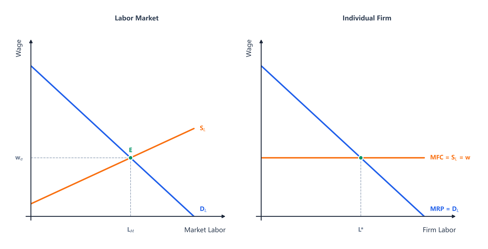

## Monopsony 买方垄断

*Monopsony*（买方垄断）指要素市场上只有一个买家（如一个城镇中只有一个大雇主）。

- 市场劳动供给曲线向上倾斜（要雇佣更多劳动，必须提高工资）
- $MFC > w$ — 因为提高工资不仅适用于新工人，也适用于所有现有工人
- MFC 曲线位于 $S_L$（劳动供给）曲线的上方

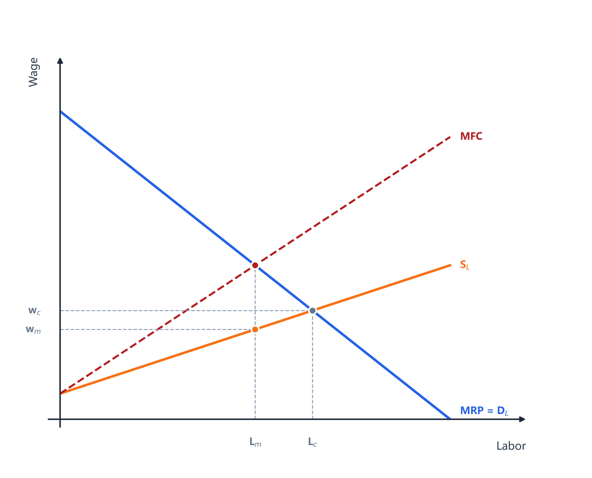

> ⚠️ **Monopsony vs Perfect Competition Labor Market：** 买方垄断雇佣更少的劳动（$L_m < L_c$）并支付更低的工资（$w_m < w_c$）。工资低于 MRP — 这与完全竞争劳动市场（w = MRP）形成对比。

**为什么 MFC > w？— 数值计算演示：**

<table>
<thead>
<tr><th style="text-align:center">工人数量 L</th><th style="text-align:center">工资率 w</th><th style="text-align:center">总可变成本 TVC = w × L</th><th style="text-align:center">边际要素成本 MFC = ΔTVC</th></tr>
</thead>
<tbody>
<tr><td style="text-align:center">1</td><td style="text-align:center">$2</td><td style="text-align:center">$2</td><td style="text-align:center">$2</td></tr>
<tr><td style="text-align:center">2</td><td style="text-align:center">$3</td><td style="text-align:center">$6</td><td style="text-align:center">$4</td></tr>
<tr><td style="text-align:center">3</td><td style="text-align:center">$4</td><td style="text-align:center">$12</td><td style="text-align:center">$6</td></tr>
</tbody>
</table>

**详细解释：** 雇佣第 3 个工人需付 w = \$4，但前 2 个工人也要从 \$3 涨到 \$4，额外支出 = \$4（付给新工人）+ 2 × \$1（给老工人加薪）= **\$6 = MFC > w = \$4**。这就是 MFC > w 的根本原因：涨工资不只是付给新工人，还必须给所有现有工人补差价。

⚠️ **MFC ≠ w，MFC 在 S_L 上方。** 买方垄断的关键特征就是 MFC 曲线位于供给曲线上方，导致 MRP = MFC 的交点对应的雇佣量更少、工资更低。

## Minimum Wage 最低工资

最低工资是劳动市场上的价格下限（Price Floor）。其效果取决于市场结构：

- **完全竞争劳动市场：** 约束性最低工资（高于均衡工资）→ 劳动过剩（失业），类似于产品市场的 Binding Price Floor。若最低工资低于或等于均衡工资，则不产生效果。

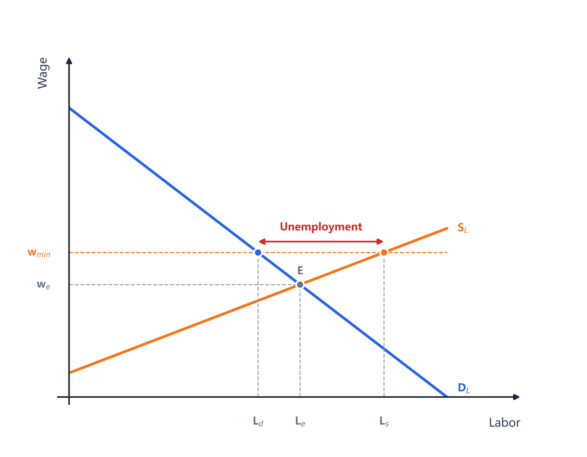

- **买方垄断劳动市场：** 合理水平的最低工资**可能同时增加工资和就业** — 这是 AP 考试的特殊考点。在买方垄断下，最低工资可视为新的劳动供给曲线（在最低工资水平水平延伸至与 MRP 相交）。就业是否增加取决于最低工资与新的分段 MFC 及 MRP 的交点 — 当最低工资设在原 $w_m$ 与 $w_c$ 之间的某一范围内时，就业通常增加；但若最低工资过高（超出使 MRP = MFC 的范围），就业反而可能减少。

**关键机制（逐步解析）：**
① **没有最低工资时**：MRP = MFC → 厂商选择 $L_m$（雇佣少）、$w_m$（工资低）
② **设 $W_{min}$ 在 $w_m$ 和 $w_c$ 之间**：新供给曲线在 $W_{min}$ 处水平延伸 → MFC 在 $W_{min}$ 范围内也变为水平 → MRP = $W_{min}$ 的交点 → $L^* > L_m$
③ **结果**：工资 ↑ 且就业 ↑ — 这是 AP 微观中极少数"价格管制改善效率"的特例

💡 **直觉类比：买方垄断像"一家独大的老板压低工资"，最低工资打破了这个压价能力。** 原来老板可以说"你不受雇就找不到工作"，现在老板必须按最低工资雇人，反而愿意雇更多人。

⚠️ **买方垄断下就业效应取决于最低工资与分段 MFC 及 MRP 的交点，不能一概而论；完全竞争市场中只有约束性（高于均衡工资的）最低工资才导致失业。** AP 考试常考这个区别：同一政策在不同市场结构下效果不同。

🔗 **产品市场 ↔ 要素市场桥梁表：**

<table>
<colgroup>
<col style="width:20%"><col style="width:40%"><col style="width:40%">
</colgroup>
<thead>
<tr><th style="text-align:center;vertical-align:middle">概念</th><th style="text-align:center;vertical-align:middle">产品市场</th><th style="text-align:center;vertical-align:middle">要素市场</th></tr>
</thead>
<tbody>
<tr><td style="text-align:center;vertical-align:middle">垄断方</td><td style="text-align:center;vertical-align:middle">卖方垄断（Monopoly）</td><td style="text-align:center;vertical-align:middle">买方垄断（Monopsony）</td></tr>
<tr><td style="text-align:center;vertical-align:middle">权力来源</td><td style="text-align:center;vertical-align:middle">唯一卖家 → 控制价格</td><td style="text-align:center;vertical-align:middle">唯一买家 → 控制工资</td></tr>
<tr><td style="text-align:center;vertical-align:middle">结果</td><td style="text-align:center;vertical-align:middle">P &gt; MC，Q 偏低</td><td style="text-align:center;vertical-align:middle">w &lt; MRP，L 偏低</td></tr>
<tr><td style="text-align:center;vertical-align:middle">管制效果</td><td style="text-align:center;vertical-align:middle">价格上限可能改善效率</td><td style="text-align:center;vertical-align:middle">最低工资可能改善效率</td></tr>
</tbody>
</table>

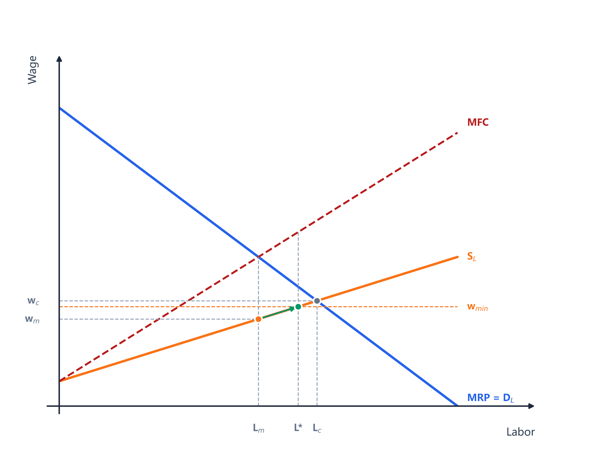

## 例题

### MCQ

1.  A firm operates in a perfectly competitive labor market. The firm's marginal revenue product of labor is \$20, and the wage rate is \$15. Which of the following is true?

    a) The firm should hire more workers.

    b) The firm should hire fewer workers.

    c) The firm is currently hiring the profit-maximizing number of workers.

    d) The firm should shut down.

    e) The firm should increase its price.

2.  A perfectly competitive firm will hire workers up to the point where which of the following is true?

    a) Marginal revenue product equals the wage rate.

    b) Marginal revenue product equals zero.

    c) Total revenue is maximized.

    d) Average product is maximized.

    e) Marginal cost equals price.

3.  If the government imposes a minimum wage above the equilibrium wage in a competitive labor market, which of the following will occur?

    a) Employment will increase.

    b) A shortage of labor will occur.

    c) A surplus of labor (unemployment) will occur.

    d) The quantity of labor demanded will exceed the quantity supplied.

    e) Wages will fall.

4.  Which of the following most directly explains why a monopsonist hires fewer workers and pays a lower wage than a firm in a perfectly competitive labor market?

    a) The monopsonist faces a horizontal labor supply curve at the market wage.

    b) The monopsonist's marginal factor cost exceeds the wage rate.

    c) The monopsonist has no market power in the product market.

    d) The monopsonist faces a downward-sloping product demand curve.

    e) The monopsonist must pay a minimum wage.

5.  If the price of a firm's output increases, what will happen to the firm's demand for labor?

    a) It will decrease because production is less profitable.

    b) It will increase because the marginal revenue product of labor increases.

    c) It will remain unchanged because labor demand depends only on the wage rate.

    d) It will decrease because the firm will substitute capital for labor.

    e) It will increase because the supply of labor has increased.

6.  A profit-maximizing firm in a perfectly competitive labor market will hire labor up to the point where

    a) the wage rate equals the marginal product of labor.

    b) the wage rate equals the marginal revenue product of labor.

    c) the marginal product of labor is maximized.

    d) the value of the average product of labor equals the wage rate.

    e) marginal revenue equals marginal product.

7.  Which of the following will cause the demand curve for labor to shift to the right?

    a) A decrease in the wage rate.

    b) An increase in the price of the firm's output.

    c) A decrease in the marginal product of labor due to a technology that substitutes for labor.

    d) An increase in the supply of labor.

    e) An increase in the wage rate.

8.  A monopsonist, compared to a perfectly competitive labor market, will hire

    a) more workers and pay a higher wage.

    b) more workers and pay a lower wage.

    c) fewer workers and pay a wage equal to marginal factor cost.

    d) fewer workers and pay a wage below marginal factor cost.

    e) the same number of workers but pay a lower wage.

9.  If the demand for labor is elastic, an increase in the minimum wage above the equilibrium wage will cause

    a) employment to fall by a larger percentage than the wage increase.

    b) employment to fall by a smaller percentage than the wage increase.

    c) employment to rise.

    d) no change in employment.

    e) total wage income for employed workers to rise.

10. The least-cost combination of two inputs, labor (L) and capital (K), occurs when which condition holds?

    a) $MP_L$ / $P_L$ = $MP_K$ / $P_K$

    b) $MP_L$ = $MP_K$

    c) $P_L$ = $P_K$

    d) $MP_L$ × $P_L$ = $MP_K$ × $P_K$

    e) $MRP_L$ = $MRP_K$

### FRQ

Assume a perfectly competitive firm produces widgets. The market price of widgets is \$10. The firm's marginal product of labor is given by the following table:

| Number of Workers | Marginal Product of Labor |
|:-----------------:|:-------------------------:|
| 1                 | 20                        |
| 2                 | 18                        |
| 3                 | 16                        |
| 4                 | 14                        |
| 5                 | 12                        |
| 6                 | 10                        |

(a) Calculate the marginal revenue product of labor for the 3rd worker.

(b) If the wage rate is \$120, how many workers should the firm hire? Explain.

(c) Assume the price of widgets increases to \$12. How will this affect the firm's demand for labor? Explain.

(d) Assume instead that the firm is a monopsonist in the labor market. How does the monopsonist's hiring decision compare to that of a perfectly competitive firm? Explain.

---

# Market Failure & Role of Government

> **考试权重：8–13%**

## What Is Market Failure? 什么是市场失灵？

当自由市场不能有效配置资源、无法最大化 *Total Surplus* 时，就发生了 *Market Failure*（市场失灵）。主要类型包括：外部性、公共品、公共资源、信息不对称（*Asymmetric Information*）、垄断力量。此外，**收入不平等**虽然常与市场失灵一并讨论，但它本质上属于**分配公平**问题而非配置效率问题 — 即使市场实现了帕累托有效，分配结果仍可能高度不平等。

**市场失灵分类表（7 大类型）：**

<table>
<colgroup>
<col style="width:30%"><col style="width:42%"><col style="width:28%">
</colgroup>
<thead>
<tr><th style="text-align:center;vertical-align:middle">类型</th><th style="text-align:center;vertical-align:middle">核心问题</th><th style="text-align:center;vertical-align:middle">典型例子</th></tr>
</thead>
<tbody>
<tr><td style="text-align:center;vertical-align:middle">负外部性（Negative Externality）</td><td style="text-align:center;vertical-align:middle">社会成本 &gt; 私人成本 → 过度生产</td><td style="text-align:center;vertical-align:middle">工厂污染、噪音、二手烟</td></tr>
<tr><td style="text-align:center;vertical-align:middle">正外部性（Positive Externality）</td><td style="text-align:center;vertical-align:middle">社会收益 &gt; 私人收益 → 生产不足</td><td style="text-align:center;vertical-align:middle">教育、疫苗接种、研发</td></tr>
<tr><td style="text-align:center;vertical-align:middle">公共品（Public Goods）</td><td style="text-align:center;vertical-align:middle">非排他性+非竞争性 → 搭便车 → 供给不足</td><td style="text-align:center;vertical-align:middle">国防、路灯、知识</td></tr>
<tr><td style="text-align:center;vertical-align:middle">公共资源（Common Resources）</td><td style="text-align:center;vertical-align:middle">非排他性+竞争性 → 过度使用 → 资源耗竭</td><td style="text-align:center;vertical-align:middle">渔场、森林、清洁空气</td></tr>
<tr><td style="text-align:center;vertical-align:middle">信息不对称（Asymmetric Information）</td><td style="text-align:center;vertical-align:middle">一方信息多于另一方 → 逆向选择/道德风险</td><td style="text-align:center;vertical-align:middle">二手车（柠檬市场）、医疗保险</td></tr>
<tr><td style="text-align:center;vertical-align:middle">垄断力量（Market Power）</td><td style="text-align:center;vertical-align:middle">P &gt; MC → 产量低于社会最优 → DWL</td><td style="text-align:center;vertical-align:middle">自然垄断、卡特尔</td></tr>
<tr><td style="text-align:center;vertical-align:middle">收入不平等（Income Inequality）</td><td style="text-align:center;vertical-align:middle">市场分配可能极度不均</td><td style="text-align:center;vertical-align:middle">贫富差距扩大</td></tr>
</tbody>
</table>

> 💡 **信息不对称的生活例子：** 你想买一辆二手车，卖主知道车有没有暗病但你不知道 — 这就是信息不对称。结果：好车车主不愿低价出售（退出市场），剩下的大多是"柠檬"（次品）→ **逆向选择**（Adverse Selection）。买了保险后开车更莽撞 → **道德风险**（Moral Hazard）。政府解决方案：强制信息披露、产品质检、强制保险。

💡 **为什么需要政府：自由市场不是万能的。** 外部性、公共品、市场势力等问题意味着"看不见的手"无法实现帕累托最优，需要政府介入来纠正效率型失灵。收入不平等则属于公平/分配问题 — 即使配置效率已实现，政府仍可能出于公平考量进行再分配。两者是不同的评价维度。

## Externalities 外部性

*Externality*（外部性）是指经济活动对未参与市场交易的第三方造成的成本或收益。

> 💡 **例子：** 工厂排放污染影响周边居民健康，这就是负外部性；邻居种花美化环境，这就是正外部性

### Negative Externality 负外部性

本节图示采用**负生产外部性**（如工厂污染）：外部成本发生在生产侧。负消费外部性需要在收益侧分别建模，但核心判断仍是私人市场数量偏离社会最优数量。

- 生产或消费活动对第三方产生未予补偿的成本
- *Marginal Social Cost (MSC)* > *Marginal Private Cost (MPC)*：社会成本高于私人成本
- $MSC = MPC + \text{Marginal External Cost (MEC)}$
- 在竞争市场且采用标准外部性图示时，自由市场结果相对于社会有效率基准是产量过高（*Overproduction*）；私人决策没有计入全部社会成本
- 在线性图示下，DWL 是位于 $Q_m$ 到 $Q_s$ 之间、MSC 与 MSB 之间的三角形区域
- **画图 tip**：外部性的 DWL 是“一点一线”的三角形：一点是 optimal point（$Q_s$ 上的社会最优交点），一线是 $Q_m$ 的垂直线；三角形夹在 MSC 与 MSB 之间。
- 例子：污染、噪音、二手烟

**3 步读图法（负外部性）：**
① 识别 MPC 和 MSC 曲线（MSC 在 MPC 上方，差距 = MEC）
② 找到市场均衡（MPC = MSB = D）→ $Q_m$，$P_m$；找到社会最优（MSC = MSB = D）→ $Q_s$，$P_s$
③ DWL = $Q_m$ 与 $Q_s$ 之间、MSC 与 MSB 之间的三角形区域

⚠️ **在本节负生产外部性图示中，MSB = MPB = D（消费者侧未改变）**，只有成本侧出现分歧：MSC > MPC。因此市场均衡产量偏高（$Q_m$ > $Q_s$）；市场价格没有反映完整的社会成本。

📌 **画图标准步骤：** ①画 D = MSB = MPB ②画 S = MPC ③在 MPC 上方画 MSC ④标出 $Q_m$（MPC 交 MSB）和 $Q_s$（MSC 交 MSB）⑤$Q_m$ 与 $Q_s$ 之间的 MSC-MSB 区域 = DWL

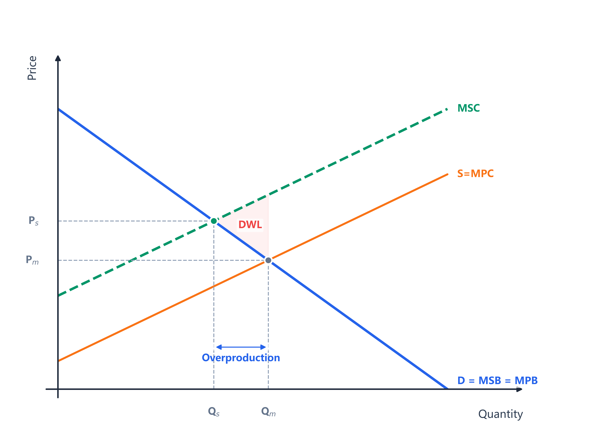

### Positive Externality 正外部性

本节图示采用**正消费外部性**（如教育、疫苗接种）：外部收益发生在消费侧。正生产外部性（如部分研发知识溢出）需要在生产侧建模，曲线位置会不同。

- 生产或消费活动对第三方产生未被补偿的收益
- *Marginal Social Benefit (MSB)* > *Marginal Private Benefit (MPB)*：社会收益高于私人收益
- $MSB = MPB + \text{Marginal External Benefit (MEB)}$
- 在竞争市场且采用标准外部性图示时，自由市场结果相对于社会有效率基准是产量过低（*Underproduction*）；私人决策没有计入全部社会收益
- 例子：教育、疫苗接种、美化花园；研发知识溢出常可作为正生产外部性另行建模

**3 步读图法（正外部性）：**
① 识别 MPB 和 MSB 曲线（MSB 在 MPB 上方，差距 = MEB）
② 找到市场均衡（MPC = MPB = S 交 D）→ $Q_m$，$P_m$；找到社会最优（MPC = MSB）→ $Q_s$，$P_s$
③ DWL = $Q_m$ 与 $Q_s$ 之间、MSB 与 MPC 之间的三角形区域

⚠️ **在本节正消费外部性图示中，MSC = MPC = S（生产者侧未改变）**，只有收益侧出现分歧：MSB > MPB。因此市场均衡产量偏低（$Q_m$ < $Q_s$），生产不足。

📌 **镜像对称记忆法：负外部性 = MSC 上移 → 过度生产，正外部性 = MSB 上移 → 生产不足。** 两者画图逻辑完全对称，只需记住"谁上移"即可。

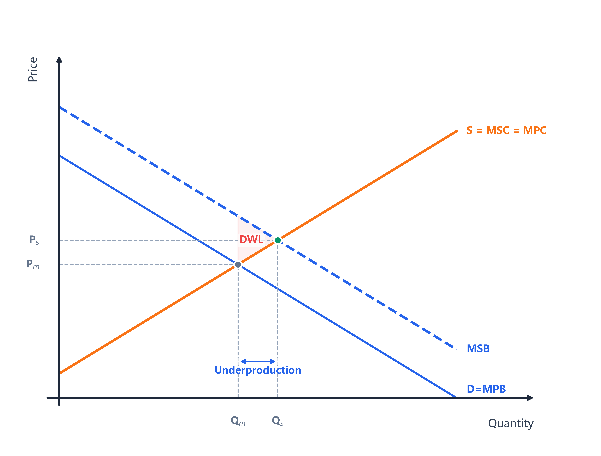

### Policies to Correct Externalities 纠正外部性的政策

<table>
<colgroup>
<col style="width:18%"><col style="width:30%"><col style="width:52%">
</colgroup>
<thead>
<tr><th style="text-align:center;vertical-align:middle">外部性类型</th><th style="text-align:center;vertical-align:middle">政策工具</th><th style="text-align:center;vertical-align:middle">说明</th></tr>
</thead>
<tbody>
<tr><td style="text-align:center;vertical-align:middle">负外部性</td><td style="text-align:center;vertical-align:middle"><em>Pigouvian Tax</em>（庇古税）</td><td style="text-align:left;vertical-align:middle">对产生负外部性的活动征税，税额 = MEC，使 MPC 上移 = MSC → 达到 $Q_s$</td></tr>
<tr><td style="text-align:center;vertical-align:middle">正外部性</td><td style="text-align:center;vertical-align:middle"><em>Pigouvian Subsidy</em>（庇古补贴）</td><td style="text-align:left;vertical-align:middle">对产生正外部性的活动补贴，补贴额 = MEB，使 MPB 上移 = MSB → 达到 $Q_s$</td></tr>
<tr><td style="text-align:center;vertical-align:middle">污染</td><td style="text-align:center;vertical-align:middle"><em>Tradable Permits</em>（可交易许可证）、直接管制</td><td style="text-align:left;vertical-align:middle">设立总量上限，允许市场化交易排放权</td></tr>
</tbody>
</table>

**庇古税数值示例（负外部性纠正）：**

| 步骤 | 数值 |
|:----:|:----:|
| 市场均衡产量 $Q_m$ | 100 单位（MPC = MSB 时） |
| 社会最优产量 $Q_s$ | 80 单位（MSC = MSB 时） |
| 边际外部成本 MEC | \$5/单位 |
| 征收庇古税 Tax | \$5/单位 |
| 征税后 MPC 上移 \$5 = MPC + 5 = MSC | 新均衡在 $Q_s$ = 80 |
| 征税前 DWL | 三角形面积 = ½ × (100 - 80) × \$5 = \$50 |
| 征税后 DWL | **\$0**（外部性完全内部化） |

💡 **碳排放税、烟酒税都是庇古税的现实应用。** 对污染征税使厂商承担社会全部成本，从而自动减少产量至社会最优水平。

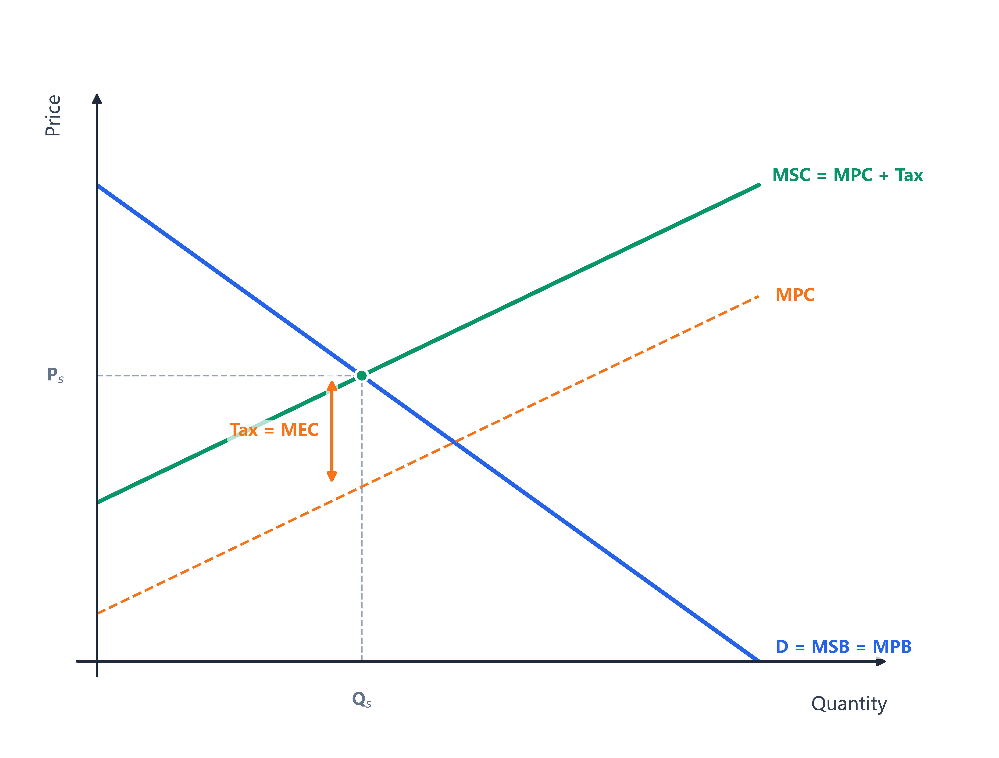

> 💡 **考试提示：** 微观经济学中，矫正外部性的一种简单有效方法是征收 per-unit tax（单位税）。庇古税（Pigouvian Tax）是 per-unit tax 的一种具体形式，专门用于纠正负外部性。在考试答题时，使用"per-unit tax"这一表述同样被认可且准确。

## Public Goods & Common Resources 公共品与公共资源

### Excludability and Rivalry 排他性与竞争性

<table>
<colgroup>
<col style="width:30%"><col style="width:35%"><col style="width:35%">
</colgroup>
<thead>
<tr><th style="text-align:center;vertical-align:middle">&nbsp;</th><th style="text-align:center;vertical-align:middle">Rivalrous（竞争性）</th><th style="text-align:center;vertical-align:middle">Non-Rivalrous（非竞争性）</th></tr>
</thead>
<tbody>
<tr><td style="text-align:center;vertical-align:middle"><strong>Excludable（排他性）</strong></td><td style="text-align:center;vertical-align:middle"><strong>Private Goods</strong>（私人物品）如：食物、衣服、手机</td><td style="text-align:center;vertical-align:middle"><strong>Club Goods</strong>如：收费电视、有线网络</td></tr>
<tr><td style="text-align:center;vertical-align:middle"><strong>Non-Excludable（非排他性）</strong></td><td style="text-align:center;vertical-align:middle"><strong>Common Resources</strong>（公共资源）如：渔场、森林、清洁空气</td><td style="text-align:center;vertical-align:middle"><strong>Public Goods</strong>（公共品）如：国防、路灯、知识</td></tr>
</tbody>
</table>

**每个象限的详细解释与更多例子：**

- **Private Goods（私人物品）**：排他性 + 竞争性 — 一个人买了别人就不能用，且可以阻止不付费者使用。例子：食物、衣服、手机、住房
- **Club Goods（俱乐部物品）**：排他性 + 非竞争性 — 可以排除不付费者，但一个人用了不影响别人用。例子：收费电视、有线网络、付费订阅内容、私人健身房
- **Common Resources（公共资源）**：非排他性 + 竞争性 — 无法排除使用者，但一人多用就减少他人的可用量。例子：渔场、森林、清洁空气、公共牧场、地下水
- **Public Goods（公共品）**：非排他性 + 非竞争性 — 无法排除不付费者，一人使用也不影响他人。例子：国防、路灯、知识/基础研究、灯塔、天气预报

**2 步判断法：**
- **Step 1：** 能否排除不付费者？→ Excludable（能排除）/ Non-excludable（不能排除）
- **Step 2：** 一个人用了别人还能用吗？→ Rivalrous（不能 = 竞争性）/ Non-rivalrous（能 = 非竞争性）

⚠️ **公共品 ≠ 政府提供的商品（政府也提供私人物品如医疗、教育）。** 公共品是经济学定义（非排他+非竞争），不是"谁提供"来定的。

> 💡 **例子：** 路灯、国防、公园，大家都能用且互不影响

### Free-Rider Problem 搭便车问题

公共品的非排他性导致了 *Free-Rider Problem*（搭便车问题）：个体可以在不支付的情况下享受公共品的收益，因此市场供给不足。政府通常通过税收融资来提供公共品。

**灯塔经典案例（4 步推理）：**
① 灯塔对附近所有船只都有用（非竞争性 — 一艘船看到灯光不影响另一艘船）
② 无法阻止不交费的船只也看到灯光（非排他性 — 没法"关掉"某艘船的灯光）
③ 每个人都不想交费，指望别人付钱（搭便车心理）
④ 结果：没人愿意建灯塔 → 市场供给不足 → 需要政府通过税收建造

**更多搭便车例子：**
- **国防**：无法阻止不纳税的人享受安全保障 → 必须强制征税
- **公共公园**：即使不付费也能走进去散步 → 需要政府维护
- **路灯**：路过的人都能免费使用照明 → 私人不会自愿安装
- **开源软件**：所有人可免费使用代码 → 开发者缺乏激励，需要基金会/赞助支持

📌 **搭便车 → 市场供给不足 → 政府通过税收提供。** 这是公共品需要政府供给的核心逻辑。

### Tragedy of the Commons 公地悲剧

公共资源具有竞争性而非排他性 → 个体理性导致过度使用和资源耗竭。解决方案：私有化（建立产权）、政府管制（配额、许可证）、*Tradable Permits*（可交易许可证）。

**过度捕鱼案例（4 步推理）：**
① 渔场对所有人开放（非排他性 — 无法阻止任何渔民进入）
② 每个渔民想多捕鱼多赚钱（个体理性 — 多捕一条就多赚一条的钱）
③ 个人理性 = 多捕鱼，集体结果 = 鱼群枯竭（竞争性 — 鱼被你捕了别人就没了）
④ 解决方案：私有化（将渔场划归私人管理）、配额（限制每人捕鱼量）、可交易许可证（总配额固定，许可证可买卖）

⚠️ **公地悲剧 = 竞争性 + 非排他性，搭便车 = 非竞争性 + 非排他性。** 两者的共同点是"非排他性"，但公地悲剧多了一个"竞争性"导致过度使用，搭便车是"非竞争性"导致供给不足。

## Income Inequality 收入不平等

市场经济可能产生显著的收入不平等。*Lorenz Curve*（洛伦兹曲线）和 *Gini Coefficient*（基尼系数）是衡量收入不平等程度的工具。

- **Lorenz Curve：** 横轴 = 累计人口百分比，纵轴 = 累计收入百分比。完全平等 = 45 度对角线。Lorenz 曲线越弯曲，收入越不平等。
- **Gini Coefficient：** $Gini = A / (A + B)$，其中 A = 45° 线与 Lorenz 曲线之间的面积，B = Lorenz 曲线以下的面积。$Gini \in [0, 1]$，值越大越不平等。

**数值计算示例（五等分法）：**

| 人口累计百分比 | 收入累计百分比 | 完全平等线收入 |
|:-------------:|:-------------:|:-------------:|
| 20%           | 5%            | 20%           |
| 40%           | 15%           | 40%           |
| 60%           | 30%           | 60%           |
| 80%           | 55%           | 80%           |
| 100%          | 100%          | 100%          |

在上表中，最底层 40% 的人只拥有 15% 的收入（而非完全平等时的 40%），说明收入分配不平等。Lorenz 曲线越远离 45° 对角线，A 面积越大，Gini 系数越高。

💡 **想象一个村子 10 个人分 100 元：** 完全平等时每人 10 元，Lorenz 曲线就是对角线；但如果最穷的 2 人只有 1 元（2%），最富的 2 人有 50 元（50%），Lorenz 曲线就会严重弯曲。Gini 系数量化的就是这个弯曲程度。

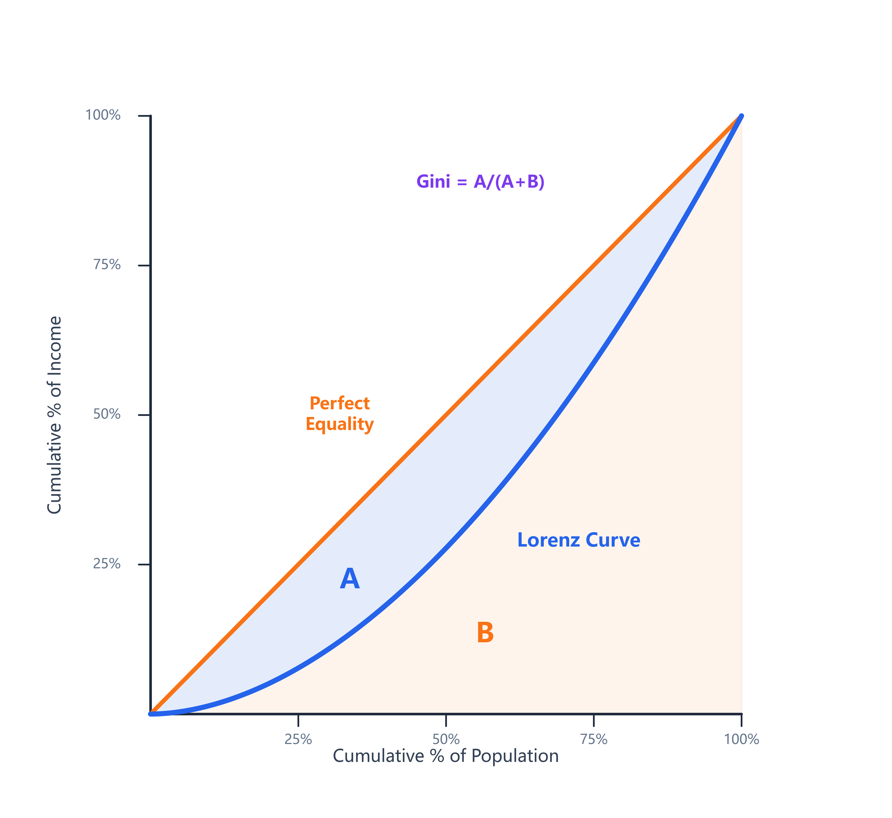

## Government's Role 政府的角色

- **提供公共品**（国防、基础设施、基础研究）
- **纠正外部性**（庇古税/补贴、管制）
- **维持竞争**（反垄断法、反托拉斯法）
- **收入再分配**（累进税制 *Progressive Tax*、转移支付）
- **宏观经济稳定**（但这是宏观经济学的主轴，AP微观仅简介）

### Tax Types 税收类型

- *Progressive Tax*（累进税）：平均税率随收入提高而上升（如美国联邦所得税）
- *Proportional / Flat Tax*（比例税）：平均税率不随收入变化（保持不变）
- *Regressive Tax*（累退税）：平均税率随收入提高而下降（如销售税 — 低收入者在消费中占比更高）

**销售税为什么是累退税？— 数值示例：**

| 纳税人 | 年收入 | 年消费 | 10% 销售税 | 有效税率 = 税额/收入 |
|:------:|:------:|:------:|:----------:|:------------------:|
| Person A | \$20,000 | \$15,000 | \$1,500 | **7.5%** |
| Person B | \$100,000 | \$40,000 | \$4,000 | **4.0%** |

虽然 Person B 交的绝对税额更多（\$4,000 > \$1,500），但有效税率更低（4% < 7.5%）。因为低收入者必须将更大比例的收入用于消费，所以销售税占其收入的比例更高 — 这就是累退性。

📌 **判断口诀：累进 = 富人税率高，累退 = 富人税率低，比例 = 税率都一样。**

### Government Intervention in Different Market Structures 跨市场结构的政府干预

本节汇总三类常考情形。

**A. Lump-Sum Tax vs Per-Unit Tax（一次性税 vs 从量税）**

两种税对厂商成本曲线的影响不同：

<table>
<colgroup>
<col style="width:16%"><col style="width:21%"><col style="width:21%"><col style="width:21%"><col style="width:21%">
</colgroup>
<thead>
<tr><th style="text-align:center;vertical-align:middle">税种</th><th style="text-align:center;vertical-align:middle">对 MC 影响</th><th style="text-align:center;vertical-align:middle">对 ATC 影响</th><th style="text-align:center;vertical-align:middle">短期生产决策</th><th style="text-align:center;vertical-align:middle">长期</th></tr>
</thead>
<tbody>
<tr><td style="text-align:center;vertical-align:middle"><em>Lump-Sum Tax</em>（一次性税）</td><td style="text-align:center;vertical-align:middle"><strong>不动</strong>（与产量无关）</td><td style="text-align:center;vertical-align:middle"><strong>上移</strong>（固定成本增加，分摊到每单位）</td><td style="text-align:center;vertical-align:middle"><strong>不变</strong>（MC 不动 → MR=MC 的 Q* 不变）</td><td style="text-align:center;vertical-align:middle">厂商退出，市场供给左移，价格上升至零经济利润</td></tr>
<tr><td style="text-align:center;vertical-align:middle"><em>Per-Unit Tax</em>（从量税）</td><td style="text-align:center;vertical-align:middle"><strong>上移</strong>（每单位多交 t）</td><td style="text-align:center;vertical-align:middle"><strong>上移</strong>（ATC = AVC + AFC + t）</td><td style="text-align:center;vertical-align:middle"><strong>减少</strong>（MC 上移 → Q* 下降）</td><td style="text-align:center;vertical-align:middle">厂商退出，价格上升至零经济利润</td></tr>
</tbody>
</table>

> ⚠️ **AP 高频考点：** Lump-sum tax 不改变 MC，所以**短期利润最大化产量不变**，只让 ATC 上移、利润下降；per-unit tax 同时改变 MC 与 ATC，短期 Q* 下降。这是 FRQ 区分两种税的经典套路。

**数值对比示例：**

假设厂商原数据：Q\* = 100，P = \$20，ATC = \$15，MC = \$20

<table>
<colgroup>
<col style="width:15%"><col style="width:15%"><col style="width:35%"><col style="width:35%">
</colgroup>
<thead>
<tr><th style="text-align:center;vertical-align:middle">项目</th><th style="text-align:center;vertical-align:middle">征税前</th><th style="text-align:center;vertical-align:middle">征 Lump-Sum Tax \$500</th><th style="text-align:center;vertical-align:middle">征 Per-Unit Tax \$5</th></tr>
</thead>
<tbody>
<tr><td style="text-align:center;vertical-align:middle">MC</td><td style="text-align:center;vertical-align:middle">\$20</td><td style="text-align:center;vertical-align:middle">\$20（不变）</td><td style="text-align:center;vertical-align:middle">\$25（+ \$5）</td></tr>
<tr><td style="text-align:center;vertical-align:middle">ATC</td><td style="text-align:center;vertical-align:middle">\$15</td><td style="text-align:center;vertical-align:middle">\$20（+ \$500/100）</td><td style="text-align:center;vertical-align:middle">\$20（+ \$5）</td></tr>
<tr><td style="text-align:center;vertical-align:middle">Q\*</td><td style="text-align:center;vertical-align:middle">100</td><td style="text-align:center;vertical-align:middle"><strong>100</strong>（MC 不变 → MR=MC 不变）</td><td style="text-align:center;vertical-align:middle"><strong>降低</strong>（MC 上移 → MR=MC'交点左移）</td></tr>
<tr><td style="text-align:center;vertical-align:middle">利润</td><td style="text-align:center;vertical-align:middle">\$500</td><td style="text-align:center;vertical-align:middle">\$0（ATC 上升吞噬利润）</td><td style="text-align:center;vertical-align:middle">降低且 Q\* 下降</td></tr>
</tbody>
</table>

📌 **FRQ 答案模板：** "A lump-sum tax increases fixed cost, shifting ATC up but not affecting MC, so the short-run profit-maximizing quantity does not change."

**B. 垄断下的价格管制**

对自然垄断（*Natural Monopoly*，ATC 持续下降）的价格管制有三种方案：

| 方案 | 定价 | 效率 | 厂商盈亏 | 政府处置 |
|:----:|:----:|:----:|:--------:|:--------:|
| *Unregulated*（不管制） | $P_m$（MR=MC 上读到 D） | 标准图示下配置无效率（$P > MC$），DWL 通常较大 | 经济利润可能为正、零或负，取决于需求与成本 | — |
| *Fair-Return Pricing*（公平回报定价，P = ATC） | $P = ATC$ | 改善但仍 $P > MC$，DWL 缩小 | 零经济利润（break-even） | 无需补贴 |
| *Marginal-Cost Pricing*（边际成本定价） | $P = MC$ | 配置有效率（社会最优，DWL=0） | 亏损（$P < ATC$） | 需政府补贴，否则长期退出 |

> 📌 **AP MCQ 常问：** 若要求 $P = MC$ 实现配置效率，自然垄断厂商会亏损（因 ATC 仍在下降，$MC < ATC$），需要政府补贴才能维持运营；若要求 $P = ATC$，厂商零经济利润可自给自足，但产量低于社会最优。

**C. 税收归宿在垄断中的画法**

对垄断者征从量税 t：MC 曲线上移 t 单位 → 新 MR' = MC' 的交点决定新 $Q_m'$ → 上读 D 得到新 $P_m'$。垄断市场中消费者承担的税负份额取决于需求曲线形状与成本结构，价格上升幅度可小于、等于或在特定需求形状下大于单位税额 — 不存在与完全竞争市场的一般性排序。

## 例题

### MCQ

1.  Which of the following is an example of a negative externality?

    a) A homeowner plants flowers that beautify the neighborhood.

    b) A factory emits pollution that reduces the health of nearby residents.

    c) A student gets a flu shot, reducing the spread of flu to others.

    d) A firm invests in research that leads to new technologies.

    e) A restaurant provides outdoor seating that benefits passersby.

2.  Which of the following is the most efficient policy to correct a negative externality?

    a) A price ceiling

    b) A per-unit tax equal to the marginal external cost

    c) A subsidy equal to the marginal external cost

    d) A quota set at the market equilibrium quantity

    e) A lump-sum tax on producers

3.  Which of the following best explains why private markets fail to provide public goods efficiently?

    a) Public goods are rival in consumption.

    b) Public goods are excludable.

    c) The free-rider problem

    d) Government regulation prevents their production.

    e) Negative externalities are associated with public goods.

4.  A positive externality exists when which of the following occurs?

    a) The social benefit of consuming a good exceeds the private benefit.

    b) The social cost of producing a good exceeds the private cost.

    c) The private benefit of consuming a good exceeds the social benefit.

    d) The market overproduces the good.

    e) There is no deadweight loss in the market.

5.  The tragedy of the commons occurs because common resources are which of the following?

    a) Nonrival and nonexcludable

    b) Rival but nonexcludable

    c) Rival and excludable

    d) Nonrival but excludable

    e) Owned by the government

6.  A negative externality in production causes which of the following?

    a) The market will produce too little of the good relative to the socially optimal quantity.

    b) The marginal social cost exceeds the marginal private cost at the market equilibrium quantity.

    c) The market will achieve allocative efficiency without government intervention.

    d) A per-unit subsidy to producers will correct the externality.

    e) The marginal social benefit exceeds the marginal private benefit.

7.  If the government wishes to correct a positive externality from a good's consumption, the appropriate policy is to

    a) impose a per-unit tax equal to the marginal external cost.

    b) provide a per-unit subsidy equal to the marginal external benefit.

    c) set a binding price ceiling on the good.

    d) impose a quota on production.

    e) tax the consumers of the good.

8.  A public good is characterized by which of the following?

    a) Rivalry in consumption and excludability.

    b) Nonrivalry in consumption and nonexcludability.

    c) Rivalry in consumption and nonexcludability.

    d) Nonrivalry in consumption and excludability.

    e) Negative externalities and zero marginal cost.

9.  The Lorenz curve is used to illustrate

    a) the trade-off between inflation and unemployment.

    b) the relationship between tax rates and tax revenue.

    c) the distribution of income in an economy.

    d) economic growth over time.

    e) the deadweight loss from taxation.

10. A Pigouvian tax designed to internalize a negative production externality should be set equal to the

    a) marginal private cost at the socially optimal quantity.

    b) marginal external cost at the socially optimal quantity.

    c) total external cost at the market equilibrium.

    d) consumer surplus lost due to the externality.

    e) marginal social benefit at the market equilibrium.

### FRQ

Assume the market for gasoline is in equilibrium. Each gallon of gasoline produces \$2 in negative externalities due to air pollution.

(a) Draw a correctly labeled graph showing the market for gasoline, including the marginal private cost (MPC), marginal social cost (MSC), and marginal social benefit (MSB).

(b) Identify the market equilibrium quantity and the socially optimal quantity.

(c) Express the deadweight loss resulting from the negative externality.

(d) What policy could the government implement to correct this market failure? Explain.

(e) Assume the government imposes a per-unit tax equal to the marginal external cost. On your graph from part (a), show how this tax affects the market outcome.

---

# 答案与解析 {-}

## Unit 1: Basic Economic Concepts {-}

### MCQ {-}

1.  **b** — Alpha 在玉米上有比较优势（机会成本 1/3 码布匹 < Beta 的 0.75），Beta 在布匹上有比较优势（机会成本 4/3 ≈ 1.33 蒲式耳玉米 < Alpha 的 3）。

    - **绝对优势**：Alpha 生产玉米需要 2 小时（< Beta 的 3 小时），Alpha 有绝对优势；Alpha 生产布匹需要 6 小时（> Beta 的 4 小时），Beta 有绝对优势。所以 a 错误。
    - **比较优势**：计算机会成本（投入表法：生产 A 的机会成本 = 生产 A 所需时间 / 生产 B 所需时间）：
      - Alpha：1 蒲式耳玉米的机会成本 = 2/6 = 1/3 码布匹；1 码布匹的机会成本 = 6/2 = 3 蒲式耳玉米
      - Beta：1 蒲式耳玉米的机会成本 = 3/4 = 0.75 码布匹；1 码布匹的机会成本 = 4/3 ≈ 1.33 蒲式耳玉米
    - 比较优势判断：机会成本更低的一方具有比较优势。
      - 玉米：Alpha（1/3 码布匹）< Beta（0.75 码布匹）→ Alpha 在玉米上有比较优势
      - 布匹：Beta（1.33 蒲式耳玉米）< Alpha（3 蒲式耳玉米）→ Beta 在布匹上有比较优势
    - 因此 b 正确。c 错误（正好选反了），d 错误（Alpha 在玉米上有绝对优势），e 错误（不可能同时在两种商品上有比较优势）。

2.  **c** — PPC 内部的点表示资源未充分利用，可以通过提高效率同时增加两种商品的产量。

    生产可能性曲线（PPC）内部的点表示资源未充分利用（无效率/资源闲置）。

    - **a 错误**：在 PPC 内部意味着资源未充分就业（存在失业或闲置）。
    - **b 错误**：这是 PPC 曲线上有效率点的特征（要增加一种商品必须减少另一种）。
    - **c 正确**：通过提高资源利用效率（将闲置资源投入生产），可以同时增加两种商品的产量（从内部点向曲线移动）。
    - **d 错误**：机会成本递增由 PPC 凹向原点的形状决定，与点在内部还是曲线上无关。
    - **e 错误**：PPC 内部点不提供任何关于比较优势的信息。

3.  **b** — Beta 在汽车上有比较优势（机会成本 0.5 台电脑 < Alpha 的 3 台），Alpha 在电脑上有比较优势（1/3 辆汽车 < 2 辆）。

    首先计算两国生产每种商品的机会成本（投入表法：生产 A 的机会成本 = 生产 A 所需时间 / 生产 B 所需时间）：

    - Alpha：
      - 1 辆汽车的机会成本 = 6/2 = 3 台电脑
      - 1 台电脑的机会成本 = 2/6 = 1/3 辆汽车

    - Beta：
      - 1 辆汽车的机会成本 = 5/10 = 0.5 台电脑
      - 1 台电脑的机会成本 = 10/5 = 2 辆汽车

    比较优势判断（机会成本更低者具有比较优势）：
    - 汽车：Beta（0.5 台电脑）< Alpha（3 台电脑）→ Beta 在汽车上有比较优势
    - 电脑：Alpha（1/3 辆汽车）< Beta（2 辆汽车）→ Alpha 在电脑上有比较优势

    逐项验证：
    - **a 错误**：Alpha 生产汽车需要 6 小时（> Beta 的 5 小时），没有汽车的绝对优势。
    - **b 正确**：Beta 生产汽车的机会成本（0.5 台电脑）低于 Alpha（3 台电脑），Beta 在汽车上有比较优势。
    - **c 错误**：不可能在两种商品上都有比较优势（这是逻辑上的不可能）。
    - **d 错误**：Beta 生产电脑需要 10 小时（> Alpha 的 2 小时），没有绝对优势。
    - **e 错误**：两国机会成本不同，存在比较优势。

4.  **b** — 理性消费者在边际收益 > 边际成本时应继续购买，这是边际分析原则。

    理性消费者的决策遵循边际分析原则：比较边际收益（Marginal Benefit, MB）和边际成本（Marginal Cost, MC）。

    - **a 错误**：总收益 > 总成本只说明总净利润为正，但不意味着应该继续增加消费（可能 MB < MC，再多消费一单位会减少总净利润）。
    - **b 正确**：边际收益 > 边际成本时，多消费一单位的额外收益大于额外成本，总净收益增加，因此应该继续消费。
    - **c 错误**：平均收益与平均成本的比较不用于边际决策（"是否多买一单位"是边际问题，不是平均问题）。
    - **d 错误**：总效用最大化时 MU = 0（在边际效用递减且价格为 0 的情况下），这不是"是否购买额外一单位"的决策依据。
    - **e 错误**：价格低于收入只是说明买得起，不构成最优购买决策的边际原则。

    **核心原则**：在连续内点模型中，最优决策通常满足 MB = MC；离散选择则继续到最后一单位满足 MB ≥ MC 且下一单位 MB < MC。

5.  **b** — 收入增加使预算线向外平行移动（斜率 $-P_x/P_y$ 不变，截距增大）。

    预算约束方程：$P_x X + P_y Y = I$

    当收入 $I$ 增加而两种商品价格 $P_x, P_y$ 都不变时：
    - 横轴截距 = $I/P_x$ 变大（能买更多 X）
    - 纵轴截距 = $I/P_y$ 变大（能买更多 Y）
    - 斜率 = $-P_x/P_y$ 不变（价格比不变）

    因此预算线**向外平行移动**。

    - **a 错误**：向内平行移动是收入减少的情况。
    - **b 正确**：收入增加，购买力普遍提高，预算线向外平行移动。
    - **c、d 错误**：只有价格变化才会改变斜率（使预算线旋转），收入变化斜率不变。
    - **e 错误**：收入变化会改变消费者的购买力，预算约束必然变化。

6.  **c** — 两国机会成本完全相同，因此不存在比较优势，无法通过贸易获益。

    计算机会成本：生产1吨steel的机会成本，A国=4/2=2 bushels wheat，B国=6/3=2 bushels wheat。生产1 bushel wheat的机会成本，A国=2/4=0.5 tons steel，B国=3/6=0.5 tons steel。两国机会成本完全相同，因此不存在比较优势，无法通过贸易获益。A国虽然有绝对优势（两种产品都用更少时间），但比较优势相同意味着贸易无利可图。

7.  **c** — 机会成本 = 显性成本 + 放弃的最高价值选项 = \$40 + \$40 = \$80。

    机会成本 = 显性成本 + 放弃的最高价值选项。显性成本 = 门票\$40；时间成本2小时，最高价值选项是辅导（\$20/hr × 2hr = \$40）。机会成本 = 40 + 40 = \$80。注意：不能同时做兼职和辅导，所以取最高价值\$40。

8.  **c** — 凹向原点的PPC表示机会成本递增。

    凹向原点的PPC表示机会成本递增（law of increasing opportunity cost）——随着横轴商品产量增加，每多生产一单位所放弃的纵轴商品数量越来越多。直线型PPC表示机会成本不变。

9.  **a** — MUx/Px = MUy/Py = 10，消费者已在最优消费点。

    效用最大化条件是 MUx/Px = MUy/Py。MUx/Px = 40/4 = 10, MUy/Py = 20/2 = 10，二者相等，消费者已在最优消费点。

10. **c** — 两商品价格等比例下降等价于实际收入增加，预算线平行外移。

    预算线平行外移表示实际收入增加但相对价格不变。两商品价格等比例下降（如各降50%）等价于收入翻倍，预算线平行外移。选项a使预算线围绕纵轴截距旋转；选项b使预算线内移；选项d改变相对价格，旋转而非平移。

### FRQ {-}

**(a) 答案：3 磅咖啡**

**解析：** Loriland 生产 1 蒲式耳小麦需要 6 小时，生产 1 磅咖啡需要 2 小时。因此，生产 1 蒲式耳小麦的机会成本 = 6/2 = 3 磅咖啡。

**(b) 答案：1 蒲式耳小麦**

**解析：** Zeeland 生产 1 磅咖啡需要 4 小时，生产 1 蒲式耳小麦需要 4 小时。因此，生产 1 磅咖啡的机会成本 = 4/4 = 1 蒲式耳小麦。

**(c) 答案：Zeeland**

**解析：**
- Loriland 生产 1 蒲式耳小麦的机会成本 = 6/2 = 3 磅咖啡
- Zeeland 生产 1 蒲式耳小麦的机会成本 = 4/4 = 1 磅咖啡
- Zeeland 生产小麦的机会成本更低（1 < 3），因此 Zeeland 在小麦生产上具有比较优势。

**(d) 答案：Loriland**

**解析：**
- Loriland 生产 1 磅咖啡的机会成本 = 2/6 = 1/3 蒲式耳小麦
- Zeeland 生产 1 磅咖啡的机会成本 = 4/4 = 1 蒲式耳小麦
- Loriland 生产咖啡的机会成本更低（1/3 < 1），因此 Loriland 在咖啡生产上具有比较优势。

**(e) 答案：两国都能从贸易中获益**

**解析：**
- 贸易条件为 1W = 2C，落在两国机会成本之间（Zeeland 的 1C < 2C < Loriland 的 3C）。
- 对 Zeeland 而言：专门生产小麦，1 蒲式耳小麦国内只能换到 1 磅咖啡，通过贸易可以换到 2 磅咖啡，高于国内机会成本，获益。
- 对 Loriland 而言：专门生产咖啡，进口 1 蒲式耳小麦只需支付 2 磅咖啡，低于国内生产 1 蒲式耳小麦的机会成本 3 磅咖啡，获益。

### FRQ 2 {-}

(a) MU of the 3rd bottle of milk = 18 utils. MU per dollar = 18 / \$2 = **9 utils per dollar**.

(b) Total utility from 3 bottles of milk = MU(1) + MU(2) + MU(3) = 30 + 24 + 18 = **72 utils**.

(c) Utility maximization requires $MU_m$/$P_m$ = $MU_b$/$P_b$ within the \$10 budget. Using the sequential purchase rule (each time buy the item with the highest MU/\$) gives a candidate bundle; because the question restricts each good to at most 5 units, compare the best feasible bread quantity for each possible milk quantity:

| Milk quantity | Best feasible bread quantity | Total utility |
|:---:|:---:|:---:|
| 0 | 5 | 60 |
| 1 | 5 | 90 |
| 2 | 5 | 114 |
| 3 | 4 | **128** |
| 4 | 2 | 120 |
| 5 | 0 | 90 |

The exhaustive comparison confirms the sequential-purchase candidate below.

| Step | Item purchased | Cost | MU/\$ | Spent | Remaining | Milk | Bread | TU |
|:-:|:-:|:-:|:-:|:-:|:-:|:-:|:-:|:-:|
| 1 | Bread #1 | \$1 | 20 | \$1 | \$9 | 0 | 1 | 20 |
| 2 | Bread #2 | \$1 | 16 | \$2 | \$8 | 0 | 2 | 36 |
| 3 | Milk #1 | \$2 | 15 | \$4 | \$6 | 1 | 2 | 66 |
| 4 | Bread #3 | \$1 | 12 | \$5 | \$5 | 1 | 3 | 78 |
| 5 | Milk #2 | \$2 | 12 | \$7 | \$3 | 2 | 3 | 102 |
| 6 | Milk #3 | \$2 | 9 | \$9 | \$1 | 3 | 3 | 120 |
| 7 | Bread #4 | \$1 | 8 | \$10 | \$0 | 3 | 4 | 128 |

**The utility-maximizing bundle is 3 bottles of milk and 4 loaves of bread** (cost = 3×\$2 + 4×\$1 = \$10). At this bundle, $MU_m$/$P_m$ = 18/2 = 9 and $MU_b$/$P_b$ = 8/1 = 8 — these are close to equalization with whole units and the budget exactly exhausted.

(d) With $P_{milk}$ = \$1, the ratio MU/P for milk doubles. Repeating the sequential approach:

| Step | Item | Cost | MU/\$ | Spent | Milk | Bread | TU |
|:-:|:-:|:-:|:-:|:-:|:-:|:-:|:-:|
| 1 | Milk #1 | \$1 | 30 | \$1 | 1 | 0 | 30 |
| 2 | Milk #2 | \$1 | 24 | \$2 | 2 | 0 | 54 |
| 3 | Bread #1 | \$1 | 20 | \$3 | 2 | 1 | 74 |
| 4 | Milk #3 | \$1 | 18 | \$4 | 3 | 1 | 92 |
| 5 | Bread #2 | \$1 | 16 | \$5 | 3 | 2 | 108 |
| 6 | Milk #4 | \$1 | 12 | \$6 | 4 | 2 | 120 |
| 7 | Bread #3 | \$1 | 12 | \$7 | 4 | 3 | 132 |
| 8 | Bread #4 | \$1 | 8 | \$8 | 4 | 4 | 140 |
| 9 | Milk #5 | \$1 | 6 | \$9 | 5 | 4 | 146 |
| 10 | Bread #5 | \$1 | 4 | \$10 | 5 | 5 | 150 |

**The new utility-maximizing bundle is 5 bottles of milk and 5 loaves of bread** (cost = 5×\$1 + 5×\$1 = \$10). Because all listed marginal utilities are positive and the quantity limits are 5 units, this uses the full available quantity of both goods. As expected, a decrease in the price of milk leads the consumer to purchase more milk (substitution and income effects).

---

## Unit 2: Supply and Demand {-}

### MCQ {-}

1.  **c** — 中点公式计算 PED = |(-20/90) / (2/9)| = 1.0（单位弹性）。

    **解析：** 使用中点公式：
    - ΔQ = 80 - 100 = -20，Q_avg = (100 + 80)/2 = 90
    - ΔP = 10 - 8 = 2，P_avg = (8 + 10)/2 = 9
    - PED = |(-20/90) / (2/9)| = |(-2/9) / (2/9)| = |-1| = 1.0

2.  **b** — 替代品（橙子）价格下降，消费者转向橙子，苹果需求减少（曲线左移）。

    需求减少（需求曲线左移）的影响因素包括：替代品价格下降、互补品价格上升、收入下降（正常品）、偏好改变、对未来价格预期下降等。

    - **a 错误**：苹果价格上升导致的是**需求量减少**（沿需求曲线移动），不是**需求减少**（整条曲线移动）。这是 AP 考试的高频考点：区分"需求变化"和"需求量变化"。
    - **b 正确**：橙子是苹果的替代品，橙子价格下降，消费者会转向购买更便宜的橙子，对苹果的需求减少（需求曲线左移）。
    - **c 错误**：收入增加，正常品的需求会增加（不是减少）。
    - **d 错误**：成功的广告会增加对苹果的需求。
    - **e 错误**：人口增加会增加需求（更多消费者）。

3.  **b** — PED = 0.5 时，价格上升 10%，需求量下降 5%（缺乏弹性，变化幅度更小）。

    需求价格弹性公式：$PED = \frac{\%ΔQ_d}{\%ΔP}$

    已知 PED = 0.5，%ΔP = +10%，代入公式：

    $0.5 = \frac{|\%ΔQ_d|}{10\%}$

    $|\%ΔQ_d| = 0.5 \times 10\% = 5\%$

    根据需求法则，价格上升，需求量下降，所以需求量减少 5%。

    - **a 错误**：需求量应该下降，不是上升。
    - **b 正确**：需求量下降 5%。
    - **c 错误**：20% 是 PED = 2 时的结果。
    - **d 错误**：方向和数值都错。
    - **e 错误**：只有完全无弹性（PED = 0）时需求量才不变。

4.  **b** — 需求完全无弹性时，消费者对价格不敏感，承担全部税负。

    税收归宿（Tax Incidence）取决于供需的相对弹性：
    - 弹性更低的一方承担更多税负
    - 完全无弹性的一方承担全部税负

    当需求完全无弹性（Perfectly Inelastic，PED = 0）时：
    - 消费者对价格完全不敏感，无论价格多高都买同样数量
    - 征税后，生产者可以将全部税额转嫁给消费者
    - 消费者支付的价格上升幅度 = 全部税额

    - **a 错误**：生产者承担全部税负是供给完全无弹性的情况。
    - **b 正确**：需求完全无弹性时，消费者承担全部税负。
    - **c 错误**：供需弹性相等时税负各半。
    - **d 错误**：双方都不承担是不可能的（税收必须有人承担）。
    - **e 错误**：政府是征税方，不是税负承担方。

5.  **b** — 限制性价格上限低于均衡价格，导致需求量 > 供给量，产生短缺。

    限制性价格上限（Binding Price Ceiling）是法定最高价格低于均衡价格。此时：
    - 价格被压低到均衡水平以下
    - 需求量增加（价格低了消费者想买更多）
    - 供给量减少（价格低了生产者愿意卖的更少）
    - 需求量 > 供给量 → 短缺（Shortage）

    - **a 错误**：过剩（Surplus）是价格下限（Price Floor）高于均衡价格的结果。
    - **b 正确**：限制性价格上限导致短缺。
    - **c 错误**：价格下降，生产者剩余减少。
    - **d 错误**：价格上限导致无效率，总剩余减少（产生无谓损失）。
    - **e 错误**：均衡数量会减少（因为供给量减少了）。

6.  **c** — 技术进步降低生产成本→供给曲线右移。

    技术进步降低生产成本→供给曲线右移。a和e增加生产成本→供给左移；b和d影响的是需求曲线而非供给。

7.  **d** — 交叉弹性为负值表示两商品为互补品。

    交叉弹性为负值表示两商品为互补品（A涨价→B需求下降，方向相反→E<0）。正值为替代品；接近零为无关商品。

8.  **b** — 限制性价格上限导致交易量小于均衡量。

    限制性价格上限设在均衡价格之下，导致Qd > Qs（短缺），交易量由供给量决定，小于均衡量；CS变化不确定但PS下降；产生DWL→总剩余减少。

9.  **d** — 供需越富有弹性，税收的DWL越大。

    供需越富有弹性，税收的DWL越大。因为弹性大意味着价格变化时数量调整幅度大，更多互利交易被阻止，DWL三角形面积更大。完全无弹性时DWL=0（数量不变）。

10. **b** — 成为进口国→CS↑，总剩余↑。

    成为进口国→价格从自给自足价格降至世界价格：CS↑（消费者买得更多更便宜），PS↓（国内生产者卖得少价格低），总剩余↑（自由贸易的效率收益）。

---

## Unit 3: Production, Cost & Perfect Competition {-}

### MCQ {-}

1.  **c** — ATC(4) = TC(4)/Q = \$300/4 = \$75。

    从表格中提取数据：TFC = \$100（产量为 0 时的总成本 = 固定成本）。

    逐项验证：
    - **a 错误**：MC(第2单位) = TC(2) - TC(1) = \$190 - \$150 = \$40 ≠ \$50
    - **b 错误**：TVC(3) = TC(3) - TFC = \$240 - \$100 = \$140，AVC(3) = \$140/3 ≈ \$46.67 ≠ \$80
    - **c 正确**：ATC(4) = TC(4)/Q = \$300/4 = \$75
    - **d 错误**：固定成本不随产量变化（始终为 \$100）
    - **e 错误**：MC(第3单位) = TC(3) - TC(2) = \$240 - \$190 = \$50 ≠ \$60

    因此正确答案为 c。

2.  **b** — TFC = AFC × Q = (\$50 - \$30) × 100 = \$2,000。

    已知：Q = 100, ATC = \$50, AVC = \$30

    方法：
    1. AFC = ATC - AVC = \$50 - \$30 = \$20
    2. TFC = AFC × Q = \$20 × 100 = \$2,000

    验证：
    - TC = ATC × Q = \$50 × 100 = \$5,000
    - TVC = AVC × Q = \$30 × 100 = \$3,000
    - TFC = TC - TVC = \$5,000 - \$3,000 = \$2,000 ✓

    - **a 错误**：\$20 是 AFC（平均固定成本），不是 TFC（总固定成本）。
    - **b 正确**：TFC = \$2,000。
    - **c 错误**：\$3,000 是 TVC（总可变成本）。
    - **d 错误**：\$5,000 是 TC（总成本）。
    - **e 错误**：计算错误。

3.  **c** — 边际报酬递减指边际产量（MP）下降，是短期现象。

    边际报酬递减（Diminishing Marginal Returns）是指：随着可变要素（如劳动）不断增加，超过某一点后，边际产量（MP）开始下降。

    这是短期现象（因为存在固定要素，新增工人的边际产出会越来越少）。

    - **a 错误**：边际报酬递减时，总产量仍可能增加（只要 MP > 0），只是增加的速度变慢。总产量减少是 MP < 0 时的情况，即"负边际报酬"。
    - **b 错误**：边际报酬递减只要求 MP 下降，不要求 MP 为负。
    - **c 正确**：边际报酬递减的定义就是边际产量递减（下降）。
    - **d 错误**：MP 递减时，AP 可能上升也可能下降（当 MP > AP 时 AP 上升，当 MP < AP 时 AP 下降）。
    - **e 错误**：固定成本与边际报酬递减无关（而且 FC 不随产量变化）。

    **关键区分**：Diminishing marginal returns（MP 下降）≠ Negative marginal returns（MP < 0, TP 下降）。

4.  **b** — MR = \$10 > MC = \$8，增加产量可提高利润。

    完全竞争厂商的利润最大化条件：MR = MC（边际收益 = 边际成本）。

    当前状态：MC = \$8, MR = \$10

    - MR > MC，说明多生产一单位的收益大于成本，总利润会增加
    - 因此应该**增加产量**，直到 MR = MC

    - **a 错误**：减少产量会让 MR 与 MC 差距更大，利润减少。
    - **b 正确**：MR > MC，增加产量可以提高利润。
    - **c 错误**：停产条件是 P < AVC，题目没有给出 AVC 信息，且 MR > MC 说明增产有利。
    - **d 错误**：当前 MR ≠ MC，不是利润最大化产量。
    - **e 错误**：退出是长期决策，且需要 P < ATC，题目未给出相关信息。

5.  **c** — 长期均衡时经济利润为零（P = min ATC），无厂商进入或退出。

    完全竞争市场长期均衡的调整机制：
    - 如果有正的经济利润 → 新厂商进入 → 供给增加 → 价格下降 → 利润减少
    - 如果有负的经济利润（亏损） → 厂商退出 → 供给减少 → 价格上升 → 亏损减少
    - 长期均衡时：经济利润为零（P = min ATC）

    此时没有厂商有动力进入或退出市场。

    - **a 错误**：正的经济利润会吸引新厂商进入，这不是长期均衡。
    - **b 错误**：负的经济利润会导致厂商退出，这不是长期均衡。
    - **c 正确**：长期均衡时经济利润为零（正常利润）。
    - **d 错误**：经济利润为零不代表会计亏损，会计利润通常为正，且等于隐性成本（正常利润包含在成本中）。
    - **e 错误**：完全竞争没有垄断利润。

6.  **c** — 边际报酬递减从第3个工人开始（MP 在第2个工人达到最高后下降）。

    计算各工人MP：1st=8, 2nd=12, 3rd=10, 4th=6, 5th=4, 6th=2。MP在第2个工人达到最高(12)，第3个工人时MP下降至10，标志着边际报酬递减开始（diminishing MP）。

7.  **b** — 当 MC < ATC 时，每多生产一单位的成本低于当前平均，ATC 被拉低。

    当MC < ATC时，每多生产一单位的成本低于当前平均，ATC被拉低（下降）。这是边际量和平均量的数学关系。注意：e选项"diseconomies of scale"意味着ATC上升，与题目描述相反。

8.  **d** — P = MC = \$8 但 P < ATC，短期亏损但继续生产。

    P=\$8 = MC=\$8 → 已在利润最大化产量（无需增减产）。ATC=\$10 > P → 每单位亏\$2，总亏损\$200。但AVC=\$6 < P=\$8 → 可以覆盖所有可变成本且部分固定成本，比停产（亏全部TFC）好。短期继续生产。

9.  **b** — 成本不变行业长期供给曲线水平，价格回到原水平但产量增加。

    成本不变行业的长期供给曲线水平（完全弹性）。需求↑→短期P↑→正利润→新厂商进入→短期供给右移→价格回落到原始均衡价格（= min ATC），但市场总产量增加。

10. **b** — Lump-sum tax 只影响固定成本，不改变 MC。

    Lump-sum tax是固定成本，只影响TFC/AFC/ATC，不影响MC和AVC（因为MC和AVC只与可变成本有关）。MC不变→利润最大化产量不变→市场价格短期不变。

### FRQ {-}

**(a) 答案：\$5**

**解析：** ATC = TC/Q = \$500/100 = \$5。

**(b) 答案：\$200**

**解析：** AVC = \$3，所以 TVC = AVC × Q = \$3 × 100 = \$300。TFC = TC - TVC = \$500 - \$300 = \$200。

**(c) 答案：不能确定**

**解析：** 仅凭 MR = MC = \$5 不足以确定 100 单位就是利润最大化产量。利润最大化还要求 MC 在该点从下向上穿过 MR（即 MC 处于上升段且由下方穿越 MR）。题目未提供 MC 在 100 单位附近的变化趋势（如第 99、101 单位的 MC），因此无法确认 100 单位是否为最优产量。

**(d) 答案：继续经营**

**解析：** P = MR = \$5 > AVC = \$3，所以短期继续经营。

**(e) 答案：无法确认是否处于长期均衡**

**解析：** 由 (c) 知不能确认 100 单位为利润最大化产量。虽然在该产量下 P = \$5 = ATC = \$5，单位经济利润为零，但仅凭此不能断定市场处于长期均衡。要确认长期均衡，还需确认 100 单位确实是厂商的利润最大化产量（即 MC 上升穿越 MR），以及行业整体无进入退出动力。

### FRQ 2 {-}

(a) MP of the 4th worker = TP(4) − TP(3) = 60 − 45 = **15 units per day**.

(b) The 3rd worker adds 45 − 25 = 20 units (units 26 through 45). The cost of hiring the 3rd worker is \$120 (the wage).
MC = ΔTC / ΔQ = wage / MP = 120 / 20 = **\$6 per unit**.

(c) The firm hires labor until VMPL (value of marginal product of labor) = wage = \$120.

| Workers | TP | MP | VMPL = P×MP (\$) | Wage (\$) | Hire? |
|:-:|:-:|:-:|:-:|:-:|:-:|
| 1 | 10 | 10 | 200 | 120 | Yes |
| 2 | 25 | 15 | 300 | 120 | Yes |
| 3 | 45 | 20 | 400 | 120 | Yes |
| 4 | 60 | 15 | 300 | 120 | Yes |
| 5 | 70 | 10 | 200 | 120 | Yes |
| 6 | 75 | 5 | 100 | 120 | No |

The firm will hire **5 workers** because VMPL ≥ wage for the first 5 workers, and VMPL of the 6th worker (\$100) is less than the wage (\$120).

(d) At 5 workers: TP = 70 units.
TR = P × Q = 20 × 70 = \$1,400
TC = TFC + TVC = 120 + (5 × 120) = 120 + 600 = \$720
Economic profit = TR − TC = 1,400 − 720 = **\$680 per day**.

(e) The firm is earning positive economic profit (\$680 > 0). In a perfectly competitive market, **this is NOT a long-run equilibrium**. Positive profits attract new firms to enter the industry in the long run. Entry continues until the market price falls to the minimum of ATC, at which point all firms earn zero economic profit (P = min ATC).

---

## Unit 4: Imperfect Competition {-}

### MCQ {-}

1.  **c** — 垄断者要多卖一单位必须降低所有已售产品价格，所以 MR < P。

    垄断者面临向下倾斜的需求曲线。为了多销售一单位产品，垄断者必须降低**所有**已售出产品的价格（而不仅仅是最后一单位）。因此，多卖一单位的边际收益（MR）等于：
    - 最后一单位的价格（即 P）
    - 减去之前所有单位因降价而损失的收益

    所以 MR < P。

    - **a 错误**：MR = P 是完全竞争的情况（企业是价格接受者，需求曲线水平）。
    - **b 错误**：MR 不可能大于价格。
    - **c 正确**：垄断者 MR < P。
    - **d 错误**：MR 随产量变化，不是常数。
    - **e 错误**：MR = 0 发生在需求价格弹性 = 1 处（总收益最大点），不是利润最大化点（利润最大化在 MR = MC > 0 处）。

2.  **b** — 垄断产量更低、价格更高（P > MC，有价格加成），产生 DWL。

    与完全竞争相比，单一价格垄断者：
    - 完全竞争：P = MC（配置有效率），产量更高，价格更低
    - 垄断：MR = MC 决定产量，P > MC（有价格加成），产量更低，价格更高

    垄断导致无谓损失（DWL），因为产量低于社会最优水平。

    - **a 错误**：垄断产量更少，不是更多。
    - **b 正确**：垄断产量更低、价格更高。
    - **c 错误**：产量不同。
    - **d 错误**：价格更高，不是更低。
    - **e 错误**：产量和价格都错。

3.  **b** — 完全价格歧视生产社会有效率产量（P = MC），DWL = 0，CS = 0。

    完全价格歧视（Perfect Price Discrimination）是指垄断者对每一位消费者收取其愿意支付的最高价格（保留价格）。

    结果：
    - 消费者剩余 = 0（全部被垄断者拿走）
    - 产量 = 完全竞争产量（社会有效率产量），因为最后一单位价格 = MC
    - 无谓损失 = 0
    - 垄断者利润最大

    - **a 错误**：完全价格歧视是对每个消费者收取不同价格，不是统一价格。
    - **b 正确**：完全价格歧视生产社会有效率的产量（P = MC），没有无谓损失。
    - **c 错误**：完全价格歧视下垄断者利润更高（攫取了全部消费者剩余）。
    - **d 错误**：产量高于单一价格垄断（等于完全竞争产量）。
    - **e 错误**：没有无谓损失（单一价格垄断才有 DWL）。

4.  **b** — 囚徒困境的纳什均衡是双方都选择占优策略（都背叛）。

    囚徒困境（Prisoner's Dilemma）的纳什均衡：
    - 每个玩家都有占优策略（Dominant Strategy）
    - 纳什均衡是双方都选择占优策略
    - 结果（都背叛）对双方来说都比（都合作）差——个体理性导致集体非理性

    - **a 错误**：联合收益最大化是合作解（都不坦白/都合作），不是纳什均衡。
    - **b 正确**：纳什均衡出现在双方都选择占优策略时（都背叛/都坦白）。
    - **c 错误**：合作不是纳什均衡（每个人都有动机背叛）。
    - **d 错误**：囚徒困境中双方都有占优策略。
    - **e 错误**：纳什均衡是对称的（双方策略相同）。

5.  **b** — 垄断竞争长期均衡时经济利润为零（P = ATC），但 P > MC。

    垄断竞争（Monopolistic Competition）的长期均衡：
    - 由于自由进入退出，长期经济利润为零（P = ATC）
    - 但 P > MC（因为企业有市场力，面临向下倾斜的需求曲线）
    - 产量低于 min ATC 的产量（有过剩生产能力/Excess Capacity）
    - 零利润均衡发生在 ATC 曲线与需求曲线相切处（在 ATC 下降段）

    - **a 错误**：不在 ATC 最低点生产（有过剩生产能力），这是垄断竞争的无效率来源之一。
    - **b 正确**：长期均衡时经济利润为零（自由进入退出的结果）。
    - **c 错误**：P > MC（有价格加成，配置无效率）。
    - **d 错误**：P > MR（面临向下倾斜的需求曲线），利润最大化在 MR = MC 处。
    - **e 错误**：面临向下倾斜的需求曲线（产品差异化）。

6.  **b** — 垄断者利润最大化条件：MR = MC，然后向上读需求曲线确定 P，因此 P > MR = MC。

    垄断者利润最大化条件：MR = MC（确定$Q_M$），然后向上读需求曲线确定$P_M$。由于需求曲线向下倾斜，MR < P，因此P > MR = MC。

7.  **c** — 完全价格歧视生产社会最优量，DWL = 0，但 CS = 0。

    完全价格歧视下，垄断者向每个消费者收取其保留价格，MR曲线与D曲线重合（MR=D），因此在MR=MC处产量=D=MC处=社会最优量$Q_{soc}$，DWL=0。但每个消费者支付了其愿付的最高价格，CS=0，所有剩余归垄断者。

8.  **b** — 垄断竞争长期均衡：P = ATC（零经济利润），但 P > MC。

    垄断竞争长期均衡特征：(1) MR=MC决定产量；(2) P = D = ATC（零经济利润，因自由进入使需求曲线下移至与ATC相切）；(3) P > MC（存在垄断定价力，配置无效率）；(4) 不在min ATC处生产（存在excess capacity）。

9.  **a** — 占优策略：无论对手选择什么，该策略都是自己的最优选择。

    占优策略(dominant strategy)的定义：无论对手选择什么策略，该策略都是自己的最优选择。选项b描述的是纳什均衡概念；c描述的是合作结果。

10. **c** — 自然垄断按 P = MC 定价会亏损，需要政府补贴。

    自然垄断的ATC持续下降（因规模经济），所以MC始终在ATC下方。按P=MC（配置有效）定价→P < ATC→厂商亏损，需要政府补贴才能维持经营。按P=ATC定价（fair-return Price）→零利润但有DWL。

### FRQ {-}

**(a) 答案：有，Alpha 的占优策略是广告**

**解析：**
- 如果 Beta 广告：Alpha 广告得 5，不广告得 2 → 广告更优
- 如果 Beta 不广告：Alpha 广告得 10，不广告得 8 → 广告更优
- 无论 Beta 如何选择，Alpha 广告都更优，因此广告是 Alpha 的占优策略。

**(b) 答案：有，Beta 的占优策略是广告**

**解析：** 对称分析：
- 如果 Alpha 广告：Beta 广告得 5，不广告得 2 → 广告更优
- 如果 Alpha 不广告：Beta 广告得 10，不广告得 8 → 广告更优
- 无论 Alpha 如何选择，Beta 广告都更优。

**(c) 答案：Nash equilibrium 是 (广告, 广告)，收益为 (5, 5)**

**解析：** 给定对方选择广告，双方都不会改变策略（改为不广告收益从 5 降到 2，更差）。因此 (广告, 广告) 是纳什均衡。这也是占优策略均衡。

**(d) 答案：不是社会最优结果**

**解析：** 如果双方都不广告，收益为 (8, 8)，高于纳什均衡的 (5, 5)。但个体理性导致集体非理性——这就是囚徒困境。

**(e) 答案：双方都不广告**

**解析：** 合谋（Collusion）会选择联合收益最大化的结果 (8, 8)，即双方都不广告。但这种合谋协议不稳定，因为双方都有欺骗动机（偷偷打广告可以获得更高收益 10 > 8）。

---

## Unit 5: Factor Markets {-}

### MCQ {-}

1.  **a** — MRP = \$20 > w = \$15，应多雇佣工人直到 MRP = w。

    完全竞争劳动市场中，厂商利润最大化的雇佣条件：MRP = w（边际收益产品 = 工资率）。

    当前：MRP = \$20, w = \$15

    MRP > w，说明多雇佣一个工人的收益（\$20）大于成本（\$15），利润增加。因此应该雇佣更多工人，直到 MRP = w。

    - **a 正确**：MRP > w，应多雇佣工人。
    - **b 错误**：MRP < w 时才应该减少雇佣。
    - **c 错误**：当前 MRP ≠ w，不是最优雇佣量。
    - **d 错误**：MRP > w 说明增产有利，不需要停产（停产是产品市场 P < AVC 的情况）。
    - **e 错误**：完全竞争厂商是价格接受者，不能提高产品价格。

2.  **a** — 完全竞争厂商雇佣到 MRP = w（边际收益产品 = 工资率）为止。

    完全竞争厂商的劳动雇佣决策：
    - MRP（Marginal Revenue Product of Labor）= 额外雇佣一单位劳动带来的额外收益
    - MRP = MP × MR = MP × P（在完全竞争产品市场中，P = MR）
    - 利润最大化：雇佣到 MRP = w（工资率）为止

    - **a 正确**：MRP = w 是利润最大化雇佣条件。
    - **b 错误**：MRP = 0 时总收益最大，但不是利润最大（还需考虑工资成本）。
    - **c 错误**：总收益最大化不考虑成本，不是利润最大化。
    - **d 错误**：平均产量最大化与利润最大化雇佣决策无关。
    - **e 错误**：MC = P 是产品市场的产量决策，不是要素市场的雇佣决策。

3.  **c** — 最低工资高于均衡工资导致劳动供给过剩（失业）。

    竞争性劳动市场中，最低工资高于均衡工资的影响：
    - 工资被推高到均衡水平以上
    - 劳动需求量减少（厂商雇佣更少，因为工资更高了）
    - 劳动供给量增加（更多人愿意工作，因为工资更高了）
    - 供给量 > 需求量 → 劳动过剩 = 失业（Unemployment）

    - **a 错误**：就业会减少（需求量下降），不是增加。
    - **b 错误**：是过剩（供给 > 需求），不是短缺。
    - **c 正确**：最低工资高于均衡工资导致劳动供给过剩，即失业。
    - **d 错误**：需求量 < 供给量，说反了。
    - **e 错误**：工资被最低工资法提高了，不会下降。

4.  **b** — MFC > w 是买方垄断雇佣更少、工资更低的直接原因。

    买方垄断（Monopsony）的关键特征：
    - 面临向上倾斜的劳动供给曲线（要多雇佣工人必须提高工资，而且要给所有工人涨工资）
    - 因此 MFC（边际要素成本）> w（工资率）
    - 雇佣决策：MRP = MFC（而不是 MRP = w）
    - 结果：雇佣量 < 完全竞争水平，工资 < 完全竞争水平

    关于选项辨析：
    - **a 错误**：买方垄断面临的是**向上倾斜**的劳动供给曲线，而非水平曲线（水平供给曲线是完全竞争劳动市场的特征）。
    - **b 正确**：MFC > w 是买方垄断雇佣更少的直接原因——因为雇佣决策是 MRP = MFC，而 MFC 在供给曲线上方，所以交点对应的雇佣量更少、工资更低。
    - **c 错误**：买方垄断有市场力（劳动市场上的买方垄断力）。
    - **d 错误**：产品市场需求曲线形状与劳动市场买方垄断无关。
    - **e 错误**：最低工资不是买方垄断的特征。

5.  **b** — 产品价格上升使 MRP = MP × P 增加，劳动需求曲线右移。

    劳动需求 = MRP 曲线（MRP = MP × P）。

    当产品价格 P 上升时：
    - MRP = MP × P 增加 → MRP 曲线向上/向右移动
    - 这意味着劳动需求增加（在每个工资水平上都愿意雇佣更多工人）

    - **a 错误**：产品价格上升，生产更有利可图，劳动需求应该增加。
    - **b 正确**：MRP 增加导致劳动需求增加（需求曲线右移）。
    - **c 错误**：劳动需求不仅取决于工资率，还取决于 MRP（产品价格影响 MRP）。
    - **d 错误**：题目说的是产品价格变化，不是资本价格变化，不涉及替代效应。
    - **e 错误**：产品价格上升影响的是劳动需求（厂商方），不是劳动供给（工人方）。

6.  **b** — 利润最大化雇佣条件：MRP = MFC（在完全竞争劳动市场中 MFC = W，所以 MRP = W）。

    利润最大化雇佣条件：MRP = MFC（边际收益产品=边际要素成本）。在完全竞争劳动市场中MFC=W，所以MRP=W。

7.  **b** — 产出价格↑→MRP = MP×P↑→劳动需求曲线右移。

    产出价格↑→MRP = MP×P↑→劳动需求曲线右移（在每个工资水平下愿意雇佣更多工人）。a和e是沿需求曲线的移动（工资变化引起需求量变化，而非需求变化）；c减少MP→MRP↓→需求左移。

8.  **d** — 买方垄断雇佣更少工人，工资低于 MFC。

    买方垄断者在MRP=MFC处确定雇佣量$L_m$，然后从劳动供给曲线S读取工资$W_m$。由于MFC在S上方（向上倾斜的供给意味着多雇一个工人必须给所有工人加薪），$W_m$ < MFC = MRP，且$L_m$ < 完全竞争雇佣量。

9.  **a** — 弹性需求下，工资↑导致就业↓幅度更大，总工资收入减少。

    劳动需求弹性= |%Δemployment / %Δwage|。如果需求是elastic（弹性>1），工资↑1%导致就业↓超过1%，总工资收入=W×L会减少。

10. **a** — 成本最小化条件：$MP_L$/$P_L$ = $MP_K$/$P_K$。

    成本最小化条件（least-cost rule）：花在每种投入上的最后一美元获得的MP相等，即$MP_L$/$P_L$ = $MP_K$/$P_K$。这是消费者效用最大化MU/P相等的生产者对偶。

### FRQ {-}

**(a) 答案：\$160**

**解析：** MRP = MP × P = 16 × \$10 = \$160。

**(b) 答案：5 名工人**

**解析：** 完全竞争厂商雇佣直到 MRP ≥ w。
MRP(1) = 20 × \$10 = \$200
MRP(2) = 18 × \$10 = \$180
MRP(3) = 16 × \$10 = \$160
MRP(4) = 14 × \$10 = \$140
MRP(5) = 12 × \$10 = \$120
MRP(6) = 10 × \$10 = \$100

w = \$120，第 5 名工人 MRP = \$120 = w；第 6 名工人 MRP = 10 × \$10 = \$100 < \$120 = w，所以雇佣 5 名工人。

**(c) 答案：劳动需求增加（需求曲线右移）**

**解析：** 产品价格上升使 MRP = MP × P 增加，在每个工资水平上厂商都愿意雇佣更多工人，劳动需求曲线右移。

**(d) 答案：买方垄断雇佣更少工人，支付更低工资**

**解析：** 买方垄断面临向上倾斜的劳动供给曲线，因此 MFC > w。雇佣量由 MRP = MFC 决定，这个数量低于完全竞争市场的 MRP = w 的雇佣量，且工资也更低。

---

## Unit 6: Market Failure & Role of Government {-}

### MCQ {-}

1.  **b** — 工厂污染损害附近居民健康，是典型的负外部性。

    负外部性（Negative Externality）是指经济活动对第三方造成了未补偿的成本（社会成本 > 私人成本）。

    - **a 错误**：种花美化邻里是正外部性（第三方受益）。
    - **b 正确**：工厂污染损害附近居民健康，居民是第三方且承担了未补偿的成本，是典型的负外部性。
    - **c 错误**：流感疫苗减少传播是正外部性（第三方受益）。
    - **d 错误**：研发产生新技术是正外部性（知识外溢）。
    - **e 错误**：餐厅户外座位让路人受益是正外部性。

2.  **b** — 每单位税额 = 边际外部成本（MEC），使私人成本等于社会成本。

    纠正负外部性的最有效政策：庇古税（Pigouvian Tax），即对每单位产品征收等于边际外部成本（MEC）的税。

    效果：
    - 使 MPC 上移到 MSC（私人成本 = 社会成本）
    - 产量从市场均衡减少到社会最优水平
    - 消除无谓损失

    - **a 错误**：价格上限不能解决外部性问题，反而会造成短缺。
    - **b 正确**：每单位税额 = 边际外部成本（MEC），使私人成本等于社会成本。
    - **c 错误**：补贴是纠正正外部性的政策，不是负外部性。
    - **d 错误**：设市场均衡数量的配额毫无意义（本来就会生产那么多）。正确的配额应设在社会最优产量（低于市场均衡）。
    - **e 错误**：定额税（Lump-sum tax）不随产量变化，不能改变边际决策，无法纠正外部性。

3.  **c** — 搭便车问题导致私人市场提供不足。

    公共品（Public Goods）的特征：非竞争性（Nonrival）和非排他性（Nonexcludable）。

    私人市场无法有效提供公共品的原因：**搭便车问题（Free-rider Problem）**——人们可以享受公共品的好处而不付费（因为非排他），所以没有人愿意为公共品付费，私人企业也无利可图。

    - **a 错误**：公共品是非竞争性的（不是竞争性）。
    - **b 错误**：公共品是非排他性的（不是排他性）。
    - **c 正确**：搭便车问题导致私人市场提供不足。
    - **d 错误**：不是政府监管阻止生产，而是私人没有动力生产。
    - **e 错误**：公共品通常与正外部性相关（不是负外部性），且这不是私人市场失灵的根本原因。

4.  **a** — 正外部性存在时，消费的社会收益超过私人收益。

    正外部性（Positive Externality）是指经济活动给第三方带来了未被补偿的收益。此时：
    - 社会收益（Social Benefit）= 私人收益（Private Benefit）+ 外部收益（External Benefit）
    - 即社会收益 > 私人收益
    - 市场产量 < 社会最优产量（供给不足）

    - **a 正确**：正外部性存在时，消费的社会收益超过私人收益。
    - **b 错误**：社会成本 > 私人成本是负外部性的特征。
    - **c 错误**：说反了，应该是社会收益 > 私人收益。
    - **d 错误**：正外部性下市场**供给不足**（生产太少），不是过度生产（负外部性才过度生产）。
    - **e 错误**：正外部性导致市场失灵，有无谓损失。

5.  **b** — 竞争性但非排他性是公共资源的特征，也是公地悲剧的根源。

    公地悲剧（Tragedy of the Commons）描述的是：由于公共资源被过度使用而导致资源枯竭/退化的现象。

    公共资源（Common Resources）的特征：
    - **竞争性（Rival）**：一个人使用会减少其他人的可用量
    - **非排他性（Nonexcludable）**：无法阻止他人使用

    因为非排他，人们缺乏保护资源的激励；因为有竞争性，过度使用会导致资源耗竭——这就是公地悲剧。

    - **a 错误**：非竞争且非排他是公共品（Public Goods）的特征。
    - **b 正确**：竞争性但非排他性是公共资源的特征，也是公地悲剧的根源。
    - **c 错误**：竞争且排他是私人物品（Private Goods）的特征。
    - **d 错误**：非竞争但排他是俱乐部物品（Club Goods）的特征。
    - **e 错误**：公地悲剧与所有权归属无关，关键在于非排他性和竞争性的组合。

6.  **b** — 负生产外部性→MSC = MPC + MEC > MPC，市场过度生产。

    负生产外部性→MSC = MPC + MEC > MPC，市场均衡在MPC=MPB处（$Q_{mkt}$），该产量大于社会最优量$Q_{soc}$（MSC=MSB处），市场过度生产。

7.  **b** — 正消费外部性→政府给予消费者 per-unit subsidy = MEB。

    正消费外部性→MSB = MPB + MEB > MPB，市场产量不足。政府给予消费者per-unit subsidy = MEB使MPB上移至MSB，达到社会最优。

8.  **b** — 公共物品：非竞争性 + 非排他性，导致搭便车问题。

    公共物品的两个定义特征：非竞争性（nonrivalry）——一人消费不减少他人可消费量（增加一名使用者的边际成本接近零）；非排他性（nonexcludability）——无法阻止未付费者使用，导致free-rider问题。

9.  **c** — Lorenz 曲线用于illustrate收入分配。

    Lorenz曲线横轴为人口累积百分比（从最穷到最富），纵轴为收入累积百分比。45度线为完全平等线，曲线离对角线越远表示收入越不平等。Gini系数 = A/(A+B) 衡量偏离程度。

10. **b** — Pigouvian tax = MEC 在社会最优产量 $Q_{soc}$ 处的值。

    Pigouvian tax = MEC在社会最优产量$Q_{soc}$处的值。这使MPC垂直上移MEC至MSC，市场均衡产量从$Q_{mkt}$降至$Q_{soc}$，外部性被内化。

### FRQ {-}

**(a) 答案：画图**

**解析：** 纵轴为价格/成本，横轴为数量。需求曲线（MSB = MPB）向下倾斜，MPC 曲线向上倾斜，MSC 曲线位于 MPC 上方（垂直距离 = \$2，即 MEC）。

参考图（与题目参数一致）：


**(b) 答案：市场均衡数量 > 社会最优数量**

**解析：** 市场均衡由需求曲线与 MPC 的交点决定（私人决策不考虑外部成本）；社会最优由需求曲线与 MSC 的交点决定（考虑全部社会成本）。由于 MSC > MPC，社会最优数量低于市场均衡数量。

**(c) 答案：DWL = MSC 与 MSB 之间、从 $Q_{soc}$ 到 $Q_{mkt}$ 的面积**

**解析：** DWL 是市场均衡量 $Q_{mkt}$ 与社会最优量 $Q_{soc}$ 之间、MSC 曲线与 MSB 曲线之间的面积。若供需曲线为线性（即相应区域确为三角形），则可简化为 $DWL = \frac{1}{2} \times (Q_{mkt} - Q_{soc}) \times \$2$。具体数值需要需求和供给函数才能计算。

**(d) 答案：征收每单位 \$2 的庇古税（Pigouvian Tax）**

**解析：** 对每单位汽油征收 \$2 的税（等于边际外部成本），使 MPC 上移至 MSC，让私人成本等于社会成本，市场产量自动调整到社会最优水平，消除无谓损失。

**(e) 答案：画图**

**解析：** 税收使供给曲线（MPC）向上移动 \$2，与 MSC 重合。新均衡点在 MSC = MSB 处，即社会最优数量，此时无谓损失消失。
